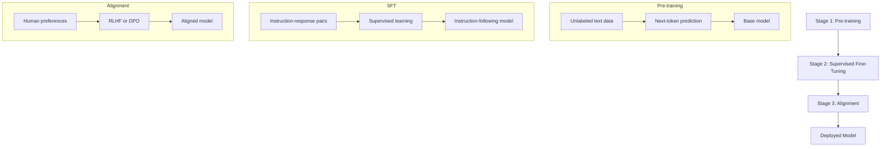
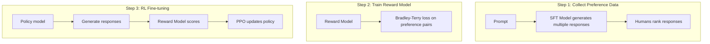
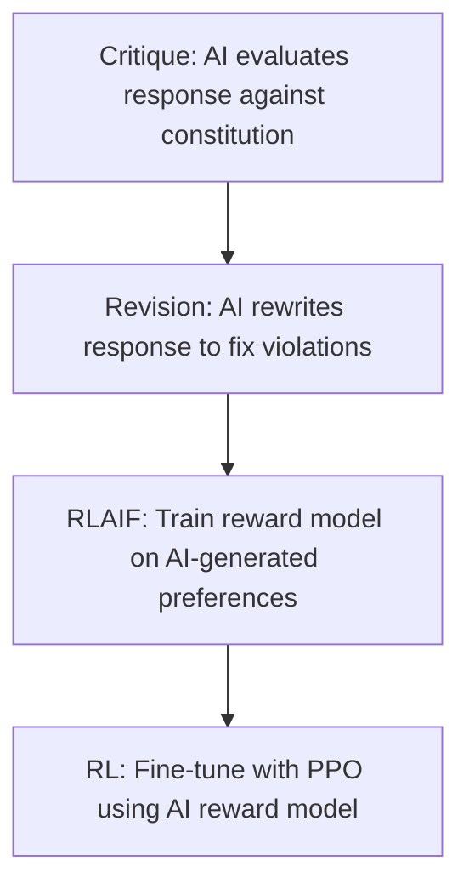
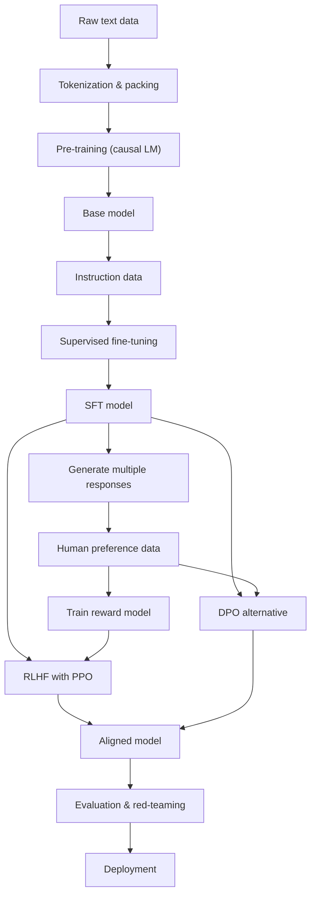

# LLM Training Pipeline

## Table of Contents
- [Overview](#overview)
- [Pre-training](#pre-training)
- [Supervised Fine-Tuning (SFT)](#supervised-fine-tuning-sft)
- [RLHF: Reinforcement Learning from Human Feedback](#rlhf)
- [DPO: Direct Preference Optimization](#dpo)
- [Constitutional AI (CAI)](#constitutional-ai)
- [Training Pipeline Diagram](#training-pipeline-diagram)
- [Code Examples](#code-examples)
- [Interview Tips](#interview-tips)

---

## Overview

Modern LLM training follows a multi-stage pipeline:



## Pre-training

### Objective

The standard pre-training objective is **causal language modeling** (next-token prediction):

\\[\mathcal{L}_{\text{pretrain}} = -\sum_{t=1}^{T} \log P_\theta(x_t \mid x_1, \ldots, x_{t-1})\\]

Some models use **masked language modeling** (BERT-style) or **span corruption** (T5-style), but decoder-only autoregressive models dominate for generative LLMs.

### Data Pipeline

```python
import torch
from torch.utils.data import Dataset, DataLoader
from transformers import AutoTokenizer
import numpy as np

class PretrainingDataset(Dataset):
    """Dataset for causal language modeling pre-training."""
    
    def __init__(self, data_path: str, tokenizer_name: str = "gpt2",
                 seq_length: int = 2048):
        self.tokenizer = AutoTokenizer.from_pretrained(tokenizer_name)
        self.seq_length = seq_length
        
        # Load and tokenize all text
        with open(data_path, 'r') as f:
            text = f.read()
        
        # Tokenize in chunks to avoid memory issues
        self.tokens = []
        chunk_size = 10000
        for i in range(0, len(text), chunk_size):
            chunk = text[i:i + chunk_size]
            self.tokens.extend(self.tokenizer.encode(chunk))
        
        self.tokens = np.array(self.tokens)
    
    def __len__(self):
        return max(0, (len(self.tokens) - 1) // self.seq_length)
    
    def __getitem__(self, idx):
        start = idx * self.seq_length
        end = start + self.seq_length + 1
        chunk = torch.tensor(self.tokens[start:end], dtype=torch.long)
        return {
            "input_ids": chunk[:-1],
            "labels": chunk[1:],  # Shifted by 1 for next-token prediction
        }


def get_pretraining_dataloader(data_path, batch_size=8, seq_length=2048):
    dataset = PretrainingDataset(data_path, seq_length=seq_length)
    return DataLoader(dataset, batch_size=batch_size, shuffle=True,
                      num_workers=4, pin_memory=True)
```

### Training Configuration

Typical pre-training hyperparameters:

| Parameter | Small Model (1B) | Medium (7B) | Large (70B) |
|-----------|-------------------|-------------|-------------|
| Batch size (tokens) | 0.5M | 4M | 4M |
| Learning rate | $3 \times 10^{-4}$ | $3 \times 10^{-4}$ | $1.5 \times 10^{-4}$ |
| LR schedule | Cosine | Cosine | Cosine |
| Warmup steps | 2000 | 2000 | 2000 |
| Weight decay | 0.1 | 0.1 | 0.1 |
| $\beta_1, \beta_2$ | 0.9, 0.95 | 0.9, 0.95 | 0.9, 0.95 |
| Training tokens | 1T | 1-2T | 1-2T |
| Precision | BF16 | BF16 | BF16 |

### Training Loop

```python
import torch
import torch.nn as nn
from torch.optim import AdamW
from torch.optim.lr_scheduler import CosineAnnealingLR
import math

def pretrain(model, dataloader, config):
    """Basic pre-training loop."""
    device = torch.device("cuda" if torch.cuda.is_available() else "cpu")
    model = model.to(device)
    
    optimizer = AdamW(
        model.parameters(),
        lr=config["lr"],
        betas=(0.9, 0.95),
        weight_decay=0.1,
        eps=1e-8,
    )
    
    total_steps = config["num_epochs"] * len(dataloader)
    scheduler = CosineAnnealingLR(
        optimizer, T_max=total_steps, eta_min=config["lr"] * 0.1
    )
    
    # Mixed precision
    scaler = torch.amp.GradScaler('cuda')
    
    model.train()
    for epoch in range(config["num_epochs"]):
        for step, batch in enumerate(dataloader):
            input_ids = batch["input_ids"].to(device)
            labels = batch["labels"].to(device)
            
            with torch.amp.autocast('cuda', dtype=torch.bfloat16):
                logits, _ = model(input_ids)
                loss = nn.functional.cross_entropy(
                    logits.view(-1, logits.size(-1)),
                    labels.view(-1),
                )
            
            scaler.scale(loss).backward()
            
            # Gradient clipping
            scaler.unscale_(optimizer)
            torch.nn.utils.clip_grad_norm_(model.parameters(), max_norm=1.0)
            
            scaler.step(optimizer)
            scaler.update()
            optimizer.zero_grad()
            scheduler.step()
            
            if step % 100 == 0:
                perplexity = math.exp(loss.item())
                print(f"Epoch {epoch}, Step {step}, Loss: {loss.item():.4f}, "
                      f"PPL: {perplexity:.2f}")
```

### Data Mixtures

The data mixture significantly affects model quality:

| Source | Typical Proportion | Description |
|--------|--------------------|-------------|
| Web crawl (Common Crawl) | 60-70% | Filtered web text |
| Books | 10-15% | BookCorpus, Gutenberg |
| Wikipedia | 3-5% | High-quality encyclopedic |
| Code (GitHub) | 5-15% | Programming source code |
| Academic papers | 2-5% | ArXiv, Semantic Scholar |
| Social media | 1-3% | Reddit, StackExchange |

Data quality filtering is crucial — deduplication, toxicity filtering, and quality scoring (e.g., using a classifier trained on Wikipedia-like text).

## Supervised Fine-Tuning (SFT)

After pre-training, the model can predict text but doesn't follow instructions. SFT teaches it to respond to user prompts.

### Data Format

```json
{
  "instruction": "Explain the difference between TCP and UDP.",
  "input": "",
  "output": "TCP (Transmission Control Protocol) is connection-oriented, ensuring reliable delivery with error checking and flow control. UDP (User Datagram Protocol) is connectionless, offering faster but unreliable transmission without guaranteed delivery..."
}
```

The training format uses a chat template:

```
<|system|>You are a helpful assistant.<|endofsystem|>
<|user|>Explain the difference between TCP and UDP.<|endofuser|>
<|assistant|>TCP (Transmission Control Protocol) is connection-oriented...<|endofassistant|>
```

### SFT Training

```python
def sft_training_step(model, batch, tokenizer):
    """SFT training: compute loss only on assistant tokens."""
    input_ids = batch["input_ids"]
    labels = batch["labels"].clone()
    attention_mask = batch["attention_mask"]
    
    # Forward pass
    with torch.amp.autocast('cuda', dtype=torch.bfloat16):
        logits, _ = model(input_ids)
    
    # Shift for next-token prediction
    shift_logits = logits[..., :-1, :].contiguous()
    shift_labels = labels[..., 1:].contiguous()
    
    # Only compute loss on assistant response tokens
    # (mask instruction tokens with -100)
    loss = nn.functional.cross_entropy(
        shift_logits.view(-1, shift_logits.size(-1)),
        shift_labels.view(-1),
        ignore_index=-100,
    )
    
    return loss
```

### Key SFT Considerations

1. **Data quality > quantity:** LIMA paper showed 1,000 high-quality examples can outperform 50,000 low-quality ones.
2. **Diversity matters:** Cover diverse tasks (summarization, coding, math, creative writing, etc.)
3. **Chat template consistency:** Use the same template during SFT and inference.
4. **Learning rate:** Typically 10x smaller than pre-training (e.g., $2 \times 10^{-5}$).
5. **Fewer epochs:** Usually 1-3 epochs to avoid overfitting.

## RLHF

RLHF aligns the SFT model with human preferences using reinforcement learning.

### The Three-Step Process



### Step 1: Preference Data Collection

For each prompt $x$, the SFT model generates $K$ responses $\{y_1, \ldots, y_K\}$. Human annotators rank them, creating preference pairs $(y_w, y_l)$ where $y_w$ is preferred over $y_l$.

### Step 2: Reward Model Training

The reward model $r_\phi(x, y)$ is trained using the **Bradley-Terry model** of pairwise preferences:

\\[P(y_w \succ y_l \mid x) = \sigma(r_\phi(x, y_w) - r_\phi(x, y_l))\\]

The loss is:

\\[\mathcal{L}_{\text{RM}} = -\mathbb{E}_{(x, y_w, y_l)} \left[\log \sigma(r_\phi(x, y_w) - r_\phi(x, y_l))\right]\\]

```python
class RewardModel(nn.Module):
    """Reward model: takes a prompt+response, outputs a scalar reward."""
    
    def __init__(self, base_model, d_model):
        super().__init__()
        self.base_model = base_model  # Pre-trained LLM backbone
        self.reward_head = nn.Linear(d_model, 1)
    
    def forward(self, input_ids, attention_mask):
        # Get the last token's hidden state
        hidden_states, _ = self.base_model(input_ids)
        
        # Use the last non-padding token's representation
        batch_size = input_ids.size(0)
        last_token_indices = attention_mask.sum(dim=1) - 1
        last_hidden = hidden_states[
            torch.arange(batch_size), last_token_indices
        ]
        
        reward = self.reward_head(last_hidden).squeeze(-1)
        return reward


def reward_model_loss(reward_model, chosen_ids, chosen_mask,
                      rejected_ids, rejected_mask):
    """Bradley-Terry preference loss."""
    chosen_reward = reward_model(chosen_ids, chosen_mask)
    rejected_reward = reward_model(rejected_ids, rejected_mask)
    
    loss = -torch.log(torch.sigmoid(chosen_reward - rejected_reward)).mean()
    return loss, chosen_reward.mean(), rejected_reward.mean()
```

### Step 3: PPO (Proximal Policy Optimization)

PPO optimizes the policy (LLM) to maximize reward while staying close to the SFT model:

\\[\mathcal{L}_{\text{PPO}} = \mathbb{E}_{t} \left[\min\left(r_t(\theta) \hat{A}_t, \text{clip}(r_t(\theta), 1-\epsilon, 1+\epsilon) \hat{A}_t\right)\right]\\]

where:
- $r_t(\theta) = \frac{\pi_\theta(a_t|s_t)}{\pi_{\theta_{\text{old}}}(a_t|s_t)}$ is the probability ratio
- $\hat{A}_t$ is the estimated advantage
- $\epsilon$ is the clipping parameter (typically 0.2)

The full RLHF objective includes a **KL penalty** to prevent the policy from drifting too far from the SFT model:

\\[\max_{\pi_\theta} \mathbb{E}_{x \sim D, y \sim \pi_\theta} \left[r_\phi(x, y) - \beta \cdot D_{\text{KL}}[\pi_\theta(y|x) \| \pi_{\text{SFT}}(y|x)]\right]\\]

```python
def compute_ppo_loss(
    policy_logprobs,
    ref_logprobs,
    rewards,
    old_logprobs,
    clip_epsilon=0.2,
    kl_coeff=0.1,
):
    """PPO loss with KL penalty."""
    # Probability ratio
    ratio = torch.exp(policy_logprobs - old_logprobs)
    
    # KL divergence penalty
    kl = policy_logprobs - ref_logprobs
    
    # Advantage (simplified: reward - KL penalty)
    advantages = rewards - kl_coeff * kl
    advantages = (advantages - advantages.mean()) / (advantages.std() + 1e-8)
    
    # Clipped surrogate loss
    surr1 = ratio * advantages
    surr2 = torch.clamp(ratio, 1 - clip_epsilon, 1 + clip_epsilon) * advantages
    policy_loss = -torch.min(surr1, surr2).mean()
    
    return policy_loss
```

## DPO

DPO (Rafailov et al., 2023) eliminates the need for a separate reward model and RL training by directly optimizing the policy on preference data.

### Key Insight

The optimal RLHF policy can be expressed analytically:

\\[\pi^*(y|x) = \frac{1}{Z(x)} \pi_{\text{ref}}(y|x) \exp\left(\frac{1}{\beta} r(x, y)\right)\\]

Rearranging to express the reward in terms of the policy:

\\[r(x, y) = \beta \log \frac{\pi_\theta(y|x)}{\pi_{\text{ref}}(y|x)} + \beta \log Z(x)\\]

Substituting into the Bradley-Terry preference model, the partition function $Z(x)$ cancels:

\\[P(y_w \succ y_l | x) = \sigma\left(\beta \log \frac{\pi_\theta(y_w|x)}{\pi_{\text{ref}}(y_w|x)} - \beta \log \frac{\pi_\theta(y_l|x)}{\pi_{\text{ref}}(y_l|x)}\right)\\]

### DPO Loss

\\[\mathcal{L}_{\text{DPO}} = -\mathbb{E}_{(x, y_w, y_l)} \left[\log \sigma\left(\beta \left(\log \frac{\pi_\theta(y_w|x)}{\pi_{\text{ref}}(y_w|x)} - \log \frac{\pi_\theta(y_l|x)}{\pi_{\text{ref}}(y_l|x)}\right)\right)\right]\\]

```python
def dpo_loss(
    policy_chosen_logprobs: torch.Tensor,
    policy_rejected_logprobs: torch.Tensor,
    ref_chosen_logprobs: torch.Tensor,
    ref_rejected_logprobs: torch.Tensor,
    beta: float = 0.1,
) -> torch.Tensor:
    """DPO loss function."""
    chosen_logratios = policy_chosen_logprobs - ref_chosen_logprobs
    rejected_logratios = policy_rejected_logprobs - ref_rejected_logprobs
    
    logits = beta * (chosen_logratios - rejected_logratios)
    loss = -F.logsigmoid(logits).mean()
    
    # Metrics
    chosen_rewards = beta * chosen_logratios.detach()
    rejected_rewards = beta * rejected_logratios.detach()
    reward_margin = (chosen_rewards - rejected_rewards).mean()
    
    return loss, chosen_rewards.mean(), rejected_rewards.mean()


class DPOTrainer:
    """DPO training loop."""
    
    def __init__(self, policy_model, ref_model, beta=0.1, lr=5e-7):
        self.policy = policy_model
        self.ref = ref_model
        self.beta = beta
        
        # Freeze reference model
        for param in self.ref.parameters():
            param.requires_grad = False
        
        self.optimizer = AdamW(self.policy.parameters(), lr=lr)
    
    def get_logprobs(self, model, input_ids, labels):
        """Compute log probabilities of labels under the model."""
        logits, _ = model(input_ids)
        log_probs = F.log_softmax(logits, dim=-1)
        
        # Gather log probs for the label tokens
        labels_shifted = labels[:, 1:]
        log_probs_shifted = log_probs[:, :-1, :]
        
        # Clamp negative labels (-100 = ignore sentinel) to a safe non-negative value
        # before gather: torch.gather with negative indices has undefined behavior
        # (it wraps around in practice, which can read garbage or NaN at masked positions).
        safe_labels = labels_shifted.clamp(min=0)
        token_log_probs = torch.gather(
            log_probs_shifted, dim=-1, index=safe_labels.unsqueeze(-1)
        ).squeeze(-1)

        # Mask padding
        mask = (labels_shifted != -100).float()
        return (token_log_probs * mask).sum(dim=1)
    
    def train_step(self, batch):
        chosen_ids = batch["chosen_input_ids"]
        rejected_ids = batch["rejected_input_ids"]
        chosen_labels = batch["chosen_labels"]
        rejected_labels = batch["rejected_labels"]
        
        # Compute log probs under policy
        policy_chosen_logps = self.get_logprobs(self.policy, chosen_ids, chosen_labels)
        policy_rejected_logps = self.get_logprobs(self.policy, rejected_ids, rejected_labels)
        
        # Compute log probs under reference (no grad)
        with torch.no_grad():
            ref_chosen_logps = self.get_logprobs(self.ref, chosen_ids, chosen_labels)
            ref_rejected_logps = self.get_logprobs(self.ref, rejected_ids, rejected_labels)
        
        loss, chosen_reward, rejected_reward = dpo_loss(
            policy_chosen_logps, policy_rejected_logps,
            ref_chosen_logps, ref_rejected_logps,
            beta=self.beta,
        )
        
        self.optimizer.zero_grad()
        loss.backward()
        torch.nn.utils.clip_grad_norm_(self.policy.parameters(), 1.0)
        self.optimizer.step()
        
        return {
            "loss": loss.item(),
            "chosen_reward": chosen_reward.item(),
            "rejected_reward": rejected_reward.item(),
        }
```

### DPO vs RLHF

| Aspect | RLHF (PPO) | DPO |
|--------|------------|-----|
| Reward model | Separate, trained first | Implicit in policy |
| Training stability | Requires careful tuning | More stable |
| Compute cost | High (4 models: policy, ref, reward, value) | Lower (2 models: policy, ref) |
| Online data | Yes (generates new responses) | No (uses offline preference data) |
| Iterative | Yes (can collect new preferences) | Typically single-pass |
| Performance | Slightly better with good tuning | Competitive, easier to implement |

## Constitutional AI

Constitutional AI (Bai et al., 2022) uses AI feedback instead of human feedback for alignment.

### Process



The **constitution** is a set of principles (e.g., "Choose the response that is least harmful", "Choose the response that is most helpful while being honest").

### Key Steps

1. **Critique-Revision:** Generate responses, then ask the model to critique them against constitutional principles and revise them.
2. **RLAIF (RL from AI Feedback):** Use the model itself to generate preference pairs by asking "Which response better follows the constitution?"
3. **Standard RLHF pipeline** but with AI-generated preferences instead of human ones.

### Advantages

- **Scalable:** No human annotation bottleneck
- **Consistent:** AI judgments are more consistent than human annotators
- **Iterable:** Can update the constitution and retrain

## Training Pipeline Diagram



## Interview Tips

1. **"Why not just pre-train bigger?"** — Pre-training optimizes for text prediction, not helpfulness. A base model will complete text, not answer questions. SFT teaches the desired input-output format.

2. **"Why RLHF over SFT alone?"** — SFT requires exact demonstrations of ideal behavior. RLHF only needs relative comparisons (A is better than B), which are easier to collect and can capture nuanced preferences.

3. **"When would you use DPO over PPO?"** — DPO is preferred when compute is limited, when you have offline preference data, or when PPO training is unstable. PPO is preferred when you need iterative online learning or when you have a well-calibrated reward model.

4. **"What is reward hacking?"** — The policy finds ways to maximize the reward model's score without actually being helpful (e.g., generating verbose, confident-sounding but incorrect answers). The KL penalty in RLHF mitigates this.

5. **"How does the KL penalty work in practice?"** — The KL divergence between the policy and reference model is computed per-token and added to the reward. $\beta$ controls the strength — too low and the model reward-hacks, too high and the model barely changes from SFT.
