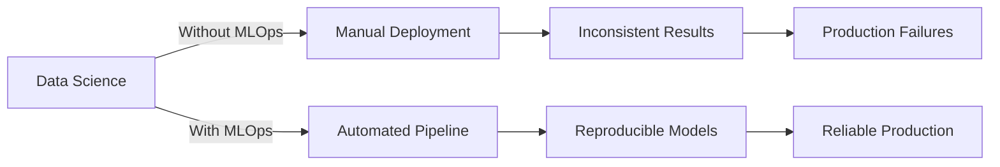
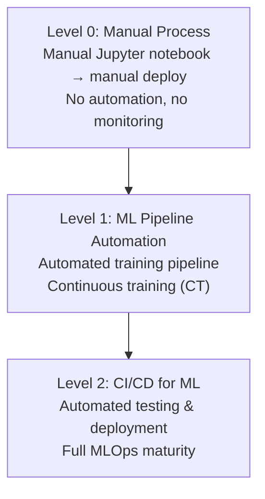
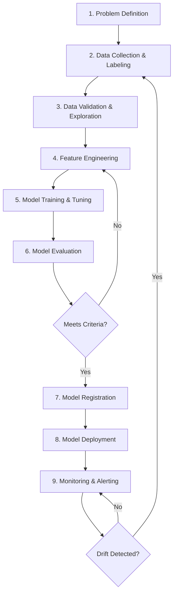
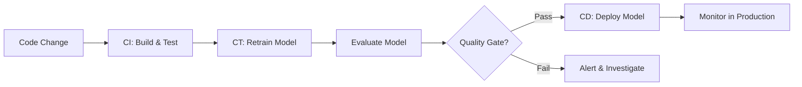

# MLOps (Machine Learning Operations)

## Overview

MLOps is a set of practices that combines Machine Learning, DevOps, and Data Engineering to deploy and maintain ML systems in production reliably and efficiently. It bridges the gap between model development and production deployment.

## Why MLOps?

**The gap:** ~85% of ML projects never make it to production. MLOps addresses this by providing the engineering practices needed to deploy, monitor, and maintain ML systems reliably.

## MLOps vs DevOps

| Aspect | DevOps | MLOps |
|--------|--------|-------|
| Artifact | Code | Code + Data + Model |
| Testing | Unit/integration tests | Data validation + model evaluation |
| Versioning | Git | Git + DVC (data) + MLflow (models) |
| Deployment | Build → Deploy | Train → Evaluate → Register → Deploy |
| Monitoring | CPU, memory, latency | + Data drift, model performance |
| Rollback | Code rollback | Model rollback + data rollback |
| Iteration | Feature releases | Model retraining cycles |

## MLOps Maturity Levels

| Level | Automation | Reproducibility | Monitoring | Typical Team |
|-------|-----------|----------------|------------|-------------|
| 0 | Manual | Low | None | Data scientists only |
| 1 | Training pipeline | Medium | Basic | DS + ML engineers |
| 2 | Full CI/CD/CT | High | Comprehensive | DS + MLE + Platform |

## ML Lifecycle

## Core Components

### 1. Data Management

| Component | Purpose | Tools |
|-----------|---------|-------|
| **Data Versioning** | Track changes to datasets | DVC, LakeFS, Delta Lake |
| **Data Validation** | Check schema, distributions, quality | Great Expectations, Pandera |
| **Data Pipeline** | Automate data ingestion/transformation | Airflow, Prefect, Dagster |
| **Feature Store** | Centralized feature management | Feast, Tecton, Hopsworks |

### 2. Model Training

| Component | Purpose | Tools |
|-----------|---------|-------|
| **Experiment Tracking** | Log params, metrics, artifacts | MLflow, W&B, Neptune |
| **Hyperparameter Tuning** | Search optimal config | Optuna, Ray Tune, SigOpt |
| **Training Orchestration** | Distributed training | Horovod, DeepSpeed, PyTorch DDP |
| **Model Registry** | Version and stage models | MLflow Registry, Vertex AI |

### 3. Model Deployment

| Pattern | Description | When to Use |
|---------|-------------|-------------|
| **Batch** | Run predictions on a schedule | Recommendations, reports |
| **Real-time** | Serve predictions via API | Fraud detection, search |
| **Streaming** | Process data in real-time | Event-driven systems |
| **Edge** | Run on device | Mobile, IoT |

### 4. Monitoring

| Category | What to Track | Tools |
|----------|--------------|-------|
| **Data Drift** | Input distribution changes | Evidently, Whylogs |
| **Model Performance** | Accuracy, latency, throughput | Prometheus, Grafana |
| **System Health** | CPU, memory, GPU utilization | Datadog, CloudWatch |
| **Business Metrics** | Revenue, conversion, engagement | Custom dashboards |

## CI/CD/CT for ML

| Pipeline | Trigger | What It Does |
|----------|---------|-------------|
| **CI** | Code commit | Run tests, lint, build containers |
| **CT** | Data change or schedule | Retrain model on new data |
| **CD** | Model passes quality gate | Deploy to staging → production |

## Popular MLOps Tools (2024-2025)

| Category | Tool | Strengths |
|----------|------|-----------|
| **Experiment Tracking** | MLflow | Open-source, widely adopted |
| | Weights & Biases | Beautiful UI, team collaboration |
| **Orchestration** | Airflow | Mature, large community |
| | Prefect | Modern Python, easy to use |
| | Dagster | Asset-centric, type-safe |
| **Feature Store** | Feast | Open-source, lightweight |
| | Tecton | Managed, real-time features |
| **Model Serving** | Triton | Multi-framework, GPU optimized |
| | vLLM | LLM-specific, fast inference |
| | BentoML | Easy packaging and deployment |
| **Monitoring** | Evidently | Open-source, drift detection |
| | Arize | Managed, production monitoring |
| **Platform** | Kubeflow | Kubernetes-native ML platform |
| | Vertex AI | GCP managed ML platform |
| | SageMaker | AWS managed ML platform |

## Key Design Decisions

### Model Registry Strategy

| Stage | Description | Access |
|-------|-------------|--------|
| **None/Development** | Experiment models | Data scientists |
| **Staging** | Passed offline eval, A/B test | Staging environment |
| **Production** | Serving live traffic | Production |
| **Archived** | Replaced by newer model | Read-only |

### Retraining Strategy

| Trigger | Description | Use Case |
|---------|-------------|----------|
| **Scheduled** | Retrain every N hours/days | Stable data distributions |
| **Performance-based** | Retrain when metrics drop | Dynamic environments |
| **Data-based** | Retrain when new labeled data arrives | Active learning setups |
| **Drift-based** | Retrain when drift detected | Non-stationary data |

## Common MLOps Anti-Patterns

| Anti-Pattern | Problem | Solution |
|-------------|---------|----------|
| Notebook-to-production | Untested, unversioned code | Package as modules, add tests |
| Training-serving skew | Different code in training/serving | Share feature pipelines |
| Data leakage | Future data in training | Point-in-time joins |
| No monitoring | Silent model degradation | Implement drift detection |
| Manual deployment | Human errors, slow | Automate with CI/CD |
| No versioning | Can't reproduce results | Version code, data, models |

## Interview Questions

1. **What is MLOps and why is it important?**
   MLOps applies DevOps principles to ML systems. It's important because ML systems have unique challenges: data dependencies, model drift, non-deterministic training, and complex reproducibility requirements. Without MLOps, most ML projects fail in production.

2. **How does MLOps differ from DevOps?**
   MLOps manages three artifacts (code, data, model) instead of just code. It requires data versioning, experiment tracking, model evaluation gates, drift monitoring, and retraining pipelines on top of standard CI/CD.

3. **What is training-serving skew and how do you prevent it?**
   When the feature computation logic differs between training and serving, causing models to see different data in production. Prevention: (1) Share feature computation code. (2) Use a feature store. (3) Validate features in both pipelines.

4. **How do you version ML models?**
   Track model artifacts (weights, config), training code version (git commit), data version (DVC hash), hyperparameters, and evaluation metrics. Store in a model registry with metadata linking all these together.

5. **Design an ML system that retrains automatically.**
   Scheduled or drift-triggered retraining → automated training pipeline → evaluation against production model → quality gate (must beat baseline) → canary deployment → monitoring → rollback if degraded.

## Common Mistakes

- Treating ML projects like software projects without considering data drift
- Not versioning data alongside code and models
- Skipping monitoring in production
- Manual deployment processes leading to human errors
- No quality gates before deployment

## Summary

MLOps is essential for moving ML from research to production. It ensures reproducibility, scalability, and reliability of ML systems through automation, monitoring, and best practices borrowed from DevOps and Data Engineering.

## References

- Sculley, D. et al. (2015). "Hidden Technical Debt in Machine Learning Systems" — Classic paper on ML system complexity
- Google. (2020). *MLOps: Continuous delivery and automation pipelines in machine learning* — MLOps whitepaper
- Kreuzberger, D. et al. (2022). "Machine Learning Operations (MLOps): Overview, Definition, and Architecture" — Comprehensive survey
- Huyen, C. (2022). *Designing Machine Learning Systems* (O'Reilly) — Best practical MLOps book
- ml-ops.org — MLOps community resources

## Cross-References

- [ML Pipelines](./pipelines.md)
- [Model Deployment](./deployment.md)
- [Monitoring](./monitoring.md)
- [Cloud Kubernetes](../../cloud/kubernetes/README.md)
- [CI/CD](../../cloud/cicd/README.md)
