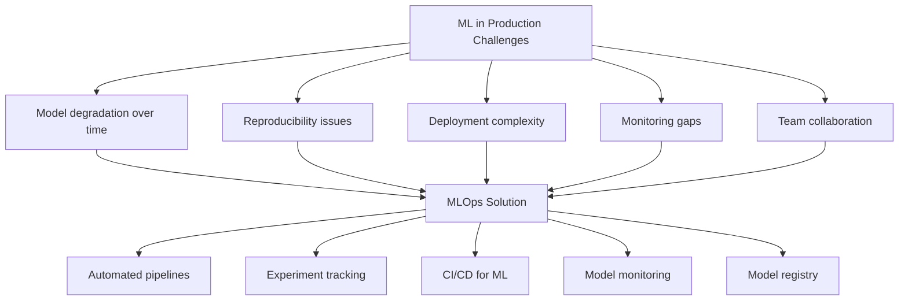
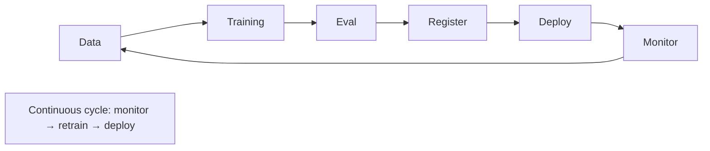
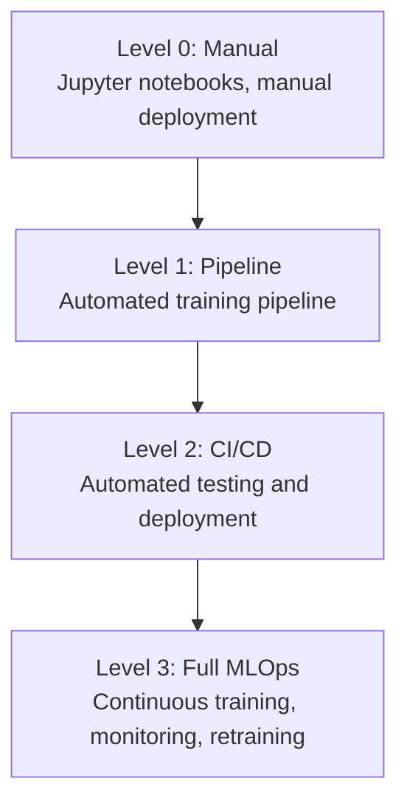
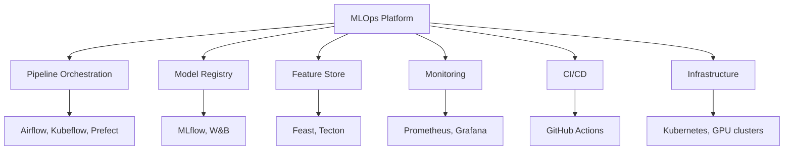

# MLOps Overview

## Overview

MLOps (Machine Learning Operations) is the practice of deploying, monitoring, and maintaining ML models in production reliably and efficiently. It combines DevOps principles with ML-specific challenges: data drift, model degradation, reproducibility, and experiment tracking. MLOps is what separates a Jupyter notebook prototype from a production ML system.

## Why MLOps?

## The MLOps Lifecycle

## MLOps Maturity Levels

| Level | Description | Tools | Automation |
|---|---|---|---|
| **Level 0** | Manual process | Jupyter, scripts | None |
| **Level 1** | ML pipeline automation | Airflow, Kubeflow | Training pipeline |
| **Level 2** | CI/CD for ML | GitHub Actions, Jenkins | Training + deployment |
| **Level 3** | Full automation | Custom platform | Retrain + deploy + monitor |

## Core Components

## Key Challenges

| Challenge | Description | Solution |
|---|---|---|
| **Data drift** | Input data changes over time | Monitoring, automated retraining |
| **Model degradation** | Performance drops | A/B testing, canary deployment |
| **Reproducibility** | Can't reproduce results | Versioning (data, code, model) |
| **Scalability** | Handle more requests | Auto-scaling, batching |
| **Cost** | GPU expenses | Spot instances, quantization |
| **Collaboration** | Team coordination | Experiment tracking, model registry |

## Interview Questions

### Q1: What is MLOps and why is it important?
**Answer:** MLOps applies DevOps principles to ML systems. It's important because:
1. Models degrade over time (data drift, concept drift)
2. ML systems have more components than software (data, model, serving)
3. Reproducibility requires versioning data, code, and models
4. Deployment is complex (GPU infrastructure, model optimization)
5. Monitoring is specialized (model performance, data quality)

Without MLOps, models stay in notebooks and never reach production reliably.

### Q2: What are the key components of an MLOps platform?
**Answer:**
1. **Pipeline orchestration**: Automate training workflows (Airflow, Kubeflow)
2. **Experiment tracking**: Log metrics, params, artifacts (MLflow, W&B)
3. **Model registry**: Version and manage models (MLflow)
4. **Feature store**: Serve features consistently (Feast)
5. **CI/CD**: Test and deploy models automatically
6. **Monitoring**: Track model performance and data quality
7. **Infrastructure**: GPU clusters, scheduling, cost management

### Q3: How does ML CI/CD differ from traditional CI/CD?
**Answer:**
- **Data testing**: Validate data quality, schema, distributions
- **Model testing**: Evaluate on holdout sets, check for regression
- **A/B testing**: Compare new model vs current in production
- **Canary deployment**: Gradual rollout with monitoring
- **Automated retraining**: Trigger on data drift or performance degradation
- **Artifact versioning**: Track data, model, and code together

## Common Mistakes

- ❌ Skipping MLOps for "simple" models (they still degrade)
- ❌ Over-engineering (don't need Level 3 for every project)
- ❌ Not versioning data (can't reproduce results)
- ❌ No monitoring (silent model failures)
- ❌ Ignoring cost optimization (GPU bills add up fast)

## Summary

MLOps applies DevOps principles to ML systems, addressing data drift, reproducibility, deployment, and monitoring. Key components: pipeline orchestration, model registry, feature store, monitoring, and CI/CD. Maturity ranges from manual (Level 0) to fully automated (Level 3).

## Cross-References

- [Pipelines →](pipelines.md) Training automation
- [Model Registry →](model-registry.md) Model management
- [Monitoring →](monitoring.md) Production monitoring
- [CI/CD →](cicd.md) Automated deployment
- [Infrastructure →](infrastructure.md) GPU clusters
