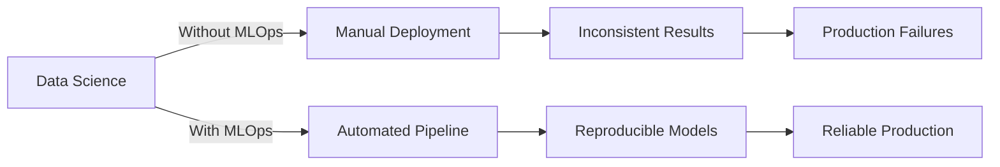
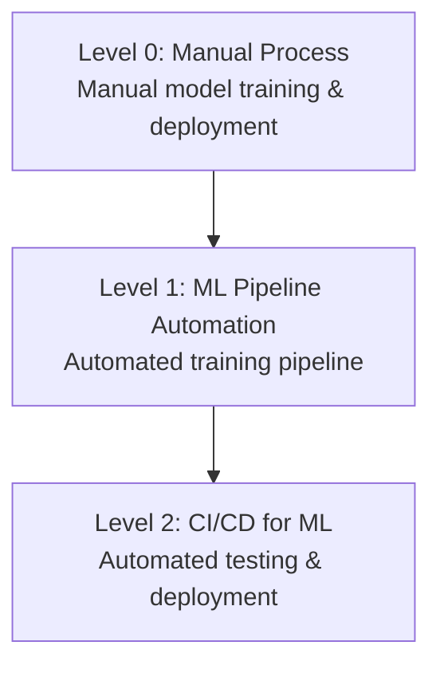

# MLOps (Machine Learning Operations)

## Overview

MLOps is a set of practices that combines Machine Learning, DevOps, and Data Engineering to deploy and maintain ML systems in production reliably and efficiently. It bridges the gap between model development and production deployment.

## Why MLOps?

## MLOps Maturity Levels

## Core Components

| Component | Purpose |
|-----------|---------|
| Pipelines | Automate training workflows |
| Model Registry | Version and track models |
| Feature Store | Manage feature engineering |
| Monitoring | Track model performance |
| CI/CD | Automate build, test, deploy |

## Interview Questions

1. **What is MLOps and why is it important?**
2. **How does MLOps differ from DevOps?**
3. **What are the key components of an MLOps pipeline?**
4. **How do you handle model versioning?**

## Common Mistakes

- Treating ML projects like software projects without considering data drift
- Not versioning data alongside code and models
- Skipping monitoring in production
- Manual deployment processes leading to human errors

## Summary

MLOps is essential for moving ML from research to production. It ensures reproducibility, scalability, and reliability of ML systems through automation, monitoring, and best practices borrowed from DevOps and Data Engineering.

## Cross-References

- [ML Pipelines](./pipelines.md)
- [Model Deployment](./deployment.md)
- [Monitoring](./monitoring.md)
- [Cloud Kubernetes](../../cloud/kubernetes/README.md)
- [CI/CD](../../cloud/cicd/README.md)

