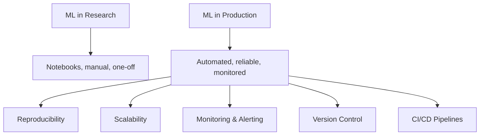
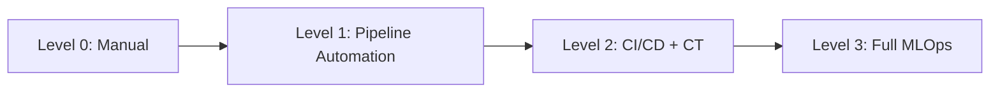
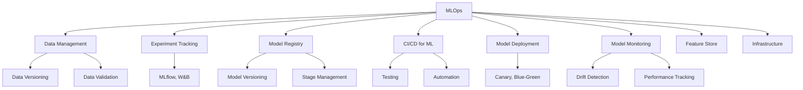

# MLOps

## Overview

MLOps (Machine Learning Operations) is the practice of deploying, monitoring, and maintaining ML models in production reliably and efficiently. It bridges the gap between ML experimentation and production-grade systems, applying DevOps principles to machine learning. MLOps encompasses the entire ML lifecycle: data management, model training, deployment, monitoring, and governance.

## Why MLOps Matters

### The Production Gap

| Aspect | Research | Production |
|--------|----------|------------|
| Data | Static, clean | Streaming, dirty |
| Environment | Jupyter notebook | Container, Kubernetes |
| Scale | Single GPU | Distributed clusters |
| Monitoring | Manual checks | Automated alerts |
| Updates | Ad-hoc | CI/CD pipeline |
| Versioning | Git (sometimes) | Model registry + data versioning |

## MLOps Maturity Levels

| Level | Description | Tools |
|-------|-------------|-------|
| 0 | Manual training and deployment | Notebooks, scripts |
| 1 | Automated training pipelines | Airflow, Kubeflow Pipelines |
| 2 | CI/CD for models, continuous training | GitHub Actions + MLflow |
| 3 | Full monitoring, auto-retraining, governance | Vertex AI, SageMaker |

## Key Components

## Interview Questions

1. **What is MLOps and why is it important?** — MLOps applies DevOps principles to ML systems, ensuring models can be reliably deployed, monitored, and maintained in production. It addresses the gap between research experimentation and production reliability.

2. **What are the key differences between DevOps and MLOps?** — MLOps adds data versioning, experiment tracking, model registry, data drift monitoring, and retraining pipelines on top of standard DevOps practices.

3. **Describe the ML lifecycle** — Data collection → Feature engineering → Model training → Evaluation → Deployment → Monitoring → Retraining. MLOps automates and monitors each stage.

4. **What is a feature store and why use one?** — A centralized repository for feature definitions and values, ensuring consistency between training and serving, enabling feature reuse, and providing point-in-time correctness.

5. **How do you detect model degradation in production?** — Monitor prediction distributions, data drift (PSI, KS test), performance metrics (if ground truth available), and business KPIs. Alert on significant deviations.

## Summary

MLOps is essential for taking ML models from research to production. It encompasses data management, experiment tracking, model deployment, monitoring, and infrastructure automation. The maturity levels range from manual processes to fully automated pipelines with continuous training and monitoring.

## Cross-References

- [ML Overview](../overview.md) — ML fundamentals
- [Model Serving](../system-design/model-serving.md) — Serving architecture
- [ML Monitoring](../system-design/monitoring.md) — Monitoring in system design
- [Docker](../../os/containers/docker.md) — Containerization
- [Kubernetes](../../os/containers/kubernetes.md) — Orchestration
