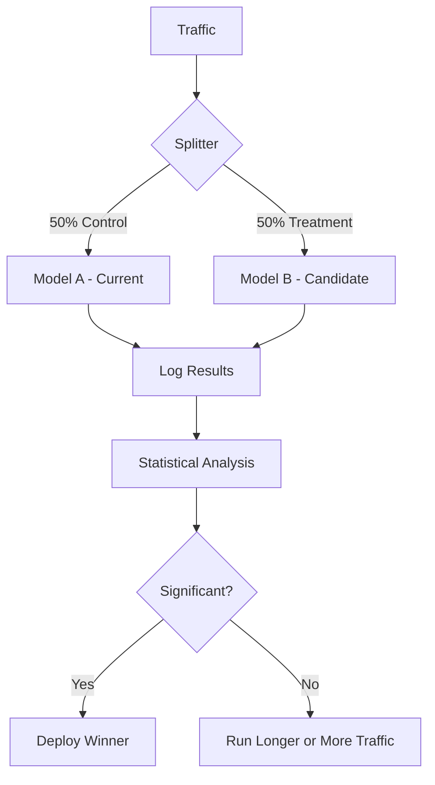
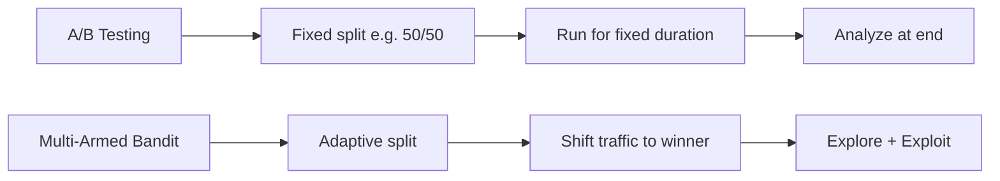

# A/B Testing for ML

## Overview

A/B testing in ML compares two model versions — the current production model (control) and a candidate model (treatment) — by serving each to a subset of users and measuring which performs better on business metrics. Unlike offline evaluation (test sets), A/B testing captures real-world behavior including user interactions, latency effects, and business impact.

## A/B Testing Flow



## Key Components

### 1. Traffic Splitting

```python
import hashlib

def assign_variant(user_id, experiment_id, variants=['control', 'treatment']):
    """Deterministic user assignment"""
    hash_input = f"{user_id}:{experiment_id}"
    hash_value = int(hashlib.md5(hash_input.encode()).hexdigest(), 16)
    return variants[hash_value % len(variants)]
```

### 2. Sample Size Calculation

```python
from scipy.stats import norm

def required_sample_size(baseline_rate, mde, alpha=0.05, power=0.8):
    """Calculate required sample size per variant"""
    # mde: minimum detectable effect (relative change)
    p1 = baseline_rate
    p2 = baseline_rate * (1 + mde)

    z_alpha = norm.ppf(1 - alpha / 2)
    z_beta = norm.ppf(power)

    # Standard two-proportion z-test sample-size formula (pooled variance for z_alpha)
    p_bar = (p1 + p2) / 2
    n = ((z_alpha * np.sqrt(2 * p_bar * (1 - p_bar)) +
          z_beta * np.sqrt(p1 * (1 - p1) + p2 * (1 - p2))) ** 2) / (p1 - p2) ** 2
    return int(np.ceil(n))

# Example: 5% baseline conversion, want to detect 10% relative lift
n = required_sample_size(0.05, 0.10)
print(f"Need {n} users per variant")
```

### 3. Statistical Significance

```python
from scipy.stats import ttest_ind, chi2_contingency

def ab_test_continuous(control_metric, treatment_metric, alpha=0.05):
    """T-test for continuous metrics (revenue, latency)"""
    stat, p_value = ttest_ind(treatment_metric, control_metric)
    lift = (treatment_metric.mean() - control_metric.mean()) / control_metric.mean()
    return {
        'p_value': p_value,
        'significant': p_value < alpha,
        'lift': lift
    }

def ab_test_proportion(control_success, control_total,
                       treatment_success, treatment_total, alpha=0.05):
    """Chi-squared test for proportions (conversion rate)"""
    contingency = [
        [control_success, control_total - control_success],
        [treatment_success, treatment_total - treatment_success]
    ]
    stat, p_value, _, _ = chi2_contingency(contingency)
    control_rate = control_success / control_total
    treatment_rate = treatment_success / treatment_total
    lift = (treatment_rate - control_rate) / control_rate
    return {'p_value': p_value, 'significant': p_value < alpha, 'lift': lift}
```

## ML-Specific Considerations

### Online vs Offline Metrics

| Offline Metric | Online Metric |
|---------------|---------------|
| AUC-ROC | Click-through rate |
| F1 Score | Revenue per user |
| Log Loss | User engagement |
| BLEU Score | User satisfaction |

Offline metrics don't always correlate with online business metrics — that's why A/B testing is essential.

### Multi-Armed Bandit vs A/B Testing



```python
# Epsilon-greedy bandit
class EpsilonGreedyBandit:
    def __init__(self, n_arms, epsilon=0.1):
        self.epsilon = epsilon
        self.counts = np.zeros(n_arms)
        self.values = np.zeros(n_arms)

    def select_arm(self):
        if np.random.random() < self.epsilon:
            return np.random.randint(len(self.counts))
        return np.argmax(self.values)

    def update(self, arm, reward):
        self.counts[arm] += 1
        n = self.counts[arm]
        self.values[arm] = ((n - 1) / n) * self.values[arm] + (1 / n) * reward
```

## Common Pitfalls

| Pitfall | Description | Solution |
|---------|-------------|----------|
| Peeking | Checking results too early | Pre-commit to sample size |
| Simpson's Paradox | Aggregated results mislead | Segment analysis |
| Network Effects | Users in different groups interact | Cluster randomization |
| Novelty Effect | Users react to change, then revert | Run long enough |
| Metric Sensitivity | Too many metrics inflate false positives | Bonferroni correction |

## Interview Questions

1. **Why A/B test ML models instead of just using offline metrics?** — Offline metrics (AUC, F1) don't capture real-world effects like latency, user behavior changes, and business impact. A/B testing measures actual user outcomes.

2. **How do you determine sample size for an A/B test?** — Based on baseline metric, minimum detectable effect (MDE), significance level (α=0.05), and statistical power (β=0.8). Larger effects need smaller samples.

3. **What is the multi-armed bandit approach?** — An adaptive allocation strategy that shifts traffic toward the better-performing variant over time. It minimizes regret (lost conversions) but provides less clean statistical analysis.

4. **How do you handle multiple model changes simultaneously?** — Use factorial design (A/B/C/D combinations) or MAB. Be careful of interaction effects and inflate false discovery rate.

5. **When should you stop an A/B test?** — Pre-commit to a sample size. Stop when you reach it and the result is statistically significant, or when the result is clearly non-significant (futility analysis).

## Summary

A/B testing is the gold standard for evaluating ML models in production. It measures real-world business impact that offline metrics cannot capture. Key components include traffic splitting, sample size calculation, statistical testing, and proper experiment design. Multi-armed bandits offer a more adaptive alternative when minimizing regret is important.

## Cross-References

- [A/B Testing (System Design)](../system-design/ab-testing.md) — System design perspective
- [Evaluation Metrics](../foundations/evaluation.md) — Offline metrics
- [Model Monitoring](./monitoring.md) — Performance tracking
- [Canary Deployment](./canary.md) — Safe rollout strategy
- [ML System Design](../system-design/README.md) — System design overview
