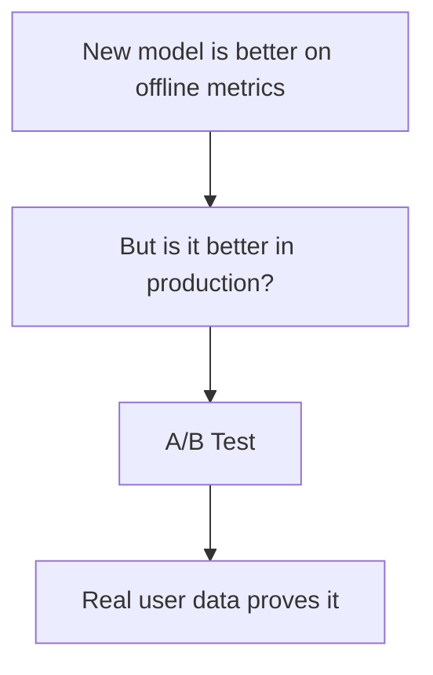
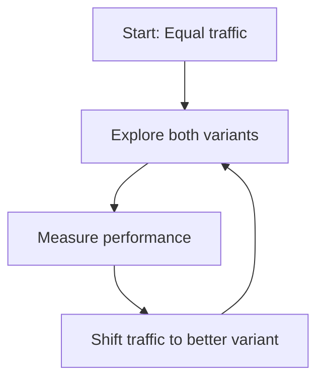

# A/B Testing for ML

## Overview

A/B testing for ML compares two model versions by splitting production traffic between them and measuring which performs better on key metrics. It's the gold standard for evaluating whether a new model is actually better than the current one before fully deploying it.

## Why A/B Testing?



Offline metrics (test set accuracy) don't always translate to production improvements. A/B testing measures real-world impact.

## A/B Test Architecture

```mermaid
graph TD
    TRAFFIC[Production Traffic] --> SPLIT[Traffic Splitter]
    SPLIT -->|50%| MODEL_A[Model A (Control)]
    SPLIT -->|50%| MODEL_B[Model B (Treatment)]
    MODEL_A --> METRICS[Collect Metrics]
    MODEL_B --> METRICS
    METRICS --> ANALYSIS[Statistical Analysis]
    ANALYSIS --> DECISION{Significant?}
    DECISION -->|Yes| WINNER[Deploy Winner]
    DECISION -->|No| CONTINUE[Continue Testing]
```

## Traffic Splitting

### Random Assignment

```python
import hashlib

def assign_variant(user_id, variants=["control", "treatment"]):
    """Deterministically assign user to variant."""
    hash_val = hashlib.md5(user_id.encode()).hexdigest()
    bucket = int(hash_val[:8], 16) % 100
    
    if bucket < 50:
        return variants[0]  # control
    else:
        return variants[1]  # treatment
```

### Sticky Sessions

Users stay in the same variant for the entire experiment:

```python
class ABTestRouter:
    def __init__(self):
        self.assignments = {}
    
    def get_model(self, user_id, experiment_id):
        key = f"{user_id}:{experiment_id}"
        
        if key not in self.assignments:
            self.assignments[key] = self.assign_variant(user_id)
        
        return self.assignments[key]
```

## Statistical Significance

### Hypothesis Testing

```
H₀: Model B is not better than Model A (null hypothesis)
H₁: Model B is better than Model A (alternative hypothesis)
```

### Sample Size Calculation

```python
from scipy import stats

def required_sample_size(baseline_rate, min_detectable_effect, alpha=0.05, power=0.8):
    """Calculate required sample size per variant."""
    p1 = baseline_rate
    p2 = baseline_rate * (1 + min_detectable_effect)
    
    z_alpha = stats.norm.ppf(1 - alpha / 2)
    z_beta = stats.norm.ppf(power)
    
    n = ((z_alpha + z_beta) ** 2 * (p1 * (1 - p1) + p2 * (1 - p2))) / (p2 - p1) ** 2
    return int(np.ceil(n))

# Example: 5% baseline rate, detect 10% relative improvement
n = required_sample_size(0.05, 0.10)  # ~16,000 per variant
```

### Significance Testing

```python
from scipy import stats

def ab_test_significance(control_successes, control_total, 
                         treatment_successes, treatment_total):
    """Two-proportion z-test for A/B test."""
    p1 = control_successes / control_total
    p2 = treatment_successes / treatment_total
    
    p_pool = (control_successes + treatment_successes) / (control_total + treatment_total)
    
    se = np.sqrt(p_pool * (1 - p_pool) * (1/control_total + 1/treatment_total))
    z = (p2 - p1) / se
    p_value = 1 - stats.norm.cdf(z)  # One-sided test
    
    return {
        "control_rate": p1,
        "treatment_rate": p2,
        "lift": (p2 - p1) / p1,
        "p_value": p_value,
        "significant": p_value < 0.05
    }
```

## ML-Specific A/B Metrics

| Metric | Description | When to Use |
|---|---|---|
| **Click-through rate** | Users click on recommendations | Recommendation models |
| **Conversion rate** | Users complete desired action | Classification models |
| **Engagement time** | Time spent on content | Content models |
| **Revenue** | Direct revenue impact | All models |
| **User satisfaction** | Ratings, feedback | Any user-facing model |
| **Latency** | Response time | Any model |

## Multi-Armed Bandit

Alternative to A/B testing that adapts traffic allocation:



```python
class EpsilonGreedyBandit:
    def __init__(self, epsilon=0.1):
        self.epsilon = epsilon
        self.rewards = {}
        self.counts = {}
    
    def select_variant(self, variants):
        if np.random.random() < self.epsilon:
            return np.random.choice(variants)  # Explore
        else:
            # Exploit: pick best
            return max(variants, key=lambda v: 
                      self.rewards.get(v, 0) / max(self.counts.get(v, 1), 1))
    
    def update(self, variant, reward):
        self.rewards[variant] = self.rewards.get(variant, 0) + reward
        self.counts[variant] = self.counts.get(variant, 0) + 1
```

## Interview Questions

### Q1: How do you A/B test a new ML model?
**Answer:**
1. **Define metrics**: What determines "better"? (CTR, conversion, revenue)
2. **Calculate sample size**: Based on baseline rate and minimum detectable effect
3. **Split traffic**: Randomly assign users to control/treatment (sticky sessions)
4. **Run experiment**: Sufficient duration (typically 1-2 weeks)
5. **Analyze results**: Statistical significance test (p-value < 0.05)
6. **Deploy winner**: If treatment is significantly better, roll out to all traffic

### Q2: How is ML A/B testing different from regular A/B testing?
**Answer:**
- **Delayed feedback**: Model predictions may take days/weeks to get ground truth
- **Non-stationarity**: User behavior changes, affecting both variants
- **Metric complexity**: Model quality is harder to measure than UI changes
- **Cold start**: New users have no history for personalized models
- **Interference**: One variant's learning can affect the other (in recommendation)

### Q3: What is the difference between A/B testing and multi-armed bandits?
**Answer:**
- **A/B testing**: Fixed traffic split, run until significant, then deploy winner. Explores equally throughout.
- **Bandits**: Adaptive traffic allocation. More traffic goes to the better variant over time. Exploits good variants while still exploring.
- A/B testing is better for statistical rigor. Bandits minimize regret (lost conversions) during the experiment.
- Use A/B for important decisions. Use bandits for continuous optimization.

## Common Mistakes

- ❌ Stopping the test too early (not enough data)
- ❌ Peeking at results before the experiment ends (false significance)
- ❌ Not using sticky sessions (users see different models)
- ❌ Running too many tests simultaneously (interference)
- ❌ Not accounting for novelty effects (users react differently to new things)

## Summary

A/B testing compares model versions with real production traffic. Key steps: define metrics, calculate sample size, split traffic, run experiment, analyze significance. Multi-armed bandits offer adaptive allocation. Statistical rigor is essential — don't stop early or peek at results.

## Cross-References

- [Monitoring →](monitoring.md) Tracking metrics during A/B tests
- [Canary →](canary.md) Gradual rollout alternative
- [Deployment →](deployment.md) Deployment patterns
