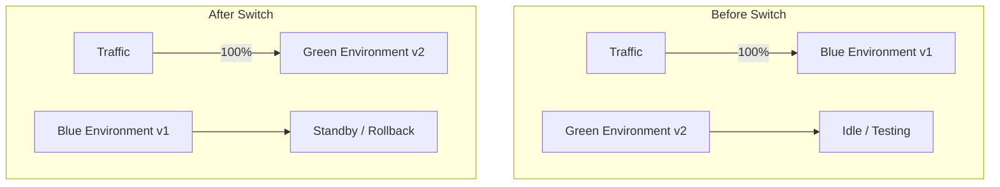

# Blue-Green Deployment

## Overview

Blue-green deployment maintains two identical production environments — **blue** (current) and **green** (new). Traffic is routed to one environment at a time. When the new model is ready, traffic is instantly switched from blue to green. If issues arise, traffic is instantly switched back. This provides zero-downtime deployment with instant rollback.

## How Blue-Green Works



## Implementation

### Load Balancer Configuration

```nginx
# Nginx upstream configuration
upstream model_serving {
    # Blue environment (active)
    server blue-model-server:8080 weight=100;
    # Green environment (standby)
    server green-model-server:8080 weight=0;
}
```

### Switch Script

```python
class BlueGreenDeployer:
    def __init__(self):
        self.active = "blue"
        self.environments = {
            "blue": {"version": "v1", "status": "active"},
            "green": {"version": "v2", "status": "standby"}
        }

    def switch(self):
        """Switch traffic from active to standby environment"""
        old_env = self.active
        new_env = "green" if old_env == "blue" else "blue"

        # Verify new environment is healthy
        if not self.health_check(new_env):
            raise Exception(f"{new_env} environment is not healthy")

        # Update load balancer
        self.update_routing(new_env)
        self.active = new_env
        self.environments[new_env]["status"] = "active"
        self.environments[old_env]["status"] = "standby"

        return f"Switched from {old_env} to {new_env}"

    def rollback(self):
        """Instant rollback to previous environment"""
        return self.switch()  # Switching again goes back

    def health_check(self, env):
        """Verify environment is ready"""
        # Check model loads, API responds, latency OK
        return True

    def update_routing(self, target_env):
        """Update load balancer / ingress"""
        # Kubernetes service selector update
        pass
```

### Kubernetes Implementation

```yaml
# Blue deployment
apiVersion: apps/v1
kind: Deployment
metadata:
  name: model-serving-blue
  labels:
    app: model-serving
    version: blue
spec:
  replicas: 3
  selector:
    matchLabels:
      app: model-serving
      version: blue
  template:
    metadata:
      labels:
        app: model-serving
        version: blue
    spec:
      containers:
      - name: model
        image: model-server:v1
        ports:
        - containerPort: 8080

---
# Green deployment
apiVersion: apps/v1
kind: Deployment
metadata:
  name: model-serving-green
  labels:
    app: model-serving
    version: green
spec:
  replicas: 3
  selector:
    matchLabels:
      app: model-serving
      version: green
  template:
    metadata:
      labels:
        app: model-serving
        version: green
    spec:
      containers:
      - name: model
        image: model-server:v2
        ports:
        - containerPort: 8080

---
# Service (switch by changing selector)
apiVersion: v1
kind: Service
metadata:
  name: model-serving
spec:
  selector:
    app: model-serving
    version: blue  # Change to "green" for switch
  ports:
  - port: 80
    targetPort: 8080
```

## Pros and Cons

| Pros | Cons |
|------|------|
| Zero downtime | 2x infrastructure cost |
| Instant rollback | Complex state management |
| Simple mental model | Database migrations tricky |
| Easy to test new version | Requires identical environments |

## Interview Questions

1. **What is blue-green deployment?** — Maintaining two identical environments, switching all traffic instantly from one to the other. Provides zero-downtime deployment with instant rollback.

2. **Blue-green vs canary?** — Blue-green: instant switch, instant rollback, 2x cost. Canary: gradual rollout, gradual rollback, lower cost. Blue-green is safer for instant rollback; canary is cheaper for gradual validation.

3. **How do you handle database migrations?** — The hardest part. Options: backward-compatible migrations, separate database per environment, or migration scripts that work with both versions.

4. **When would you choose blue-green over canary?** — When instant rollback is critical (high-stakes systems), when you need zero-downtime, and when infrastructure cost is not a constraint.

5. **How do you verify the green environment before switching?** — Run smoke tests, integration tests, and health checks against the green environment. Some teams run shadow traffic through it first.

## Summary

Blue-green deployment provides instant, zero-downtime model deployment with instant rollback capability. By maintaining two identical environments, it eliminates deployment risk. The main trade-off is 2x infrastructure cost and complexity in handling stateful components like databases.

## Cross-References

- [Deployment Patterns](./deployment.md) — Overview of strategies
- [Canary Deployment](./canary.md) — Gradual alternative
- [Shadow Deployment](./shadow.md) — Zero-impact testing
- [Infrastructure](./infrastructure.md) — Compute resources
- [Kubernetes](../../os/containers/kubernetes.md) — Orchestration
