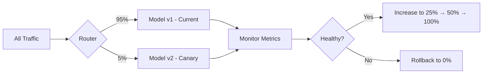

# Canary Deployment

## Overview

Canary deployment gradually rolls out a new model version to a small subset of users before full deployment. Named after the "canary in a coal mine" practice, it exposes the new model to real traffic while limiting blast radius. If metrics degrade, the rollout is stopped and traffic returns to the old model.

## How Canary Works



## Canary Stages

```python
canary_stages = [
    {"traffic_percent": 5, "duration_hours": 2, "metrics": ["latency", "error_rate"]},
    {"traffic_percent": 25, "duration_hours": 4, "metrics": ["latency", "error_rate", "accuracy"]},
    {"traffic_percent": 50, "duration_hours": 24, "metrics": ["latency", "error_rate", "accuracy", "business_kpi"]},
    {"traffic_percent": 100, "duration_hours": 0, "metrics": []},  # Full rollout
]
```

## Implementation

```python
class CanaryDeployer:
    def __init__(self, stages):
        self.stages = stages
        self.current_stage = 0

    def get_traffic_split(self):
        if self.current_stage >= len(self.stages):
            return {"canary": 100, "baseline": 0}
        canary_pct = self.stages[self.current_stage]["traffic_percent"]
        return {"canary": canary_pct, "baseline": 100 - canary_pct}

    def evaluate_stage(self, canary_metrics, baseline_metrics):
        """Check if canary passes current stage criteria"""
        for metric in self.stages[self.current_stage]["metrics"]:
            # Canary should not be worse than baseline by more than threshold
            if metric in canary_metrics and metric in baseline_metrics:
                degradation = (baseline_metrics[metric] - canary_metrics[metric]) / baseline_metrics[metric]
                if degradation > 0.05:  # 5% degradation threshold
                    return False, f"{metric} degraded by {degradation:.1%}"
        return True, "All checks passed"

    def advance_stage(self):
        self.current_stage += 1
        if self.current_stage >= len(self.stages):
            return "Fully deployed"
        return f"Advanced to {self.stages[self.current_stage]['traffic_percent']}%"
```

## Kubernetes Canary with Istio

```yaml
apiVersion: networking.istio.io/v1alpha3
kind: VirtualService
metadata:
  name: model-serving
spec:
  hosts:
  - model-serving
  http:
  - route:
    - destination:
        host: model-serving
        subset: stable
      weight: 95
    - destination:
        host: model-serving
        subset: canary
      weight: 5
---
apiVersion: networking.istio.io/v1alpha3
kind: DestinationRule
metadata:
  name: model-serving
spec:
  host: model-serving
  subsets:
  - name: stable
    labels:
      version: v1
  - name: canary
    labels:
      version: v2
```

## Metrics to Monitor

| Metric | Threshold | Action |
|--------|-----------|--------|
| Error rate | > 1% increase | Rollback |
| Latency p99 | > 20% increase | Rollback |
| Prediction distribution | PSI > 0.25 | Investigate |
| Business KPI | > 2% decrease | Rollback |

## Interview Questions

1. **What is canary deployment?** — Gradually routing a small percentage of traffic to the new model, monitoring for issues, and incrementally increasing traffic if healthy. Limits blast radius of bad deployments.

2. **How do you determine canary traffic percentages?** — Start small (1-5%) for early detection, increase gradually (25%, 50%, 100%). Each stage has monitoring criteria that must pass before advancing.

3. **What happens if the canary fails?** — Immediately route all traffic back to the stable version. Alert the team. Investigate the issue before attempting another deployment.

4. **Canary vs A/B testing?** — Canary focuses on safety (is the new model broken?). A/B focuses on effectiveness (is the new model better?). Canary uses technical metrics; A/B uses business metrics.

5. **How do you implement canary deployment?** — Use service mesh (Istio) for traffic splitting, or application-level routing. Monitor canary metrics against baseline and automate rollback.

## Summary

Canary deployment provides a safe, gradual rollout strategy for ML models. By starting with a small traffic percentage and monitoring key metrics, teams can detect issues before full deployment. Automated rollback on metric degradation ensures production stability.

## Cross-References

- [Deployment Patterns](./deployment.md) — Overview of strategies
- [Shadow Deployment](./shadow.md) — Zero-impact testing
- [Blue-Green Deployment](./blue-green.md) — Instant switch
- [A/B Testing](./ab-testing.md) — Statistical comparison
- [Monitoring](./monitoring.md) — What to monitor
