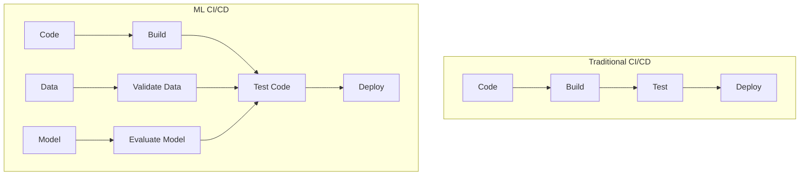
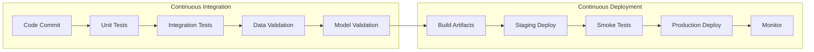
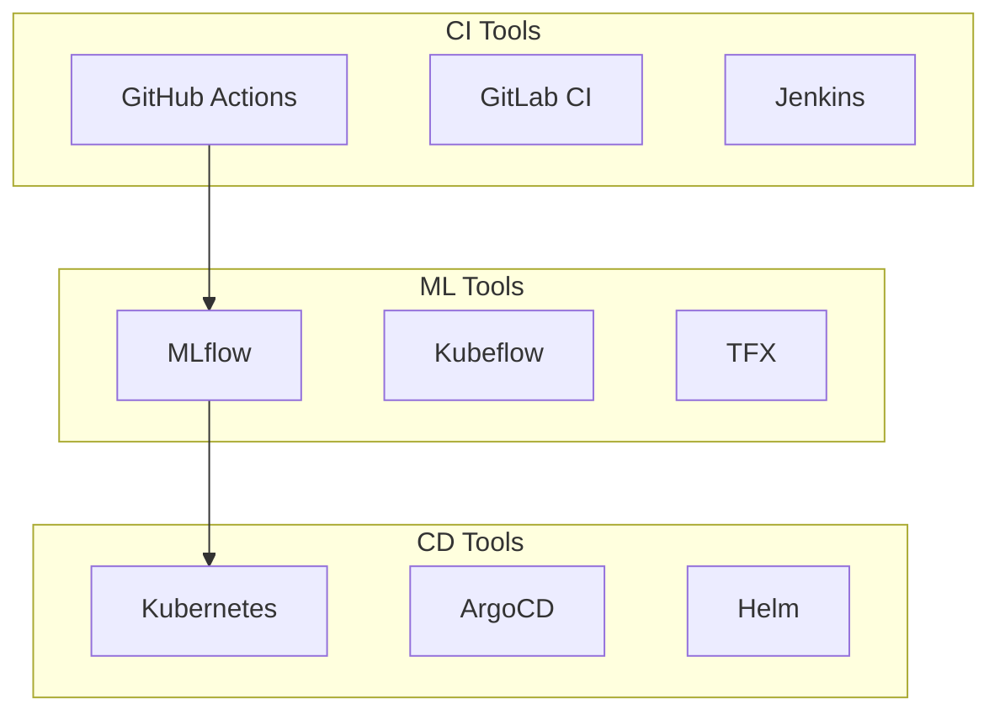

# CI/CD for ML

## Overview

CI/CD for ML (Continuous Integration/Continuous Deployment) extends traditional software CI/CD to handle ML-specific artifacts: data, models, and training pipelines. It automates testing, validation, and deployment of ML systems.

## ML CI/CD vs Traditional CI/CD



## CI/CD Pipeline for ML



## What to Test

### 1. Code Tests
- Unit tests for feature engineering
- Integration tests for pipeline steps
- Linting and type checking

### 2. Data Tests
```python
# Great Expectations example
validator.expect_column_values_to_not_be_null("feature_1")
validator.expect_column_mean_to_be_between("age", 25, 45)
validator.expect_table_row_count_to_be_between(1000, 1000000)
```

### 3. Model Tests
- Performance must exceed baseline
- Latency within SLA
- Bias/fairness checks pass
- Model size within limits

### 4. Infrastructure Tests
- Container builds successfully
- Dependencies resolved
- Resource limits appropriate

## Deployment Strategies

| Strategy | Risk | Rollback Speed | Use Case |
|----------|------|----------------|----------|
| Blue-Green | Low | Instant | Critical systems |
| Canary | Low | Fast | Large traffic |
| Shadow | None | N/A | New model validation |
| A/B Testing | Low | Fast | Experimentation |

## Tools



## Interview Questions

1. **How does ML CI/CD differ from traditional CI/CD?**
2. **What tests should be included in an ML CI/CD pipeline?**
3. **How do you handle model validation in CI/CD?**
4. **Explain a blue-green deployment for ML models.**
5. **How do you roll back a bad model deployment?**

## Common Mistakes

- **Testing only code, not data**: Data validation is as important as code tests
- **No performance regression tests**: New model might be slower even if more accurate
- **Manual deployment**: Human error is the #1 cause of production issues
- **No rollback plan**: Always have a way to revert to the previous model

## Summary

ML CI/CD automates the entire lifecycle from code commit to production deployment. It requires testing not just code, but also data quality and model performance. Key components include automated testing, model validation, deployment strategies (blue-green, canary), and monitoring. Tools like GitHub Actions + MLflow + Kubernetes form a common stack.

## Cross-References

- [Cloud CI/CD](../../cloud/cicd/pipelines.md)
- [GitOps](../../cloud/cicd/gitops.md)
- [ML Pipelines](./pipelines.md)
- [Model Registry](./model-registry.md)
- [Deployment Strategies](./deployment.md)
