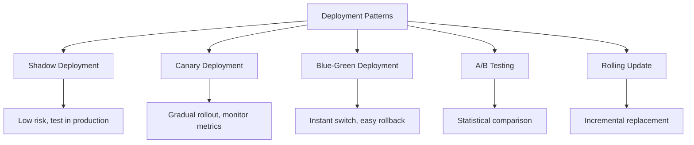

# Model Deployment Patterns

## Overview

Model deployment is the process of making trained ML models available for inference in production. Unlike deploying a web service, ML model deployment must handle model artifacts, feature pipelines, latency requirements, and safe rollout strategies. The choice of deployment pattern depends on risk tolerance, traffic volume, and rollback requirements.

## Deployment Strategies



## Serving Architectures

### 1. Online Serving (Real-time)


```python
# FastAPI model server
from fastapi import FastAPI
import joblib

app = FastAPI()
model = joblib.load("model.pkl")

@app.post("/predict")
async def predict(features: dict):
    import pandas as pd
    X = pd.DataFrame([features])
    prediction = model.predict(X)
    return {"prediction": prediction.tolist()}
```

### 2. Batch Serving

```python
# Batch prediction job
def batch_predict(model_path, input_path, output_path):
    model = load_model(model_path)
    data = pd.read_parquet(input_path)
    predictions = model.predict(data)
    data['prediction'] = predictions
    data.to_parquet(output_path)
```

### 3. Streaming Serving

```python
# Kafka-based streaming inference
from kafka import KafkaConsumer, KafkaProducer

consumer = KafkaConsumer('input-topic', bootstrap_servers='localhost:9092')
producer = KafkaProducer(bootstrap_servers='localhost:9092')

for message in consumer:
    data = json.loads(message.value)
    prediction = model.predict(data['features'])
    producer.send('output-topic', json.dumps({
        'id': data['id'],
        'prediction': prediction
    }).encode())
```

## Model Serialization Formats

| Format | Framework | Pros | Cons |
|--------|-----------|------|------|
| Pickle/Joblib | Sklearn | Simple | Python-only, security risk |
| ONNX | Cross-framework | Universal, optimized | Conversion can be lossy |
| SavedModel | TensorFlow | Full TF support | TF-only |
| TorchScript | PyTorch | C++ inference | PyTorch-only |
| PMML | XML standard | Legacy compatible | Limited model support |

## Model Optimization for Deployment

```python
# ONNX conversion for faster inference
import onnxruntime as ort
from skl2onnx import convert_sklearn

# Convert
onnx_model = convert_sklearn(model, initial_types=initial_type)
session = ort.InferenceSession("model.onnx")

# Quantization
from onnxruntime.quantization import quantize_dynamic
quantize_dynamic("model.onnx", "model_quant.onnx")
```

## Interview Questions

1. **What are the key considerations for model deployment?** — Latency requirements, throughput, model size, update frequency, rollback strategy, monitoring, and feature pipeline integration.

2. **What is the difference between online and batch serving?** — Online: real-time inference (milliseconds), HTTP/gRPC. Batch: scheduled predictions on large datasets, higher throughput, no latency constraint.

3. **How do you choose a deployment pattern?** — Shadow for testing in production without impact. Canary for gradual rollout. Blue-green for instant rollback. A/B for statistical comparison.

4. **Why use ONNX for model serving?** — ONNX provides a universal format, enabling framework-independent deployment with optimized inference runtimes (ONNX Runtime), supporting hardware acceleration.

5. **How do you handle model versioning in production?** — Model registry with version numbers, blue-green or canary deployment for safe rollout, and ability to instantly rollback to previous versions.

## Summary

Model deployment patterns (shadow, canary, blue-green) provide safe ways to release models to production. Serving architectures range from real-time (API) to batch to streaming. Model optimization (ONNX, quantization) reduces latency and cost. Proper deployment requires monitoring, versioning, and rollback capability.

## Cross-References

- [Canary Deployment](./canary.md) — Gradual rollout
- [Shadow Deployment](./shadow.md) — Testing in production
- [Blue-Green Deployment](./blue-green.md) — Instant switch
- [Model Registry](./model-registry.md) — Versioning
- [Model Serving (System Design)](../system-design/model-serving.md) — Architecture design
