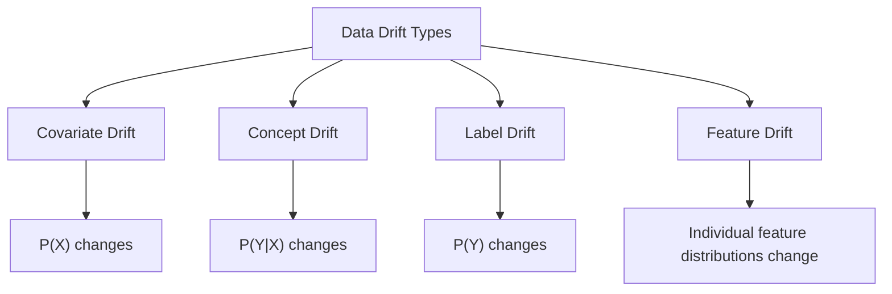
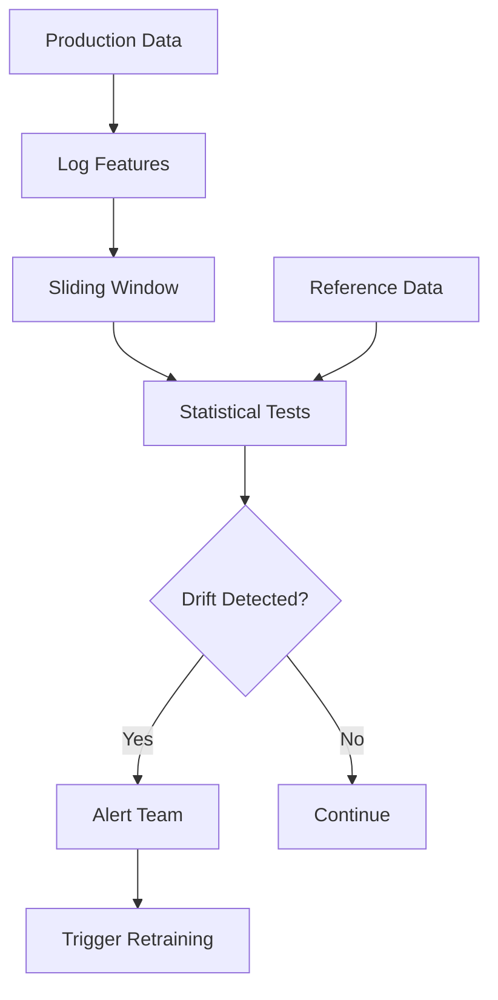

# Data Drift Detection

## Overview

Data drift detection identifies when the statistical properties of input data change over time. This is critical because models trained on historical data may perform poorly when production data differs. Early drift detection enables proactive retraining before model performance degrades.

## Types of Drift



## Statistical Tests for Drift Detection

### Population Stability Index (PSI)

Measures distribution shift between two datasets:

```
PSI = Σ (Actual% - Expected%) × ln(Actual% / Expected%)
```

| PSI Value | Interpretation |
|---|---|
| < 0.1 | No significant shift |
| 0.1 - 0.25 | Moderate shift |
| > 0.25 | Significant shift |

```python
def calculate_psi(expected, actual, bins=10):
    """Calculate Population Stability Index."""
    # Bin both distributions
    breakpoints = np.quantile(expected, np.linspace(0, 1, bins + 1))
    
    expected_counts = np.histogram(expected, bins=breakpoints)[0] / len(expected)
    actual_counts = np.histogram(actual, bins=breakpoints)[0] / len(actual)
    
    # Avoid division by zero
    expected_counts = np.clip(expected_counts, 0.001, None)
    actual_counts = np.clip(actual_counts, 0.001, None)
    
    # Calculate PSI
    psi = np.sum((actual_counts - expected_counts) * 
                 np.log(actual_counts / expected_counts))
    return psi
```

### Kolmogorov-Smirnov (KS) Test

Non-parametric test for continuous distributions:

```python
from scipy import stats

def ks_drift_test(reference, current):
    """KS test for distribution drift."""
    statistic, p_value = stats.ks_2samp(reference, current)
    
    drift_detected = p_value < 0.05
    return {
        "statistic": statistic,
        "p_value": p_value,
        "drift_detected": drift_detected
    }
```

### Chi-Squared Test

For categorical features:

```python
def chi_squared_drift(reference, current):
    """Chi-squared test for categorical drift."""
    # Create contingency table
    ref_counts = pd.Series(reference).value_counts()
    cur_counts = pd.Series(current).value_counts()
    
    # Align categories
    all_categories = set(ref_counts.index) | set(cur_counts.index)
    ref_aligned = [ref_counts.get(c, 0) for c in all_categories]
    cur_aligned = [cur_counts.get(c, 0) for c in all_categories]
    
    statistic, p_value = stats.chisquare(cur_aligned, ref_aligned)
    return {"statistic": statistic, "p_value": p_value, "drift_detected": p_value < 0.05}
```

### KL Divergence

Measures how one distribution differs from another:

```
KL(P || Q) = Σ P(x) × log(P(x) / Q(x))
```

```python
def kl_divergence(reference, current, bins=10):
    """Calculate KL divergence between distributions."""
    breakpoints = np.quantile(reference, np.linspace(0, 1, bins + 1))
    
    p = np.histogram(reference, bins=breakpoints)[0] / len(reference)
    q = np.histogram(current, bins=breakpoints)[0] / len(current)
    
    # Clip to avoid log(0)
    p = np.clip(p, 1e-10, None)
    q = np.clip(q, 1e-10, None)
    
    return np.sum(p * np.log(p / q))
```

### Jensen-Shannon Divergence

Symmetric version of KL divergence (more robust):

```
JSD(P || Q) = 0.5 × KL(P || M) + 0.5 × KL(Q || M)
where M = 0.5 × (P + Q)
```

## Comparison of Methods

| Test | Data Type | Pros | Cons |
|---|---|---|---|
| **PSI** | Continuous/Categorical | Simple, interpretable | Needs binning |
| **KS Test** | Continuous | No binning, non-parametric | Only 1D |
| **Chi-Squared** | Categorical | Well-established | Needs sufficient samples |
| **KL Divergence** | Continuous/Categorical | Information-theoretic | Asymmetric |
| **JSD** | Continuous/Categorical | Symmetric, bounded | Needs binning |

## Drift Detection Pipeline



## Evidently AI Example

```python
from evidently.report import Report
from evidently.metric_preset import DataDriftPreset

# Create drift report
report = Report(metrics=[DataDriftPreset()])
report.run(
    reference_data=training_data,
    current_data=production_data
)

# Get results
result = report.as_dict()
drift_detected = result["metrics"][0]["result"]["dataset_drift"]
drifted_features = [
    f for f in result["metrics"][0]["result"]["drift_by_columns"]
    if result["metrics"][0]["result"]["drift_by_columns"][f]["drift_detected"]
]
```

## Interview Questions

### Q1: What is data drift and how do you detect it?
**Answer:** Data drift is a change in the statistical properties of input data over time. Detection methods:
1. **PSI**: Measures distribution shift. PSI > 0.25 indicates significant drift.
2. **KS Test**: Non-parametric test comparing two distributions. p-value < 0.05 indicates drift.
3. **Chi-Squared**: For categorical features. Compares observed vs expected frequencies.
4. **KL Divergence**: Information-theoretic measure of distribution difference.

Monitor each feature individually and set up alerts when drift is detected.

### Q2: What is the difference between data drift and concept drift?
**Answer:**
- **Data drift**: P(X) changes. The input features have different distributions. Detectable by comparing feature statistics.
- **Concept drift**: P(Y|X) changes. The relationship between features and target changes. Harder to detect — requires labeled data or proxy metrics.
- Example: Fraud patterns change (concept drift) even if transaction features look similar (no data drift).

### Q3: How do you handle detected drift?
**Answer:**
1. **Investigate**: Is the drift real or a data quality issue?
2. **Root cause**: What changed? New user segment? Seasonal effect? System change?
3. **Impact assessment**: How much has model performance degraded?
4. **Options**:
   - Retrain on recent data
   - Use online learning to adapt
   - Deploy a fallback model
   - Adjust features
5. **Prevention**: Set up monitoring to catch drift earlier

## Common Mistakes

- ❌ Not monitoring drift at all (silent degradation)
- ❌ Using only one test (combine multiple methods)
- ❌ Not distinguishing between temporary fluctuation and permanent drift
- ❌ Alerting on every small shift (alert fatigue)
- ❌ Not having a response plan when drift is detected

## Summary

Data drift detection identifies when input data distributions change. PSI, KS test, Chi-squared, and KL divergence are the main methods. Monitor each feature and set up alerts. Combine statistical tests with performance monitoring for comprehensive drift detection.

## Cross-References

- [Monitoring →](monitoring.md) Overall model monitoring
- [Pipelines →](pipelines.md) Automated retraining on drift
- [A/B Testing →](ab-testing.md) Comparing models after retraining
