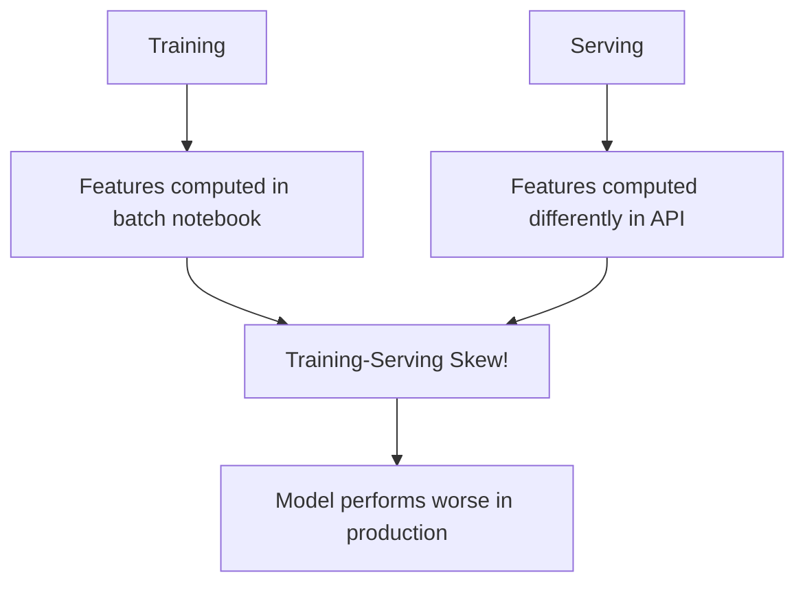
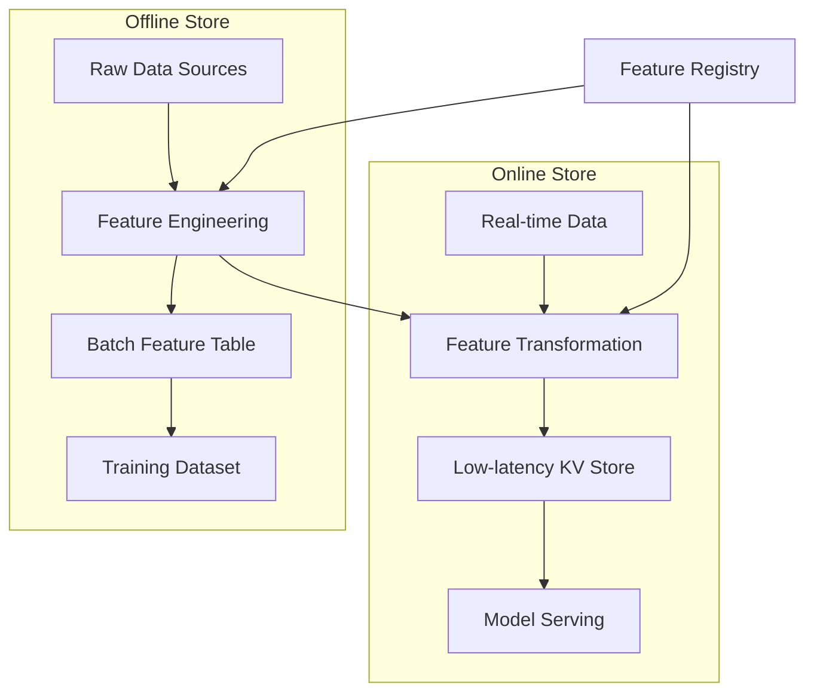

# Feature Store

## Overview

A feature store is a centralized platform for storing, managing, and serving ML features. It solves the critical problem of **training-serving skew** — where features computed differently during training and inference lead to degraded model performance. A feature store provides consistent feature access across batch and real-time scenarios, enables feature reuse across teams, and ensures point-in-time correctness.

## The Problem



## Feature Store Architecture



## Key Concepts

### Feature Definitions

```python
# Feast feature definition example
from feast import Entity, FeatureView, Field, ValueType
from feast.types import Float32, Int64
from datetime import timedelta

# Entity: what features describe
user = Entity(
    name="user_id",
    value_type=ValueType.INT64,
    description="User identifier"
)

# Feature View: group of related features
user_features = FeatureView(
    name="user_features",
    entities=[user],
    schema=[
        Field(name="total_purchases", dtype=Float32),
        Field(name="avg_order_value", dtype=Float32),
        Field(name="days_since_last_order", dtype=Int64),
    ],
    source=source,
    ttl=timedelta(days=1),
)
```

### Point-in-Time Correctness

When creating training data, features must reflect what was known **at prediction time**, not future data:

```python
# Correct: use features as of prediction time
training_df = feature_store.get_historical_features(
    entity_df=entities_with_timestamps,  # user_id + event_timestamp
    features=["user_features:total_purchases", "user_features:avg_order_value"]
).to_df()

# Wrong: using today's features for past predictions
# This causes data leakage!
```

## Online vs Offline

| Aspect | Offline Store | Online Store |
|--------|---------------|--------------|
| Latency | Seconds to minutes | Milliseconds |
| Storage | Data warehouse, Parquet | Redis, DynamoDB |
| Use case | Training, batch inference | Real-time serving |
| Data | Full history | Latest values |
| Consistency | Eventually consistent | Strongly consistent |

## Popular Feature Stores

| Tool | Type | Strengths |
|------|------|-----------|
| Feast | Open-source | Lightweight, provider-agnostic |
| Tecton | Managed | Production-grade, real-time |
| Hopsworks | Open-source | Full ML platform |
| Vertex AI Feature Store | GCP | Integrated with GCP |
| SageMaker Feature Store | AWS | Integrated with AWS |

### Feast Example

```python
from feast import FeatureStore

# Initialize
store = FeatureStore(repo_path=".")

# Online serving (low latency)
features = store.get_online_features(
    features=[
        "user_features:total_purchases",
        "user_features:avg_order_value"
    ],
    entity_rows=[{"user_id": 123}]
).to_dict()

# Offline serving (training)
training_data = store.get_historical_features(
    entity_df=entities_df,
    features=[
        "user_features:total_purchases",
        "user_features:avg_order_value"
    ]
).to_df()
```

## Interview Questions

1. **What problem does a feature store solve?** — Training-serving skew, where features are computed differently in notebooks vs production. It ensures consistent feature definitions and values across training and inference.

2. **What is point-in-time correctness?** — When creating training data, features must reflect the state at the prediction time, not future values. This prevents data leakage.

3. **Online vs offline feature store?** — Online: low-latency KV store for real-time serving. Offline: batch storage (Parquet, data warehouse) for training. Many feature stores have both.

4. **How do you handle feature freshness?** — Set TTL (time-to-live) on feature views. Features older than TTL trigger recomputation. For real-time features, use streaming pipelines.

5. **When don't you need a feature store?** — Small teams, simple models, batch-only inference. The overhead isn't worth it for 1-2 models with simple features.

## Summary

A feature store centralizes feature management, ensuring consistency between training and serving. It provides point-in-time correctness for training data, low-latency serving for real-time inference, and feature reuse across teams. Feast is the leading open-source option, while cloud providers offer integrated solutions.

## Cross-References

- [Feature Engineering](../foundations/feature-engineering.md) — Creating features
- [Feature Store (System Design)](../system-design/feature-store.md) — Design perspective
- [Model Serving](../system-design/model-serving.md) — Serving architecture
- [Data Pipeline](../system-design/data-pipeline.md) — Data engineering
- [MLOps Overview](./README.md) — MLOps fundamentals
