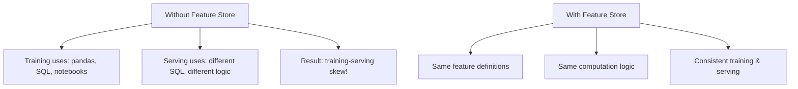
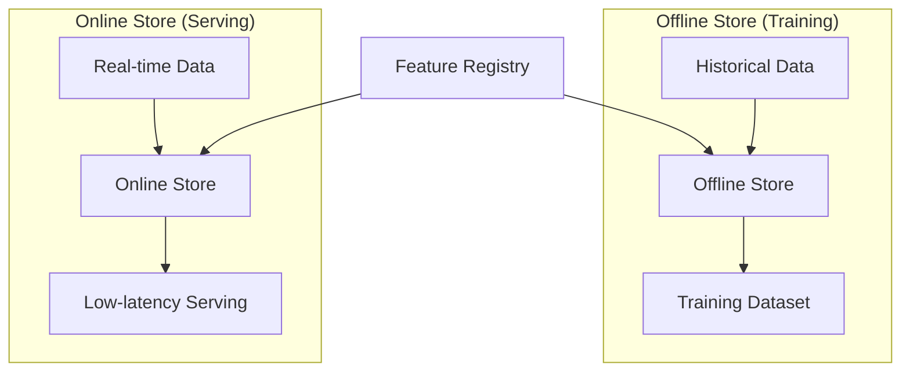
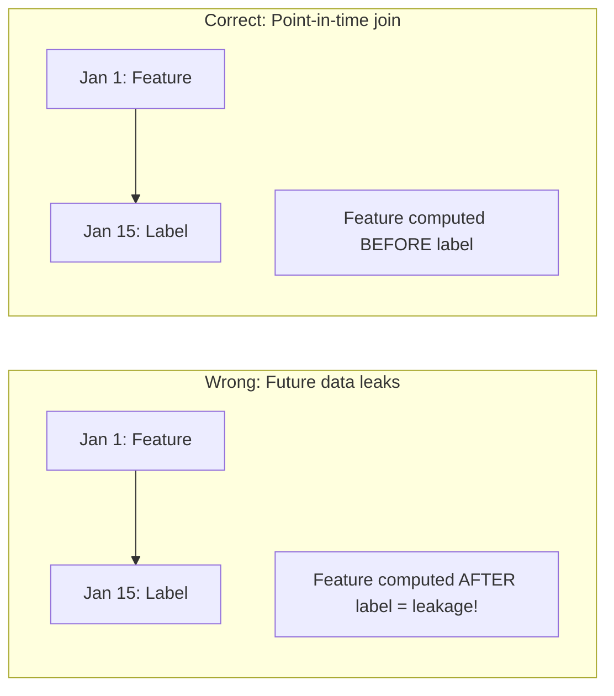

# Feature Store

## Overview

A feature store is a centralized system for storing, managing, and serving ML features. It solves the problem of feature inconsistency between training and inference (training-serving skew) by providing a single source of truth for features. Think of it as a database specifically designed for ML features.

## Why a Feature Store?



## Feature Store Architecture



| Store | Purpose | Latency | Storage |
|---|---|---|---|
| **Offline** | Training datasets | Minutes | Data warehouse (BigQuery, S3) |
| **Online** | Real-time serving | Milliseconds | Key-value store (Redis, DynamoDB) |

## Key Concepts

### Feature Definitions

```python
# Feast feature definition
from feast import Entity, FeatureView, Field
from feast.types import Float32, Int64
from feast.infra.offline_stores.file_source import FileSource

# Entity (what features describe)
user = Entity(name="user_id", join_keys=["user_id"])

# Feature source
user_features_source = FileSource(
    path="data/user_features.parquet",
    timestamp_field="event_timestamp"
)

# Feature view
user_features = FeatureView(
    name="user_features",
    entities=[user],
    schema=[
        Field(name="age", dtype=Int64),
        Field(name="avg_transaction", dtype=Float32),
        Field(name="login_count_7d", dtype=Int64),
    ],
    source=user_features_source,
)
```

### Point-in-Time Correctness

Critical for avoiding data leakage:



```python
# Feast point-in-time join
training_df = store.get_historical_features(
    entity_df=labels_df,  # Contains user_id and event_timestamp
    features=[
        "user_features:age",
        "user_features:avg_transaction",
        "user_features:login_count_7d",
    ],
).to_df()
```

## Feature Store Tools

| Tool | Type | Key Feature |
|---|---|---|
| **Feast** | Open-source | Lightweight, flexible |
| **Tecton** | Managed | Production-grade, real-time |
| **Hopsworks** | Open-source | Full ML platform |
| **Vertex AI FS** | Google Cloud | Integrated with GCP |
| **SageMaker FS** | AWS | Integrated with AWS |

## Feast Example

```python
from feast import FeatureStore

store = FeatureStore(repo_path=".")

# Training: Get historical features
training_data = store.get_historical_features(
    entity_df=entity_df,
    features=["user_features:age", "user_features:avg_transaction"]
).to_df()

# Serving: Get online features (low latency)
online_features = store.get_online_features(
    features=["user_features:age", "user_features:avg_transaction"],
    entity_rows=[{"user_id": 123}]
).to_dict()
```

## Interview Questions

### Q1: What is a feature store and why is it needed?
**Answer:** A feature store is a centralized system for managing ML features. It's needed because:
1. **Training-serving skew**: Without it, training and serving compute features differently
2. **Feature reuse**: Same features used by multiple models
3. **Point-in-time correctness**: Prevents data leakage in training
4. **Low-latency serving**: Online store provides features in milliseconds
5. **Feature discovery**: Team can find and reuse existing features

### Q2: What is training-serving skew?
**Answer:** Training-serving skew occurs when features are computed differently during training vs inference. Example:
- Training: "Average transaction amount" computed from historical data with pandas
- Serving: Same feature computed from real-time data with different SQL
- Result: Model sees different feature distributions → poor performance

Feature store prevents this by providing the same feature computation for both.

### Q3: What is point-in-time correctness?
**Answer:** Point-in-time correctness ensures that when creating training data, features are computed using only data available BEFORE the prediction time, not after. Without it:
- Feature: "Total purchases in last 30 days" (computed at training time)
- Label: "Made purchase on day 30"
- If feature includes day 30 data → data leakage!

Feature stores handle this by joining features at the correct timestamp.

## Common Mistakes

- ❌ Not using point-in-time joins (data leakage)
- ❌ Computing features differently for training and serving
- ❌ Not caching online features (high latency)
- ❌ Making feature definitions too complex
- ❌ Not versioning feature definitions

## Summary

A feature store provides consistent feature management for training and serving. The offline store (training) supports point-in-time joins; the online store (serving) provides low-latency access. Feast is the leading open-source option. Key benefits: no training-serving skew, feature reuse, and point-in-time correctness.

## Cross-References

- [Pipelines →](pipelines.md) Where features are computed
- [Monitoring →](monitoring.md) Feature drift monitoring
- [MLflow →](mlflow.md) Experiment tracking
