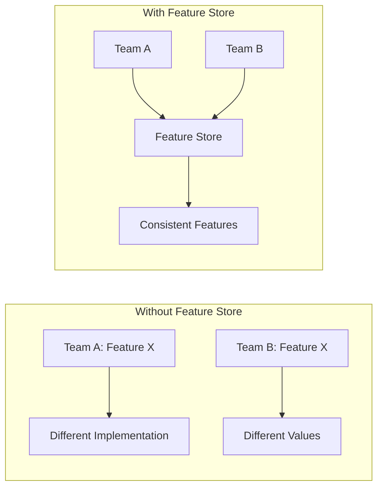
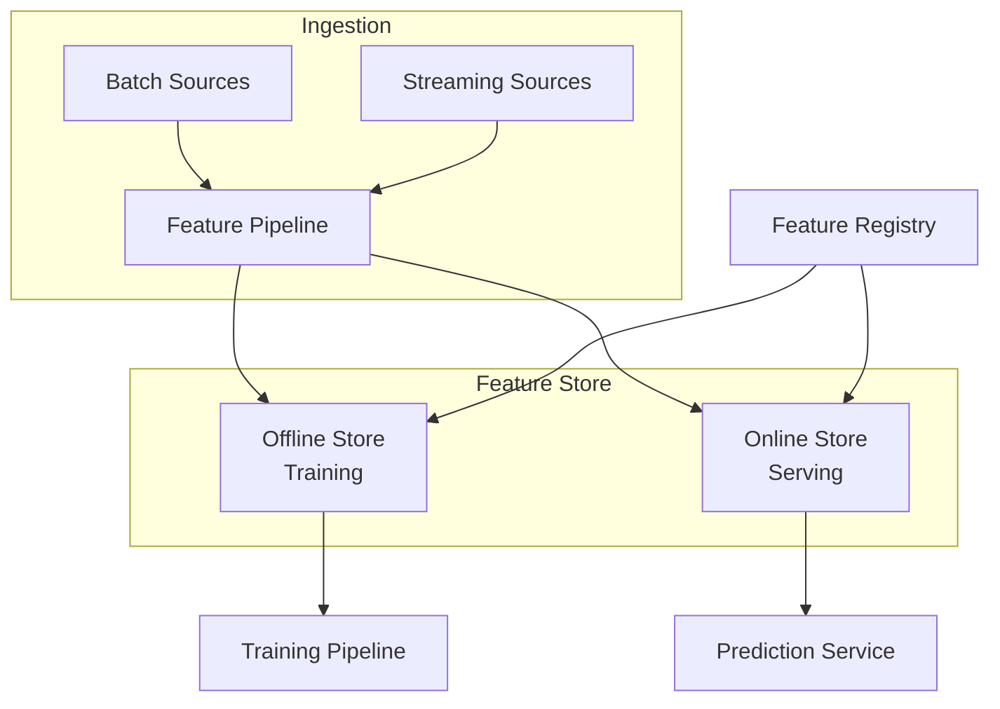

# Feature Store

## Overview

A Feature Store is a centralized platform for storing, managing, and serving ML features. It ensures consistency between training and serving, enables feature reuse across teams, and provides point-in-time correct feature retrieval.

## Why Feature Store?



## Architecture



## Key Concepts

### 1. Offline Store
- Stores historical feature values
- Used for model training
- Supports point-in-time joins
- Technologies: Hive, BigQuery, Delta Lake

### 2. Online Store
- Stores latest feature values
- Used for real-time serving
- Low-latency access (ms)
- Technologies: Redis, DynamoDB, Bigtable

### 3. Point-in-Time Correctness
```python
# Avoid data leakage - only use features available at prediction time
# BAD: Using future data
features_jan = get_features("2024-01-31")  # Includes Feb data!

# GOOD: Point-in-time join
features = feature_store.get_historical_features(
    entity_df=events,
    features=["user_avg_spend_30d"],
    timestamp_column="event_time"
)
```

## Feature Store Comparison

| Tool | Offline | Online | Open Source |
|------|---------|--------|-------------|
| Feast | ✅ | ✅ | ✅ |
| Tecton | ✅ | ✅ | ❌ |
| Hopsworks | ✅ | ✅ | ✅ |
| Vertex AI FS | ✅ | ✅ | ❌ |
| SageMaker FS | ✅ | ✅ | ❌ |

## Interview Questions

1. **What problem does a feature store solve?**
2. **Explain the difference between offline and online stores.**
3. **How do you ensure point-in-time correctness?**
4. **How would you design a feature store for a recommendation system?**
5. **What are the trade-offs of using a feature store?**

## Common Mistakes

- **Training-serving skew**: Computing features differently in training vs serving
- **Data leakage**: Using future data in training features
- **Over-engineering**: Not every project needs a full feature store
- **Ignoring freshness**: Online store not updated frequently enough

## Summary

A Feature Store solves critical ML infrastructure problems: feature reuse, consistency between training and serving, and point-in-time correctness. It bridges the gap between data engineering and ML engineering, enabling teams to share and serve features reliably.
