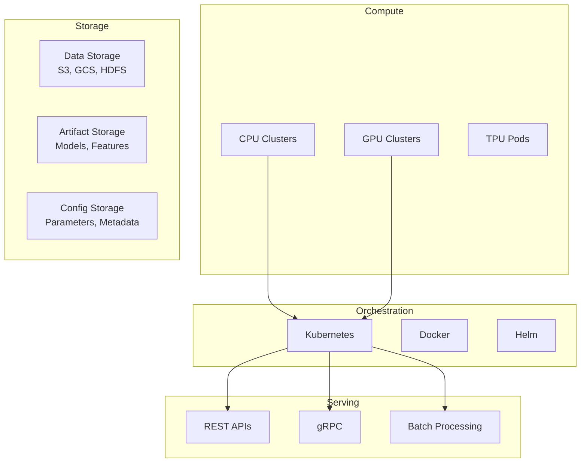
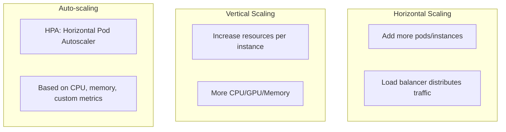

# ML Infrastructure

## Overview

ML Infrastructure encompasses the hardware, software, and services needed to support the entire ML lifecycle — from data processing and model training to deployment and serving at scale.

## Infrastructure Components



## Compute Infrastructure

### GPU vs CPU

| Aspect | CPU | GPU |
|--------|-----|-----|
| Best for | Data preprocessing | Deep learning training |
| Cost | Lower | Higher |
| Parallelism | Limited | Massive (thousands of cores) |
| Use case | Tabular models | Vision, NLP, LLMs |

### Cloud vs On-Premise

```mermaid
graph LR
    subgraph "Cloud"
        A[AWS] --> G1[SageMaker, EC2, EKS]
        B[GCP] --> G2[Vertex AI, GKE]
        C[Azure] -> G3[AML, AKS]
    end
    
    subgraph "On-Premise"
        D[Own Hardware] --> G4[Full Control]
    end
    
    G1 --> P[Pros: Scalable, Managed]
    G4 --> C2[Pros: Data Privacy, Cost Long-term]
```

## Containerization

### Docker for ML
```dockerfile
FROM python:3.9-slim

WORKDIR /app
COPY requirements.txt .
RUN pip install -r requirements.txt

COPY model/ ./model/
COPY src/ ./src/

EXPOSE 8080
CMD ["python", "serve.py"]
```

### Kubernetes for ML
```yaml
apiVersion: apps/v1
kind: Deployment
metadata:
  name: ml-model
spec:
  replicas: 3
  selector:
    matchLabels:
      app: ml-model
  template:
    spec:
      containers:
      - name: model
        image: ml-model:v1.0
        resources:
          limits:
            nvidia.com/gpu: 1
            memory: "4Gi"
```

## Scaling Strategies



## Cost Optimization

| Strategy | Description |
|----------|-------------|
| Spot Instances | Use preemptible VMs for training |
| Right-sizing | Match resources to workload |
| Caching | Cache feature computations |
| Batching | Batch predictions for efficiency |

## Interview Questions

1. **How would you design ML infrastructure for a startup?**
2. **What are the trade-offs between cloud and on-premise ML infrastructure?**
3. **How do you handle GPU resource management?**
4. **Explain how you'd set up auto-scaling for model serving.**
5. **How do you optimize ML infrastructure costs?**

## Common Mistakes

- **Over-provisioning**: Paying for idle GPU resources
- **No monitoring**: Can't optimize what you don't measure
- **Tight coupling**: Infrastructure too specific to one framework
- **Ignoring networking**: Data transfer costs and latency between services

## Summary

ML Infrastructure requires careful planning across compute, storage, orchestration, and serving. Cloud providers offer managed solutions (SageMaker, Vertex AI), while Kubernetes provides flexibility. Key considerations include cost optimization, auto-scaling, and choosing the right compute (CPU vs GPU) for each workload.

## Cross-References

- [Cloud Overview](../../cloud/overview.md)
- [Kubernetes](../../cloud/kubernetes/README.md)
- [GPU in Cloud](../../cloud/virtualization/README.md)
- [MLOps Platforms](./platforms.md)
- [Storage Overview](../../storage/overview.md)
