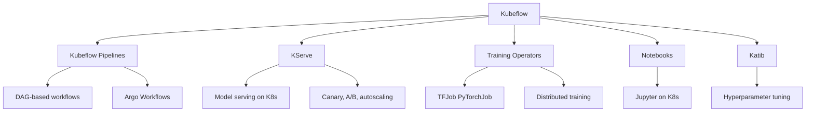

# Kubeflow

## Overview

Kubeflow is an open-source ML platform designed to run on Kubernetes. It provides tools for each stage of the ML lifecycle: data preparation (Jupyter notebooks), training (distributed jobs), model serving (KServe), and pipeline orchestration. Kubeflow's K8s-native approach enables scalable, portable ML workflows.

## Architecture



## Kubeflow Pipelines

```python
import kfp
from kfp import dsl
from kfp.dsl import component, pipeline

@component(
    base_image="python:3.9",
    packages_to_install=["scikit-learn", "pandas"]
)
def train_model(data_path: str, model_output: Output[Model]):
    import pickle
    from sklearn.ensemble import RandomForestClassifier
    import pandas as pd

    df = pd.read_csv(data_path)
    X, y = df.drop("target", axis=1), df["target"]
    model = RandomForestClassifier(n_estimators=100)
    model.fit(X, y)

    with open(model_output.path, "wb") as f:
        pickle.dump(model, f)

@component
def evaluate_model(model_path: Input[Model], test_data: str) -> float:
    import pickle
    from sklearn.metrics import accuracy_score
    import pandas as pd

    with open(model_path.path, "rb") as f:
        model = pickle.load(f)

    df = pd.read_csv(test_data)
    X, y = df.drop("target", axis=1), df["target"]
    accuracy = accuracy_score(y, model.predict(X))
    return accuracy

@pipeline(
    name="training-pipeline",
    description="End-to-end training pipeline"
)
def training_pipeline(data_path: str, test_path: str):
    train = train_model(data_path=data_path)
    evaluate = evaluate_model(
        model_path=train.outputs["model_output"],
        test_data=test_path
    )
```

## KServe (Model Serving)

```yaml
apiVersion: serving.kserve.io/v1beta1
kind: InferenceService
metadata:
  name: fraud-detection
spec:
  predictor:
    model:
      modelFormat:
        name: sklearn
      storageUri: "s3://models/fraud-detection/v2"
      resources:
        requests:
          cpu: "1"
          memory: "2Gi"
        limits:
          nvidia.com/gpu: "1"
  # Canary traffic split
  canaryTrafficPercent: 10
```

## Distributed Training

```yaml
apiVersion: "kubeflow.org/v1"
kind: PyTorchJob
metadata:
  name: distributed-training
spec:
  pytorchReplicaSpecs:
    Master:
      replicas: 1
      template:
        spec:
          containers:
          - name: pytorch
            image: training:v1
            command: ["python", "train.py"]
            resources:
              limits:
                nvidia.com/gpu: "1"
    Worker:
      replicas: 4
      template:
        spec:
          containers:
          - name: pytorch
            image: training:v1
            resources:
              limits:
                nvidia.com/gpu: "2"
```

## Katib (Hyperparameter Tuning)

```yaml
apiVersion: "kubeflow.org/v1beta1"
kind: Experiment
metadata:
  name: hp-tuning
spec:
  objective:
    type: maximize
    goal: 0.95
    objectiveMetricName: accuracy
  algorithm:
    algorithmName: bayesianoptimization
  parameters:
  - name: learning-rate
    parameterType: double
    feasibleSpace:
      min: "0.001"
      max: "0.1"
  - name: batch-size
    parameterType: categorical
    feasibleSpace:
      list: ["32", "64", "128"]
  trialTemplate:
    primaryContainerName: trainer
    trialParameters:
    - name: learningRate
      description: Learning rate
      reference: learning-rate
    trialSpec:
      apiVersion: "kubeflow.org/v1"
      kind: PyTorchJob
```

## Interview Questions

1. **What is Kubeflow and why use it?** — An open-source ML platform on Kubernetes, providing pipelines, model serving, distributed training, and hyperparameter tuning. It's portable across K8s clusters.

2. **How do Kubeflow Pipelines work?** — Define DAGs of components (each a container), connected by inputs/outputs. Pipelines run on Argo Workflows in K8s, with caching, retries, and monitoring.

3. **Kubeflow vs Airflow for ML?** — Kubeflow is ML-specific (model serving, training operators, HPO). Airflow is general-purpose. Use Kubeflow for ML-heavy workloads, Airflow for data-heavy workflows.

4. **What is KServe?** — Kubeflow's model serving component. It supports autoscaling, canary deployments, A/B testing, and multiple frameworks (TensorFlow, PyTorch, sklearn, ONNX).

5. **How does Katib do hyperparameter tuning?** — It runs experiments with different hyperparameter configurations using search strategies (random, grid, Bayesian, hyperband). Each trial is a K8s job.

## Summary

Kubeflow provides a comprehensive, K8s-native ML platform. Its components — Pipelines, KServe, Training Operators, and Katib — cover the full ML lifecycle. While complex to set up, it offers scalability, portability, and deep Kubernetes integration.

## Cross-References

- [MLOps Overview](./README.md) — MLOps fundamentals
- [ML Pipelines](./pipelines.md) — Pipeline orchestration
- [Model Deployment](./deployment.md) — Deployment patterns
- [Kubernetes](../../os/containers/kubernetes.md) — K8s fundamentals
- [Vertex AI](./vertex.md) — Managed alternative
