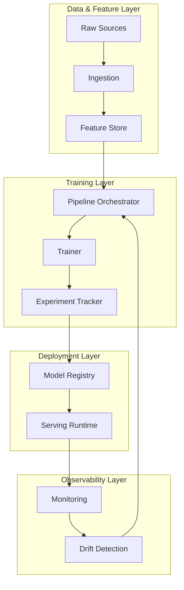
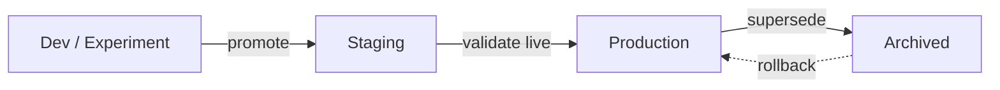
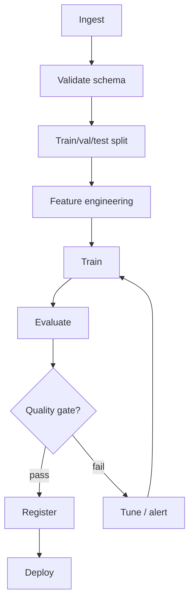
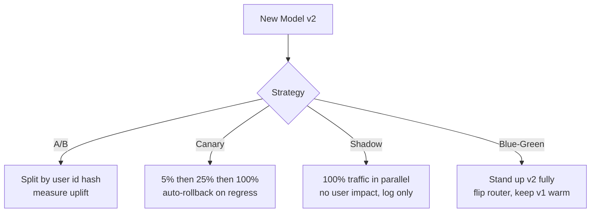

# ML Systems / MLOps Deep Dive

## Overview

This page is the consolidated deep dive for **Section 25 — ML Systems / MLOps** of the [Master Topic Index](../../index.md). It covers the end-to-end lifecycle of an ML system in production: feature stores, model versioning and registries, pipeline orchestration, serving, deployment strategies, monitoring, drift, model cards, model compression, and edge deployment. Each subsection links to the dedicated page where one already exists; this page stitches them into a single mental model and provides the comparison tables and diagrams interviewers expect.

The framing throughout draws on three sources:

- **Burkov, *Machine Learning Engineering* (2020)** — a practical engineering checklist for shipping ML.
- **Huyen, *Designing Machine Learning Systems* (2022)** — the system-design lens, maturity levels, and continuous training.
- **Sculley et al., *Hidden Technical Debt in Machine Learning Systems* (NeurIPS 2015)** — the canonical paper on why ML systems rot faster than the code suggests.

## Why ML Systems Are Hard

Sculley et al. frame the central problem: in traditional software the code is the artifact, and debt lives in the code. In ML systems the *model* is a derivative artifact produced by a *pipeline* consuming *data*, and the debt lives in the data dependencies, feature pipelines, monitoring gaps, and the entanglement between code, configuration, and weights. Concretely:

- **Data dependencies are code dependencies you cannot `git blame`.** A column rename upstream silently breaks the model.
- **Feedback loops** — predictions shape the next training set (recommendations influence what users click, which becomes the label).
- **Configuration is a first-class citizen.** Hyperparameters, feature lists, schema versions, and pipeline topology all behave like code but are rarely versioned like it.
- **Production fragility** — a model that scored 0.94 AUC offline can degrade to 0.70 in a week because the input distribution shifted.

MLOps is the set of practices — pipelines, registries, feature stores, monitoring, CI/CD/CT — that makes this debt visible and repayable.

## ML System Architecture



The diagram shows the four planes every production ML system eventually grows into: **data/features**, **training**, **deployment**, and **observability**. The feedback edge from monitoring back into the pipeline is what turns a one-shot training job into *continuous training* (CT) — the MLOps analogue of continuous integration. Huyen's maturity model (Level 0 manual → Level 1 ML pipeline automation → Level 2 CI/CD/CT) is essentially a measure of how much of this loop is automated and gated.

## Feature Stores

A feature store is the contract between data engineering and ML: it gives training and serving **the same feature definition**, with **point-in-time correctness** so that no future data leaks into a training row. Without one, teams ship two implementations of every feature (a batch Spark job for training and a Python function for serving) that quietly diverge — the canonical *training-serving skew*.

### Offline vs Online

| Store | Purpose | Latency | Backing tech |
|-------|---------|---------|--------------|
| **Offline** | Historical joins for training, backfills | seconds to minutes | BigQuery, Snowflake, Spark, Delta Lake |
| **Online** | Low-latency lookup at prediction time | under 10 ms | Redis, DynamoDB, Bigtable, Cassandra |

### Point-in-time correctness

The query must return only feature values whose event timestamp is at or before the prediction event time. A violation here is the most common silent bug in ML pipelines and the largest single source of "it worked offline, it failed online" incidents.

```python
# Feast-style point-in-time join — the entity_df carries event timestamps
fs = FeatureStore(repo_path=".")
training_data = fs.get_historical_features(
    entity_df=events,                       # contains an event_timestamp column
    features=["user_features:avg_spend_30d",
              "user_features:login_count_7d"],
).to_df()
```

### Feature Store Comparison

| Tool | Offline | Online | Streaming ingest | Open source | Notes |
|------|:------:|:------:|:----------------:|:-----------:|-------|
| **Feast** | yes | yes | partial | yes | Lightweight, vendor-neutral, the de facto OSS standard |
| **Tecton** | yes | yes | yes | no | Managed, Rust-backed online store, strong SLAs |
| **Hopsworks** | yes | yes | yes | yes | Full platform with training notebooks |
| **Vertex AI FS** | yes | yes | yes | no | Tight GCP integration |
| **SageMaker FS** | yes | yes | yes | no | Tight AWS integration |

**Selection rule of thumb:** Feast for a vendor-neutral OSS baseline that any cloud can back; Tecton or Hopsworks when you need real-time streaming features and an SLA on the online store; the managed-cloud stores when you are already committed to a single cloud's IAM and billing.

→ Deep dive: [Feature Store](./feature-store.md).

## Model Versioning & Registries

A model artifact is useless without the metadata to reproduce it. A **model registry** is a versioned, queryable store of model artifacts plus their lineage: which code commit, which data version, which hyperparameters, which metrics, and which environment produced each version. The minimum metadata tuple every registry must hold is:

\\[\text{Model} = \langle \text{weights},\ \text{code\_git\_sha},\ \text{data\_hash},\ \text{config},\ \text{metrics} \rangle\\]

### Stage lifecycle



| Stage | Audience | Traffic | Rollback target? |
|-------|----------|---------|:----------------:|
| Dev | Author only | none | no |
| Staging | QA / shadow | internal or shadow | yes (emergency) |
| Production | All users | 100% live | yes |
| Archived | Read-only | none | rollback source |

MLflow Model Registry, Vertex AI Model Registry, SageMaker Model Registry, and W&B Artifacts all implement this lifecycle with slightly different APIs but the same shape: a registered model has many versions, each version is in exactly one stage, and transitions are audited.

→ Deep dive: [Model Registry](./model-registry.md).

## ML Pipelines & Orchestration

A pipeline is the unit of reproducibility: an explicit, versioned DAG of steps from raw data to a registered model. The orchestrator's job is **dependency resolution, retry, caching, and lineage** — *not* training logic. Burkov's rule is that a pipeline that cannot be re-run from scratch on a clean checkout and reproduce the same artifact is not a pipeline; it is a script with aspirations.

### Pipeline DAG



The quality gate is non-negotiable: a model registers only if it beats the current production model on a held-out set *and* on fairness and latency budgets, not just on the headline metric. Skipping the gate is the most common reason a bad model ships.

### Continuous Training (CT)

CT is the ML analogue of CI: whenever data, code, or a schedule triggers, the pipeline re-runs end to end and a new candidate is produced. The trigger taxonomy matters because it determines cost:

| Trigger | When | Cost shape | Risk |
|---------|------|------------|------|
| **Scheduled** | every N hours/days | predictable, flat | stale between runs |
| **Data-based** | new labeled data crosses a threshold | bursty | over-fits to recent window |
| **Performance-based** | live metric drops below SLA | reactive | already impacting users |
| **Drift-based** | PSI/KS fires on enough features | early | false positives retrain needlessly |

The safe default is *scheduled + drift-based*: a cheap nightly run on the latest window plus an on-demand run when drift fires. Performance-based triggers are a last resort because by the time the metric drops, users are already seeing bad predictions.

### ML Pipeline Frameworks

| Framework | Origin | Abstraction | Strengths | Weaknesses |
|-----------|--------|-------------|-----------|------------|
| **Apache Airflow** | Airbnb, 2014 | DAGs of `Operator` tasks | Mature, huge ecosystem, generic | Not ML-aware; data passing is clunky |
| **Kubeflow Pipelines** | Google | Containerized steps on k8s | Cloud-native, reproducible artifacts | Heavy ops burden; k8s required |
| **TFX** | Google | Typed TF components | Strong schema/validation, battle-tested | TensorFlow-centric |
| **Metaflow** | Netflix | Python decorators `@step`/`@batch` | Local-first dev, AWS-native scaling, great DX | Less adopted outside Netflix alum |
| **MLflow Projects** | Databricks | `MLproject` + conda/docker | Reproducible runs, ties to Tracking | Not a true orchestrator; pairs with Airflow/Databricks |
| **Dagster / Prefect** | Modern OSS | Software-defined assets / flows | Type-safe, asset-centric, modern Python | General-purpose; ML is a use case |

**Selection rule of thumb:** Airflow for company-wide scheduling already used by data engineering, glued to an MLflow Project for the training step; Kubeflow or TFX if you live on GCP and TensorFlow respectively; Metaflow if you want data scientists to write scalable pipelines in pure Python without touching k8s.

→ Deep dives: [ML Pipelines](./pipelines.md), [MLflow](./mlflow.md), [Kubeflow](./kubeflow.md).

## Model Serving

Serving is where the model meets the SLA. The first design decision is **batch vs online**:

| Mode | Trigger | Latency target | Cost shape | Example |
|------|---------|----------------|------------|---------|
| **Batch** | Schedule (hourly/daily) | minutes to hours | throughput-bound, cheap | Nightly recommendation refresh |
| **Online (synchronous)** | HTTP/gRPC request | 10 to 200 ms p99 | latency-bound, expensive | Fraud scoring at checkout |
| **Streaming** | Kafka/Kinesis event | sub-second | per-event cost | Real-time bidding |
| **Edge** | On-device call | under 50 ms local | no infra cost | Mobile vision filter |

### Serving Runtimes

| Runtime | Frameworks | Hardware | Sweet spot |
|---------|------------|----------|------------|
| **NVIDIA Triton** | TF, PyTorch, ONNX, TensorRT | NVIDIA GPU | Multi-model GPU boxes, dynamic batching |
| **TF Serving** | TensorFlow | CPU/GPU | Pure-TF shops, mature gRPC API |
| **TorchServe** | PyTorch | CPU/GPU | PyTorch-native, handler API |
| **Ray Serve** | Any (Python) | CPU/GPU, autoscaling | Composable Python pipelines, LLMs |
| **BentoML** | Any (Python) | CPU/GPU | Easy packaging/Yatai, small teams |
| **ONNX Runtime** | ONNX | CPU/GPU/edge | Cross-framework portability, inference-only |

The defining production pattern is **dynamic (micro) batching**: the server collects requests for a few milliseconds and runs them as one batched forward pass, recovering most of the throughput of offline batching while keeping tail latency bounded — the same idea as `vLLM`'s continuous batching for LLMs.

### Model gateways & autoscaling

A **model gateway** sits in front of one or more serving runtimes and handles the concerns the runtime should not: routing by model version, A/B and canary traffic splits, authentication, rate limiting, request/response logging, and fallback to a previous version on error. Concretely it decouples *which model answers* from *where the model runs*, so promotions and rollbacks are config changes rather than redeploys.

Autoscaling for ML differs from web services in one key way: GPU nodes are expensive and slow to warm (model weights can be tens of GB). The practical patterns are (1) **overprovision a warm pool** of 1–2 standby replicas to absorb bursts, (2) **scale on request queue depth**, not CPU, since GPU utilisation is bursty during inference, and (3) **use Ray Serve or KServe** for scale-to-zero on CPU-only models where cold start is acceptable.

→ Deep dive: [Model Deployment Patterns](./deployment.md).

## Deployment Strategies

Once a model is registered and the serving runtime is up, the *promotion* strategy determines blast radius if the new model is bad.



### Deployment Strategy Comparison

| Strategy | Traffic to new model | User impact | Rollback | Statistical power | When to use |
|----------|:--------------------:|:-----------:|:--------:|:-----------------:|-------------|
| **A/B test** | configurable split | real | flip bucketing | high (with power calc) | Comparing two candidate models on a business metric |
| **Canary** | 1% to 5% to 25% to 100% | real, small | shift traffic back | low early, grows | Default for risk-averse prod changes |
| **Shadow** | 100% (no response) | none | instant (no traffic) | high (offline) | Validating a new model class without risk |
| **Blue-Green** | 0% then 100% | real, all at once | flip DNS/router | n/a | Big-bang releases, infra migrations |
| **Multi-armed bandit** | adaptive | real | automatic | adaptive | Many arms, fast feedback, exploration OK |

### A/B testing essentials

The trap in ML A/B testing is *peeking*: checking the p-value daily and stopping when significant inflates false positives. Pre-register a sample size from a power analysis:

\\[n \approx \frac{(z_{\alpha/2} + z_{\beta})^2 \cdot 2\sigma^2}{\Delta^2}\\]

where \\(\Delta\\) is the minimum detectable uplift, \\(\sigma^2\\) the metric variance, \\(\alpha\\) the false-positive rate, and \\(\beta\\) the false-negative rate. Without this discipline, "we ran an A/B and v2 won" is unfalsifiable.

→ Deep dives: [A/B Testing](./ab-testing.md), [Canary](./canary.md), [Shadow](./shadow.md), [Blue-Green](./blue-green.md).

### CI/CD/CT for ML

Three pipelines compose the MLOps loop and each has a distinct trigger and owner:

| Pipeline | Trigger | Owner | Artifact |
|----------|---------|-------|----------|
| **CI** | code commit | ML platform / SRE | tested container image + unit/integration tests |
| **CT** | data change, schedule, or drift alert | ML engineer | a registered model candidate + eval report |
| **CD** | candidate passes the quality gate | ML platform | a deployed model version behind the gateway |

The discipline is that CD is gated on CT's eval report — a model deploys only if a machine-readable evaluation artifact proves it beats the incumbent. Wiring this gate as a manual approval is the most common MLOps anti-pattern; it should be an automated check on a signed eval report stored in the registry.

→ Deep dive: [CI/CD for ML](./cicd.md).

## Model Monitoring & Drift

Once live, a model degrades for two reasons: the world changed, or the pipeline changed. Monitoring must catch both. The four layers of ML monitoring are:

1. **System health** — CPU, GPU, memory, latency p50/p95/p99, error rate (same as any service).
2. **Input data drift** — has \\(P(X)\\) shifted away from the training distribution?
3. **Concept drift** — has \\(P(Y \mid X)\\) shifted, i.e., the same input now maps to a different label?
4. **Prediction drift** — has \\(P(\hat{Y})\\) shifted? Cheap to measure (no labels needed) and a strong early-warning signal.

### Drift Types

| Drift type | Definition | Needs labels? | Typical test | Fix |
|------------|-----------|:-------------:|--------------|-----|
| **Data / covariate drift** | \\(P_{\text{train}}(X) \neq P_{\text{live}}(X)\\) | no | KS, Chi-2, PSI, KL | Retrain on recent data |
| **Concept drift** | \\(P_{\text{train}}(Y\mid X) \neq P_{\text{live}}(Y\mid X)\\) | yes (delayed) | Performance decay, ADWIN | Retrain + new features |
| **Label / prior drift** | \\(P(Y)\\) changes | yes | Class balance over time | Re-calibrate, resample |
| **Prediction drift** | \\(P(\hat{Y})\\) changes | no | PSI on predictions | Investigate upstream |

### Detection methods

**Population Stability Index (PSI)** is the industry workhorse for continuous features:

\\[\text{PSI} = \sum_i (p_i^{\text{live}} - p_i^{\text{ref}}) \ln\!\left(\frac{p_i^{\text{live}}}{p_i^{\text{ref}}}\right)\\]

Rules of thumb: PSI < 0.1 → no significant drift; 0.1 to 0.25 → watch; > 0.25 → retrain. For continuous features the **Kolmogorov–Smirnov** statistic is the non-parametric alternative; for categorical features use **Chi-squared** or **JS divergence**. For multivariate drift where per-feature tests miss correlated shifts, **Maximum Mean Discrepancy (MMD)** or a **domain classifier** (train a model to distinguish reference from live; AUC near 0.5 means no drift, near 1.0 means strong drift) are the right tools.

Concept drift is harder because labels arrive late (days for clicks, weeks for chargebacks, months for defaults). The practical proxy is **online metric decay**: a rolling AUC below the offline AUC by more than two standard deviations of the bootstrap distribution is the trigger to retrain.

### Latency budgets & alerting

Every ML service needs an explicit latency SLO (e.g., p99 < 100 ms) and an error budget. Burn the budget faster than allowed and promotions freeze until the budget recovers. Alerting should be on **business-equivalent metrics** (e.g., fraud recall on labeled data) rather than raw drift PSI, because drift without accuracy loss is noise. The hierarchy is: page on accuracy SLO breach, ticket on sustained drift, dashboard everything else.

→ Deep dives: [Monitoring](./monitoring.md), [Drift Detection](./drift.md).

## Model Cards

A **model card** (Mitchell et al., 2019) is a short, structured document — one to two pages — accompanying a model that states its intended use, training data, evaluation across slices, ethical considerations, and limitations. It is the ML analogue of a drug label: not a marketing artifact, not a research paper, but a disclosure.

Minimum fields:

- **Model details** — owner, version, date, license, framework.
- **Intended use & out-of-scope uses** — explicit, not implicit.
- **Training data** — source, size, time window, known biases.
- **Evaluation** — metrics disaggregated by demographic/slice, not just headline numbers.
- **Ethical considerations & limitations** — what the model *cannot* do safely.

Model cards are what turn a model registry from a blob store into a governance system. Regulators (EU AI Act, NIST AI RMF) increasingly expect them as the entry-level artifact for any high-risk model.

## Testing ML Systems

ML testing is broader than software testing because the artifact under test is a model plus its data, not just code. The four layers, in order of cost:

| Layer | What is tested | Tooling |
|-------|----------------|--------|
| **Data tests** | schema, nulls, ranges, distribution vs. baseline | Great Expectations, Pandera, Deequ |
| **Model tests** | offline metrics, sliced metrics, invariance/fairness | pytest + custom, Fairlearn, AIF360 |
| **Shadow tests** | does v2 agree with v1 on live traffic within tolerance? | custom diff pipeline |
| **Online tests** | A/B/canary metrics over time | feature-flag + experiment platform |

The most underused test is the **shadow agreement test**: before any canary, run v2 on mirrored v1 traffic for 24 hours and assert the disagreement rate is within a tolerance band. This catches regressions that pass offline metrics but break on real input shapes (e.g., a tokenizer change, a feature whose online distribution differs from offline).

## Model Compression

Production constraints — latency budget, memory budget, battery on edge — are usually tighter than what a fully trained model needs. Three orthogonal compression techniques:

### Quantization

Lower the precision of weights and/or activations. **Post-training quantization (PTQ)** maps FP32 → INT8 with a calibration set; **quantization-aware training (QAT)** simulates quantization in the forward pass so the model adapts. The quantization error for uniform INT8 is bounded by:

\\[\epsilon \leq \frac{\Delta}{2}, \qquad \Delta = \frac{x_{\max} - x_{\min}}{2^8 - 1}\\]

where \\(\Delta\\) is the step size. INT8 typically gives a 2–4× speedup and 4× memory reduction with under 1% accuracy loss on vision models; INT4 is increasingly viable for LLMs (GPTQ, AWQ, GGUF).

### Pruning

Remove weights or channels with low saliency. **Unstructured** pruning sets individual weights to zero (sparse kernels needed to realize the speedup); **structured** pruning removes whole filters/channels (immediate dense speedup). A common schedule is *train → prune → fine-tune → repeat* (iterative magnitude pruning), pruning to sparsity in small increments to avoid an accuracy cliff.

### Knowledge distillation

Train a small **student** to match a large **teacher**'s soft outputs:

\\[\mathcal{L} = (1-\alpha)\,\mathcal{L}_{\text{CE}}(y, p_s) + \alpha\,T^2\,\text{KL}(p_t^\tau \,\|\, p_s^\tau)\\]

where \\(T\\) is the temperature softening the teacher distribution \\(p_t\\), \\(p_s\\) is the student, and \\(\alpha\\) balances the hard-label and soft-label losses. Distillation often preserves 95%+ of teacher accuracy at under 10% of the FLOPs, and is the dominant technique for shipping cheap production LLMs and mobile vision models.

→ Deep dive: [LLM Quantization](../llm/llm-serving/quantization.md).

## Edge Deployment

Edge means "the model runs on a device you do not control: phone, camera, car, watch." Constraints are inverted versus cloud: memory and energy matter more than throughput, and there is no ops team to patch the model in the field.

| Runtime | Target | Format | Notes |
|---------|--------|--------|-------|
| **TensorFlow Lite** | Android, iOS, microcontrollers | `.tflite` (FlatBuffers) | Most mature mobile path; supports delegates (GPU, NNAPI, Core ML) |
| **ONNX Runtime** | Cross-platform, mobile, server | `.onnx` | Single export from TF/PyTorch/JAX; mobile builds available |
| **Core ML** | iOS / macOS | `.mlmodel` / `.mlpackage` | Apple-native, hardware-accelerated via Neural Engine |
| **ML Kit** | Android | wraps TF Lite | Google-managed, low-friction |
| **ExecuTorch (PyTorch)** | Android, iOS, embedded | `.pte` | PyTorch-native successor to PyTorch Mobile |

The export pipeline is usually **PyTorch/TF → ONNX → target runtime**, with the ONNX intermediate giving framework portability and the final runtime giving hardware acceleration. On Apple platforms the last hop is typically ONNX → Core ML via `onnx-coreml` so the model reaches the Neural Engine.

### Edge constraints

Three constraints dominate edge deployment and shape every decision: (1) **binary size** — an app store caps the model at tens of MB, so quantization to INT8 and weight pruning are usually mandatory; (2) **energy budget** — sustained inference drains battery, so the model must hit its accuracy target at minimum FLOPs; (3) **offline correctness** — there is no monitoring once shipped, so the model card must disclose its degradation envelope (e.g., "accuracy drops 4% on images taken below 50 lux"). OTA model updates are the only recourse, and they must be versioned and rollback-able through the registry just like a cloud model.

## Interview Questions

1. **Explain training-serving skew and three concrete ways to prevent it.**
   Skew is when features are computed differently in training vs. serving, so the live model sees inputs the trainer never saw. Prevent it by (1) sharing one feature pipeline through a feature store, (2) writing contract tests that assert the training and serving feature distributions match, and (3) logging served features and replaying them through the training pipeline periodically to catch divergence.

2. **Compare Airflow, Kubeflow, Metaflow, and TFX for an ML platform. When would you pick each?**
   Airflow is the safest default for a company-wide scheduler already used by data engineering — pair it with MLflow for the training step. Kubeflow or TFX when you are all-in on Kubernetes and TensorFlow respectively and want ML-native primitives. Metaflow when data scientists should write scalable pipelines in pure Python without touching k8s, especially on AWS.

3. **Your model's offline AUC is 0.94 but live AUC dropped to 0.78 in two weeks. How do you triage?**
   First check pipeline health (input schema, feature freshness, model version actually deployed). Then check data drift with PSI/KS per feature, prediction drift on \\(\hat{Y}\\), and any known product changes in the last two weeks. If input is stable but accuracy dropped, suspect concept drift — pull the most recent labels and check sliced performance. Finally, verify the online feature distribution matches what the trainer expected.

4. **What is a feature store, and what does point-in-time correctness prevent?**
   A feature store centralizes feature definitions with both offline (historical) and online (low-latency) interfaces, guaranteeing training and serving use the same logic. Point-in-time correctness prevents *data leakage* — using feature values whose event timestamp is after the prediction event, which inflates offline metrics and collapses in production.

5. **Design a canary rollout for a new fraud model. What do you monitor, and when do you roll back?**
   Route 1% of traffic by a stable hash (e.g., `user_id`), monitor precision/recall on labeled fraud within hours, plus p99 latency and rejection rate, for 24–48 hours. Roll back automatically if rejection rate moves more than 2σ from baseline, if latency p99 exceeds the SLO, or if recall drops below a pre-registered threshold. Only then ramp to 5% → 25% → 100%.

6. **Contrast quantization, pruning, and distillation. When does each win?**
   Quantization wins when the model is bandwidth- or memory-bound and the hardware supports INT8/INT4 (almost always). Pruning wins when you can afford retraining and the model has redundant structure (e.g., over-parameterized transformers). Distillation wins when you can keep a large teacher around offline and need a small student for serving — the dominant pattern for cheap production LLMs and mobile vision.

7. **What goes in a model card, and why do regulators care?**
   Owner, version, intended use, out-of-scope uses, training data summary, sliced evaluation metrics, ethical considerations, and limitations. Regulators care because the card is a *disclosure* — it makes claims auditable, forces owners to state intended use explicitly, and is the natural artifact an EU AI Act conformity assessment or NIST AI RMF review would request.

8. **Design an ML system that retrains itself safely.**
   Trigger retraining on a schedule *and* on a drift alert → run the pipeline on the latest labeled window → evaluate against the current production model on a frozen holdout with a quality gate (must beat baseline by \\(\Delta\\) on the primary metric, with no slice regressing beyond a threshold) → if pass, register to staging → shadow deploy → canary → promote; if any gate fails, alert and keep the current model. The discipline is the gates, not the automation.

## Common Mistakes

- **No quality gate** — registering any model that finishes training guarantees the worst run ships eventually.
- **Notebook-to-production** — shipping a `.ipynb` as the training pipeline. Repackaging as a versioned, tested module is the single biggest reliability win.
- **Monitoring only system metrics** — CPU and latency look fine while \\(P(X)\\) silently shifts. ML monitoring must include data and prediction drift.
- **A/B tests without power analysis** — running until "significant" produces a graveyard of phantom wins.
- **Unversioned features** — the data version and feature code version must travel with the model; otherwise reproduction is impossible.
- **Treating shadow traffic as free** — shadow doubles inference cost and can saturate downstream dependencies; budget for it.

## Summary

A production ML system is four planes — data/features, training, deployment, observability — wrapped in a feedback loop that turns one-shot training into continuous training. The tools (Feast, MLflow, Kubeflow, Airflow, TFX, Metaflow, Triton, Ray Serve, Evidently) are interchangeable; the *practices* — feature store contracts, quality gates, drift monitoring, model cards, safe deployment strategies — are not. Sculley et al.'s warning from 2015 still holds: the debt in ML systems is hidden in the data and configuration, and MLOps is the discipline of making it visible.

## References

- Burkov, A. (2020). *Machine Learning Engineering*. True Positive Inc.
- Huyen, C. (2022). *Designing Machine Learning Systems*. O'Reilly Media.
- Sculley, D., Holt, G., Golovin, D., Davydov, E., Phillips, T., Ebner, D., Chaudhary, V., Young, M., Crespo, J.-F., & Dennison, D. (2015). *Hidden Technical Debt in Machine Learning Systems*. NeurIPS.
- Mitchell, M. et al. (2019). *Model Cards for Model Reporting*. FAT*.
- MLflow Documentation — https://mlflow.org/docs/latest/
- Kubeflow Documentation — https://www.kubeflow.org/docs/
- Metaflow Documentation — https://docs.metaflow.org/
- TensorFlow Extended (TFX) Documentation — https://www.tensorflow.org/tfx
- Feast Documentation — https://docs.feast.dev/
- Tecton Engineering Blog — https://www.tecton.ai/blog/

## Cross-References

- [MLOps Overview](./README.md)
- [ML Pipelines](./pipelines.md) · [MLflow](./mlflow.md) · [Kubeflow](./kubeflow.md) · [W&B](./wandb.md)
- [Feature Store](./feature-store.md) · [Model Registry](./model-registry.md)
- [Deployment](./deployment.md) · [Canary](./canary.md) · [Shadow](./shadow.md) · [Blue-Green](./blue-green.md)
- [A/B Testing](./ab-testing.md) · [Monitoring](./monitoring.md) · [Drift Detection](./drift.md) · [CI/CD for ML](./cicd.md)
- [LLM Serving Overview](../llm/llm-serving/README.md) · [LLM Quantization](../llm/llm-serving/quantization.md)
- [Cloud CI/CD Pipelines](../../cloud/cicd/pipelines.md) · [Cloud Kubernetes](../../cloud/kubernetes/README.md)
- [SRE SLO/SLI/SLA](../../sre/slo-sli-sla.md) · [SRE Canary Releases](../../sre/canary-releases.md)
