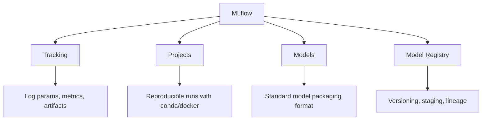

# MLflow

## Overview

MLflow is the most popular open-source ML lifecycle platform. It provides four core components: **Tracking** (experiment logging), **Projects** (reproducible runs), **Models** (packaging format), and **Model Registry** (versioning and stage management). MLflow is framework-agnostic, working with any ML library.

## Core Components



## MLflow Tracking

```python
import mlflow
import mlflow.sklearn
from sklearn.ensemble import RandomForestClassifier
from sklearn.metrics import accuracy_score

# Start a run
mlflow.set_experiment("fraud-detection")

with mlflow.start_run(run_name="rf-baseline"):
    # Log parameters
    params = {"n_estimators": 100, "max_depth": 10}
    mlflow.log_params(params)

    # Train model
    model = RandomForestClassifier(**params)
    model.fit(X_train, y_train)

    # Log metrics
    y_pred = model.predict(X_test)
    accuracy = accuracy_score(y_test, y_pred)
    mlflow.log_metric("accuracy", accuracy)
    mlflow.log_metric("f1", f1_score(y_test, y_pred))

    # Log artifacts
    mlflow.log_artifact("confusion_matrix.png")

    # Log model
    mlflow.sklearn.log_model(
        model,
        "model",
        registered_model_name="fraud-detection"
    )
```

## MLflow Models

Standard format for packaging ML models:

```python
# Log model with signature
from mlflow.models import ModelSignature
from mlflow.types.schema import Schema, ColSpec

input_schema = Schema([
    ColSpec("double", "feature1"),
    ColSpec("double", "feature2"),
])
signature = ModelSignature(inputs=input_schema)

mlflow.sklearn.log_model(model, "model", signature=signature)

# Load and serve
model = mlflow.pyfunc.load_model("runs:/<run_id>/model")
predictions = model.predict(X_new)

# Serve via REST API
# mlflow models serve -m "models:/fraud-detection/Production" -p 5001
```

## MLflow Model Registry

```python
from mlflow import MlflowClient

client = MlflowClient()

# Register a model
client.create_registered_model("fraud-detection")

# Create a version
client.create_model_version(
    name="fraud-detection",
    source="runs:/abc123/model",
    run_id="abc123"
)

# Transition stages
client.transition_model_version_stage(
    name="fraud-detection",
    version=1,
    stage="Production"
)

# Get latest production model
model = mlflow.pyfunc.load_model("models:/fraud-detection/Production")
```

## MLflow Projects

Reproducible runs with dependency management:

```yaml
# MLproject file
name: fraud-detection

conda_env: conda.yaml

entry_points:
  main:
    parameters:
      n_estimators: {type: int, default: 100}
      max_depth: {type: int, default: 10}
    command: "python train.py --n_estimators {n_estimators} --max_depth {max_depth}"
```

## Interview Questions

1. **What is MLflow and what are its components?** — An open-source ML lifecycle platform with four components: Tracking (log experiments), Projects (reproducible runs), Models (packaging format), and Model Registry (versioning).

2. **How does MLflow Tracking work?** — You log parameters, metrics, and artifacts during training runs. The UI lets you compare runs, filter by metrics, and visualize results.

3. **What is an MLflow Model?** — A standard format for packaging ML models that includes the model artifact, conda environment, model signature, and input examples. It enables serving across different tools.

4. **How does the Model Registry help?** — It provides versioning, stage management (Staging → Production → Archived), lineage tracking, and access control for models.

5. **MLflow vs W&B?** — MLflow: self-hosted, open-source, broader lifecycle management. W&B: managed service, superior experiment visualization, better collaboration features.

## Summary

MLflow is the de facto open-source standard for ML experiment tracking and lifecycle management. Its four components cover the key stages of ML development. While it has limitations in serving and orchestration, it integrates well with other tools and is easy to adopt.

## Cross-References

- [MLOps Overview](./README.md) — MLOps fundamentals
- [Model Registry](./model-registry.md) — Detailed model versioning
- [W&B](./wandb.md) — Alternative tracking platform
- [Kubeflow](./kubeflow.md) — Full ML platform
- [Experiment Tracking](./pipelines.md) — Pipeline integration
- [Cloud Observability](../../cloud/observability/README.md)

