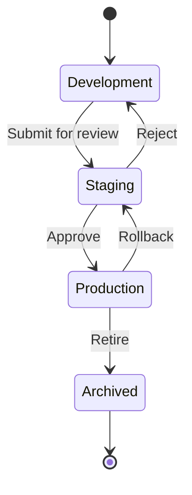
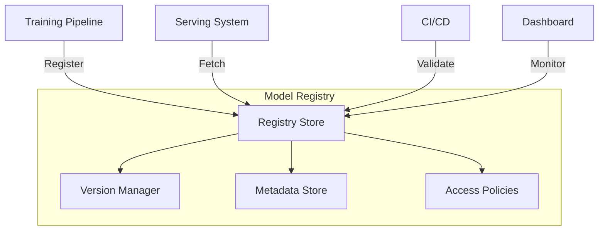

# Model Registry

## Overview

A Model Registry is a centralized repository for managing ML model versions, their metadata, and lifecycle stages. It acts as a "single source of truth" for all models in an organization.

## Model Lifecycle



## Registry Architecture



## Key Features

### 1. Model Versioning
```python
# MLflow example
import mlflow

with mlflow.start_run():
    mlflow.log_param("learning_rate", 0.01)
    mlflow.log_metric("accuracy", 0.95)
    mlflow.sklearn.log_model(model, "model")
    
    # Register model
    mlflow.register_model("runs:/<run_id>/model", "MyModel")
```

### 2. Metadata Tracking
- Training parameters (hyperparameters, data version)
- Performance metrics (accuracy, loss, latency)
- Lineage (which data, which code version)
- Tags and descriptions

### 3. Model Promotion
| Stage | Purpose | Who Can Promote |
|-------|---------|-----------------|
| Development | Experimentation | Data Scientists |
| Staging | Validation | ML Engineers |
| Production | Live serving | ML Leads |
| Archived | Retired models | System |

## Comparison of Tools

| Tool | Open Source | Cloud-native | Key Strength |
|------|------------|--------------|--------------|
| MLflow | ✅ | ❌ | Popular, framework-agnostic |
| Neptune | ❌ | ✅ | Rich UI, collaboration |
| Weights & Biases | ❌ | ✅ | Experiment tracking |
| Vertex AI | ❌ | ✅ | GCP integration |
| SageMaker | ❌ | ✅ | AWS integration |

## Interview Questions

1. **Why do you need a model registry?**
2. **How do you handle model rollback in production?**
3. **What metadata should be stored with each model?**
4. **How do you manage model access control?**
5. **Explain the model promotion workflow.**

## Common Mistakes

- **No versioning**: Deploying models without versions makes rollback impossible
- **Missing metadata**: Without lineage, debugging production issues is hard
- **No access control**: Anyone can push models to production without review
- **Storing large artifacts inline**: Use artifact storage (S3, GCS) with registry pointers

## Summary

A Model Registry is critical for managing ML model lifecycle. It provides versioning, metadata tracking, access control, and a clear promotion path from development to production. Tools like MLflow, Neptune, and cloud-native solutions (Vertex AI, SageMaker) offer varying levels of functionality.

## Cross-References

- [MLflow](./mlflow.md)
- [Model Deployment](./deployment.md)
- [Model Monitoring](./monitoring.md)
- [Versioning & Storage](../../storage/overview.md)
