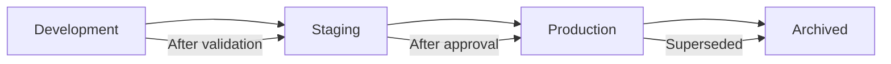

# Model Registry

## Overview

A model registry is a centralized repository for managing ML models throughout their lifecycle. It stores model artifacts, tracks versions, manages metadata (metrics, parameters, data lineage), and controls the staging process (development → staging → production). Think of it as "GitHub for ML models."

## Why a Model Registry?

```mermaid
graph TD
    PROBLEM[Without Registry]
    PROBLEM --> P1[Models scattered across machines]
    PROBLEM --> P2[No version tracking]
    PROBLEM --> P3[No lineage (which data? which code?)]
    PROBLEM --> P4[Manual deployment process]
    PROBLEM --> P5[No rollback capability]

    REGISTRY[With Registry]
    REGISTRY --> R1[Centralized storage]
    REGISTRY --> R2[Version management]
    REGISTRY --> R3[Full lineage tracking]
    REGISTRY --> R4[Automated staging]
    REGISTRY --> R5[Easy rollback]
```

## Model Lifecycle



| Stage | Description | Who Can Access |
|---|---|---|
| **Development** | Experimental models | Data scientists |
| **Staging** | Validated, ready for testing | ML engineers |
| **Production** | Live, serving traffic | Everyone |
| **Archived** | Retired models | Reference only |

## Model Versioning

```python
# Register a new model version
model_registry.register(
    name="fraud-detection",
    version="v2.3",
    artifact_path="s3://models/fraud/v2.3/model.pkl",
    metrics={"auc": 0.95, "precision": 0.92, "recall": 0.88},
    parameters={"learning_rate": 0.001, "epochs": 100},
    training_data="s3://data/transactions/2024-01.parquet",
    code_commit="abc123",
    stage="staging"
)

# Promote to production
model_registry.transition(
    name="fraud-detection",
    version="v2.3",
    stage="production"
)

# Rollback
model_registry.transition(
    name="fraud-detection",
    version="v2.2",
    stage="production"
)
```

## Model Metadata

| Metadata | Purpose | Example |
|---|---|---|
| **Metrics** | Model performance | AUC=0.95, accuracy=0.92 |
| **Parameters** | Training config | lr=0.001, epochs=100 |
| **Data lineage** | Training data | dataset v3.2, 100K samples |
| **Code version** | Training code | git commit abc123 |
| **Framework** | Dependencies | PyTorch 2.0, Python 3.10 |
| **Tags** | Searchability | "fraud", "production" |
| **Description** | Human notes | "Added new features" |

## Model Registry Tools

| Tool | Type | Key Feature |
|---|---|---|
| **MLflow** | Open-source | Most popular, integrates with everything |
| **W&B** | Managed | Great visualization, collaboration |
| **Neptune** | Managed | Metadata focus |
| **DVC** | Open-source | Git-based versioning |
| **Vertex AI** | Google Cloud | Integrated with GCP |
| **SageMaker** | AWS | Integrated with AWS |

## MLflow Model Registry

```python
import mlflow

# Log and register model
with mlflow.start_run():
    mlflow.log_param("learning_rate", 0.001)
    mlflow.log_metric("auc", 0.95)
    
    mlflow.sklearn.log_model(
        model,
        "model",
        registered_model_name="fraud-detection"
    )

# Transition stage
client = mlflow.tracking.MlflowClient()
client.transition_model_version_stage(
    name="fraud-detection",
    version=1,
    stage="Production"
)
```

## Interview Questions

### Q1: What is a model registry and why do you need one?
**Answer:** A model registry is a centralized system for managing ML models throughout their lifecycle. It provides:
1. **Versioning**: Track every model version with its metrics, parameters, and data
2. **Staging**: Manage models through dev → staging → production stages
3. **Lineage**: Know which data and code produced each model
4. **Collaboration**: Team can discover, compare, and approve models
5. **Rollback**: Quickly revert to a previous model version

Without a registry, models are scattered across machines with no tracking.

### Q2: How do you handle model rollback?
**Answer:** With a model registry:
1. The previous production model is still in the registry with its stage marked
2. To rollback: transition the old version back to "Production" and the new version to "Archived"
3. The serving system reads from the registry and loads the production model
4. Some registries support traffic splitting for gradual rollback

Key: Never delete old model versions. Always keep them for rollback.

### Q3: What metadata should you track for each model?
**Answer:**
- **Metrics**: Performance on validation/test sets
- **Hyperparameters**: Training configuration
- **Data version**: Which dataset was used (hash or version)
- **Code version**: Git commit hash of training code
- **Framework**: Library versions (PyTorch, Python)
- **Training environment**: GPU type, number of GPUs
- **Model size**: Parameters, file size
- **Inference latency**: Prediction time benchmarks

## Common Mistakes

- ❌ Not versioning models (can't rollback)
- ❌ Not tracking data lineage (can't reproduce)
- ❌ No staging process (models go straight to production)
- ❌ Not storing model metadata (can't compare versions)
- ❌ Keeping only the latest model (no rollback capability)

## Summary

A model registry manages ML models through their lifecycle with versioning, staging, and metadata tracking. MLflow is the most popular open-source option. Key features: version management, stage transitions, lineage tracking, and rollback capability.

## Cross-References

- [MLflow →](mlflow.md) MLflow deep dive
- [Pipelines →](pipelines.md) Where models are trained
- [Deployment →](deployment.md) How models are deployed
- [Monitoring →](monitoring.md) Tracking model performance
