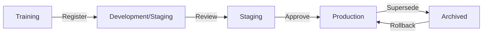

# Model Registry

## Overview

A model registry is a centralized repository for managing trained ML models through their lifecycle. It stores model artifacts, metadata, versions, and tracks which models are in staging, production, or archived. Think of it as "Git for ML models" — providing versioning, lineage, access control, and stage management.

## Model Lifecycle



## Key Features

| Feature | Description |
|---------|-------------|
| Versioning | Track every model iteration |
| Metadata | Hyperparameters, metrics, training data |
| Lineage | Which code/data produced this model |
| Stage Management | Dev → Staging → Production → Archived |
| Access Control | Who can register, promote, deploy |
| Model Artifacts | Serialized model files (pkl, ONNX, SavedModel) |

## MLflow Model Registry

```python
import mlflow
import mlflow.sklearn
from sklearn.ensemble import RandomForestClassifier

# Train model
model = RandomForestClassifier(n_estimators=100)
model.fit(X_train, y_train)

# Log and register
with mlflow.start_run() as run:
    mlflow.log_param("n_estimators", 100)
    mlflow.log_metric("accuracy", accuracy)
    mlflow.sklearn.log_model(
        model,
        "model",
        registered_model_name="fraud-detection"
    )

# Transition stages
from mlflow import MlflowClient

client = MlflowClient()
# Transition to staging
client.transition_model_version_stage(
    name="fraud-detection",
    version=3,
    stage="Staging"
)
# After validation, transition to production
client.transition_model_version_stage(
    name="fraud-detection",
    version=3,
    stage="Production"
)
```

## Model Metadata Schema

```python
model_metadata = {
    "model_name": "fraud-detection-v2",
    "version": "3",
    "framework": "sklearn",
    "algorithm": "RandomForest",
    "hyperparameters": {
        "n_estimators": 100,
        "max_depth": 10
    },
    "metrics": {
        "accuracy": 0.95,
        "f1_score": 0.92,
        "auc_roc": 0.97
    },
    "training_data": {
        "dataset": "transactions-2024-q1",
        "version": "v2.1",
        "rows": 1000000
    },
    "lineage": {
        "git_commit": "abc123",
        "pipeline_run_id": "run-456",
        "training_date": "2024-03-15"
    },
    "stage": "Production",
    "deployed_to": ["us-east-1", "eu-west-1"]
}
```

## Comparison of Registries

| Tool | Integration | Strengths |
|------|-------------|-----------|
| MLflow | Open-source, any framework | Simple, widely adopted |
| Weights & Biases | W&B ecosystem | Rich experiment tracking |
| Vertex AI Model Registry | GCP | Integrated with Vertex AI |
| SageMaker Model Registry | AWS | Integrated with SageMaker |
| Neptune.ai | Any framework | Strong metadata management |

## Interview Questions

1. **Why do you need a model registry?** — Without one, model artifacts are scattered across filesystems, there's no versioning or lineage, and promoting models to production is manual and error-prone.

2. **What metadata should a model registry track?** — Hyperparameters, metrics, training data version, code commit, framework, dependencies, training date, and deployment status.

3. **How do you handle model rollback?** — The registry maintains previous versions. If a production model degrades, promote the previous version back to production and redeploy.

4. **What is the difference between a model registry and an artifact store?** — An artifact store holds files (models, plots, data). A registry adds versioning, metadata, stage management, and lineage tracking on top.

5. **How do you ensure model reproducibility?** — Store the exact code commit, data version, hyperparameters, random seeds, and environment (Docker image) alongside the model in the registry.

## Summary

A model registry is essential for managing ML models in production. It provides versioning, metadata tracking, stage management, and lineage. MLflow's model registry is the most popular open-source option, while cloud platforms offer integrated solutions. Proper model registry practices enable reliable rollbacks, auditing, and governance.

## Cross-References

- [MLOps Overview](./README.md) — MLOps fundamentals
- [MLflow](./mlflow.md) — MLflow details
- [Model Deployment](./deployment.md) — Deploying registered models
- [Monitoring](./monitoring.md) — Tracking model performance
- [ML Pipeline](./pipelines.md) — Where models are trained
