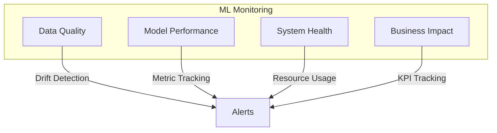
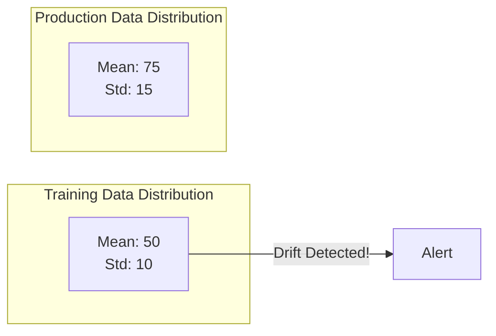
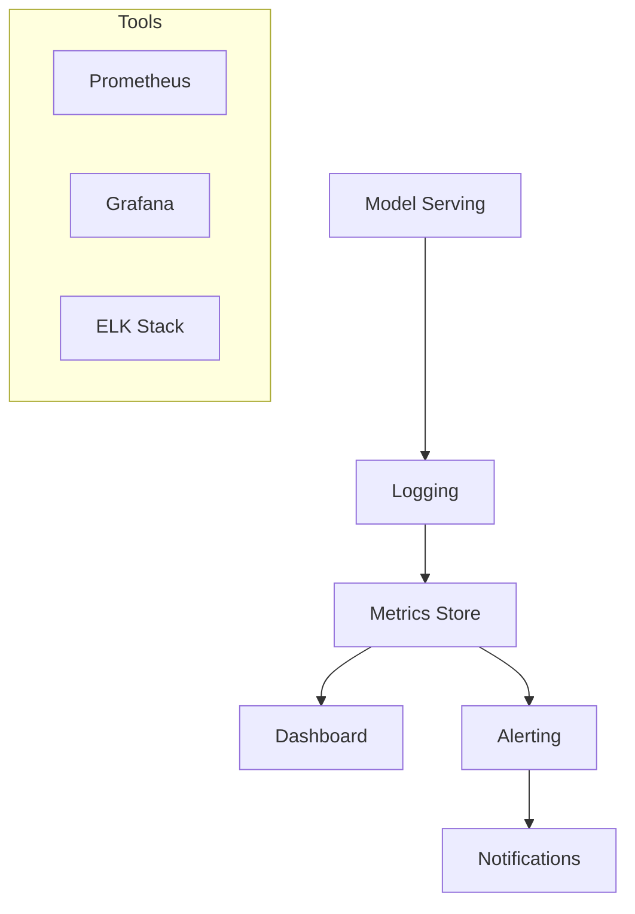

# ML Monitoring

## Overview

ML Monitoring tracks the health, performance, and behavior of ML models in production. It detects issues like data drift, model degradation, and infrastructure problems before they impact business outcomes.

## Monitoring Dimensions



## What to Monitor

### 1. Data Drift



**Types of Drift:**
| Type | Description | Detection Method |
|------|-------------|------------------|
| Covariate Drift | Input distribution changes | KS test, PSI |
| Concept Drift | Relationship X→Y changes | Performance monitoring |
| Label Drift | Output distribution changes | Chi-square test |

### 2. Model Performance
- **Prediction metrics**: Accuracy, precision, recall, F1
- **Business metrics**: Revenue impact, conversion rate
- **Latency**: P50, P95, P99 response times
- **Throughput**: Predictions per second

### 3. System Health
- CPU/GPU utilization
- Memory usage
- Request queue depth
- Error rates

## Monitoring Stack



## Drift Detection Methods

### Population Stability Index (PSI)
```python
def calculate_psi(expected, actual, buckets=10):
    """Calculate PSI between two distributions."""
    breakpoints = np.percentile(expected, np.linspace(0, 100, buckets + 1))
    expected_pct = np.histogram(expected, breakpoints)[0] / len(expected)
    actual_pct = np.histogram(actual, breakpoints)[0] / len(actual)
    
    psi = np.sum((actual_pct - expected_pct) * np.log(actual_pct / expected_pct))
    return psi

# PSI < 0.1: No drift
# PSI 0.1-0.25: Moderate drift
# PSI > 0.25: Significant drift
```

## Interview Questions

1. **What is data drift and how do you detect it?**
2. **How do you set up alerting for model performance?**
3. **What's the difference between data drift and concept drift?**
4. **How would you monitor a model that doesn't get ground truth labels immediately?**
5. **What metrics would you track for a recommendation model?**

## Common Mistakes

- **No baseline**: Without a reference distribution, drift detection is meaningless
- **Delayed ground truth**: Waiting weeks for labels means late detection
- **Alert fatigue**: Too many alerts lead to ignoring real issues
- **Monitoring only accuracy**: Business metrics matter more than ML metrics

## Summary

ML Monitoring is essential for maintaining model quality in production. It encompasses data quality, model performance, system health, and business impact. Key techniques include drift detection (PSI, KS test), performance tracking, and proactive alerting. A good monitoring setup catches issues before they impact users.

## Cross-References

- [Cloud Observability](../../cloud/observability/README.md)
- [Model Drift](./drift.md)
- [A/B Testing](./ab-testing.md)
- [Metrics & Logging](../../cloud/observability/logging.md)
- [ML System Design Monitoring](../system-design/monitoring.md)
