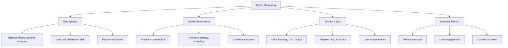

# Model Monitoring

## Overview

Model monitoring tracks the health, performance, and behavior of ML models in production. Unlike traditional software, ML models can silently degrade as data patterns shift. Monitoring detects data drift, concept drift, prediction anomalies, and performance degradation — triggering alerts or retraining before business impact.

## What to Monitor



## Monitoring Layers

### 1. Data Monitoring

```python
import numpy as np
from scipy.stats import ks_2samp, chi2_contingency

def detect_data_drift(reference_data, current_data, threshold=0.05):
    """Detect drift using Kolmogorov-Smirnov test"""
    drift_results = {}
    for col in reference_data.columns:
        stat, p_value = ks_2samp(reference_data[col], current_data[col])
        drift_results[col] = {
            'statistic': stat,
            'p_value': p_value,
            'drift_detected': p_value < threshold
        }
    return drift_results

def population_stability_index(reference, current, bins=10):
    """PSI: measure distribution shift"""
    # Bin the reference data
    breakpoints = np.percentile(reference, np.linspace(0, 100, bins + 1))
    ref_counts = np.histogram(reference, bins=breakpoints)[0] / len(reference)
    cur_counts = np.histogram(current, bins=breakpoints)[0] / len(current)

    # Avoid division by zero
    ref_counts = np.clip(ref_counts, 1e-4, None)
    cur_counts = np.clip(cur_counts, 1e-4, None)

    psi = np.sum((cur_counts - ref_counts) * np.log(cur_counts / ref_counts))
    return psi  # < 0.1: stable, 0.1-0.25: moderate shift, > 0.25: significant shift
```

### 2. Prediction Monitoring

```python
class PredictionMonitor:
    def __init__(self, baseline_predictions):
        self.baseline_mean = np.mean(baseline_predictions)
        self.baseline_std = np.std(baseline_predictions)

    def check_prediction_drift(self, current_predictions, window_size=1000):
        """Monitor prediction distribution shift"""
        current_mean = np.mean(current_predictions[-window_size:])
        current_std = np.std(current_predictions[-window_size:])

        # Z-test for mean shift
        z_score = abs(current_mean - self.baseline_mean) / self.baseline_std
        drift = z_score > 3  # 3-sigma rule

        return {
            'mean_shift': current_mean - self.baseline_mean,
            'z_score': z_score,
            'drift_detected': drift
        }
```

### 3. Performance Monitoring

```python
def monitor_performance(y_true, y_pred, baseline_metrics):
    """Track model performance over time"""
    from sklearn.metrics import accuracy_score, f1_score, roc_auc_score

    current = {
        'accuracy': accuracy_score(y_true, y_pred),
        'f1': f1_score(y_true, y_pred),
    }

    alerts = []
    for metric, value in current.items():
        baseline = baseline_metrics[metric]
        degradation = (baseline - value) / baseline
        if degradation > 0.05:  # 5% degradation threshold
            alerts.append(f"⚠️ {metric} degraded by {degradation:.1%}")

    return current, alerts
```

## Alerting Strategy

```python
class AlertManager:
    def __init__(self):
        self.alerts = []

    def evaluate(self, metrics, thresholds):
        """Evaluate metrics against thresholds"""
        for metric, value in metrics.items():
            threshold = thresholds.get(metric)
            if threshold and value > threshold:
                self.alerts.append({
                    'metric': metric,
                    'value': value,
                    'threshold': threshold,
                    'severity': self._severity(value, threshold)
                })

    def _severity(self, value, threshold):
        ratio = value / threshold
        if ratio > 2:
            return 'CRITICAL'
        elif ratio > 1.5:
            return 'WARNING'
        return 'INFO'
```

## Monitoring Dashboard Metrics

| Metric | Frequency | Alert Condition |
|--------|-----------|-----------------|
| Prediction distribution | Real-time | PSI > 0.25 |
| Feature drift | Hourly | KS test p < 0.01 |
| Latency p99 | Real-time | > 500ms |
| Error rate | Real-time | > 1% |
| Throughput | Real-time | < 50% baseline |
| Missing features | Hourly | > 5% null |
| Model accuracy | Daily | > 5% degradation |

## Interview Questions

1. **What is the difference between data drift and concept drift?** — Data drift: input distribution P(X) changes. Concept drift: the relationship P(Y|X) changes. Example: user demographics shift (data drift) vs. what users want changes (concept drift).

2. **How do you detect data drift?** — Statistical tests (KS test, chi-squared), distribution comparison (PSI, JS divergence), or by monitoring feature statistics (mean, variance, missing rate).

3. **What metrics should you monitor for an ML model?** — Input data quality (missing values, drift), prediction distribution, performance metrics (if ground truth available), system metrics (latency, throughput), and business KPIs.

4. **How do you handle model degradation?** — Automated retraining pipeline triggered by drift alerts, A/B testing new models, canary deployment for safe rollout, and rollback capability.

5. **What is the feedback loop problem?** — When model predictions influence future training data (e.g., recommendation system only shows predicted-top items). This can amplify biases and degrade performance.

## Summary

Model monitoring is critical for maintaining ML model health in production. It encompasses data quality (drift, anomalies), prediction behavior, system health, and business impact. Key techniques include statistical drift tests (KS, PSI), performance tracking, and multi-level alerting. Monitoring should trigger automated retraining when degradation is detected.

## Cross-References

- [Data Drift](./drift.md) — Detailed drift detection
- [MLOps Overview](./README.md) — MLOps fundamentals
- [ML Monitoring (System Design)](../system-design/monitoring.md) — Design perspective
- [A/B Testing](./ab-testing.md) — Evaluating model changes
- [Evaluation Metrics](../foundations/evaluation.md) — Performance metrics
