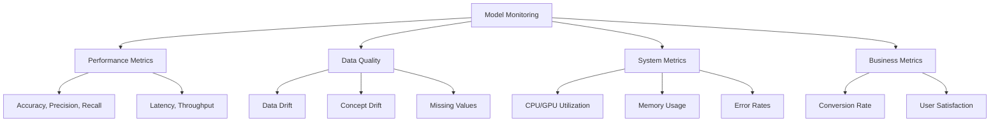
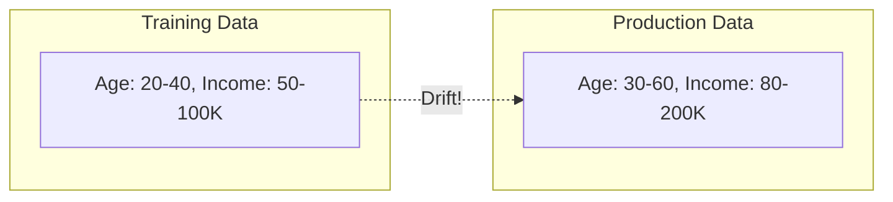
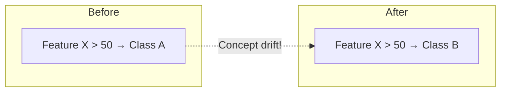
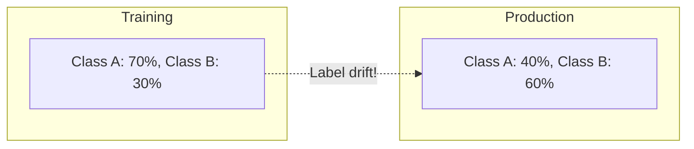
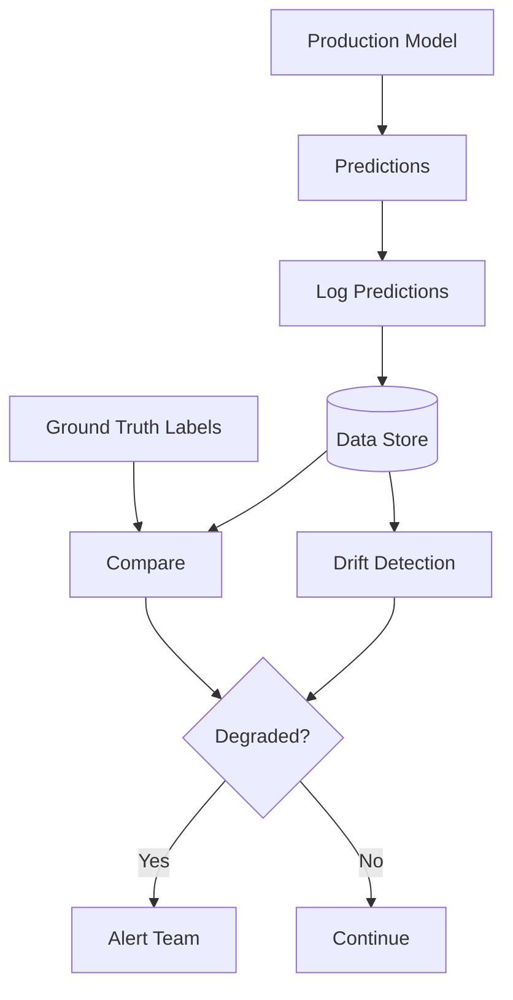

# Model Monitoring

## Overview

Model monitoring tracks the performance and health of ML models in production. Unlike software that either works or fails, ML models can silently degrade — predictions become less accurate over time as data patterns change. Monitoring detects these issues before they impact users.

## What to Monitor



## Types of Drift

### Data Drift (Covariate Shift)

Input data distribution changes:



### Concept Drift

Relationship between input and output changes:



### Label Drift

Output distribution changes:



## Monitoring Architecture



## Key Metrics

### Performance Metrics

| Metric | Formula | When to Use |
|---|---|---|
| **Accuracy** | correct / total | Balanced classes |
| **Precision** | TP / (TP + FP) | Cost of false positives is high |
| **Recall** | TP / (TP + FN) | Cost of false negatives is high |
| **F1** | 2 × P × R / (P + R) | Balance precision and recall |
| **AUC** | Area under ROC | Ranking problems |
| **MAE/MSE** | Error metrics | Regression |

### Operational Metrics

| Metric | What It Measures | Alert Threshold |
|---|---|---|
| **Latency (p50/p99)** | Prediction time | > 100ms / > 500ms |
| **Throughput** | Predictions/sec | < expected minimum |
| **Error rate** | Failed predictions | > 1% |
| **Memory usage** | Model memory | > 80% capacity |
| **Queue depth** | Pending requests | > 100 |

## Alerting

```python
class ModelMonitor:
    def __init__(self, thresholds):
        self.thresholds = thresholds
    
    def check_metrics(self, current_metrics):
        alerts = []
        
        for metric, value in current_metrics.items():
            threshold = self.thresholds.get(metric)
            if threshold and value < threshold:
                alerts.append(Alert(
                    metric=metric,
                    current=value,
                    threshold=threshold,
                    severity="HIGH" if value < threshold * 0.9 else "MEDIUM"
                ))
        
        if alerts:
            self.send_notifications(alerts)
        
        return alerts
```

## Monitoring Tools

| Tool | Focus | Key Feature |
|---|---|---|
| **Prometheus + Grafana** | System metrics | Industry standard |
| **Evidently AI** | ML-specific | Drift detection |
| **Whylogs** | Data logging | Lightweight profiling |
| **Arize** | ML observability | Production monitoring |
| **Fiddler** | Model monitoring | Explainability |

## Interview Questions

### Q1: What is model monitoring and why is it important?
**Answer:** Model monitoring tracks ML model performance in production. It's important because:
1. Models degrade silently (unlike software errors)
2. Data distributions change over time (data drift)
3. The relationship between inputs and outputs can change (concept drift)
4. Production data may differ from training data
5. Early detection prevents business impact

Without monitoring, you won't know your model is failing until users complain.

### Q2: What is the difference between data drift and concept drift?
**Answer:**
- **Data drift**: The input data distribution changes. Example: average user age shifts from 25 to 35.
- **Concept drift**: The relationship between inputs and outputs changes. Example: what was a "high-value customer" before is no longer.
- Data drift is easier to detect (compare distributions). Concept drift requires labeled data or proxy metrics.

### Q3: How do you set up monitoring for an ML model?
**Answer:**
1. **Log predictions**: Store all inputs, outputs, and timestamps
2. **Collect ground truth**: Get actual outcomes when available
3. **Compute metrics**: Calculate performance metrics on recent data
4. **Detect drift**: Compare recent data distribution to training data
5. **Set alerts**: Define thresholds for key metrics
6. **Create dashboards**: Visualize trends over time
7. **Automate response**: Trigger retraining or rollback on degradation

## Common Mistakes

- ❌ Not monitoring at all (silent failures)
- ❌ Monitoring only system metrics (not model quality)
- ❌ No ground truth collection (can't compute real accuracy)
- ❌ Setting alert thresholds too sensitive (alert fatigue) or too loose (missed issues)
- ❌ Not automating response to degradation

## Summary

Model monitoring tracks performance, data quality, system health, and business metrics. Key concepts: data drift (input changes), concept drift (relationship changes), and label drift (output changes). Tools like Evidently AI and Prometheus help detect issues early. Alerting and automated response are essential for production systems.

## Cross-References

- [Drift →](drift.md) Drift detection methods
- [A/B Testing →](ab-testing.md) Comparing model versions
- [Canary →](canary.md) Gradual rollout with monitoring
- [MLflow →](mlflow.md) Experiment tracking
