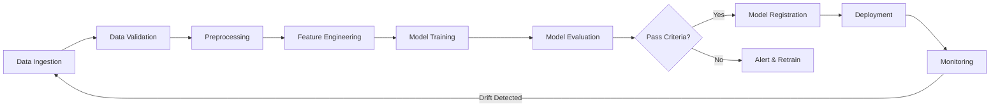
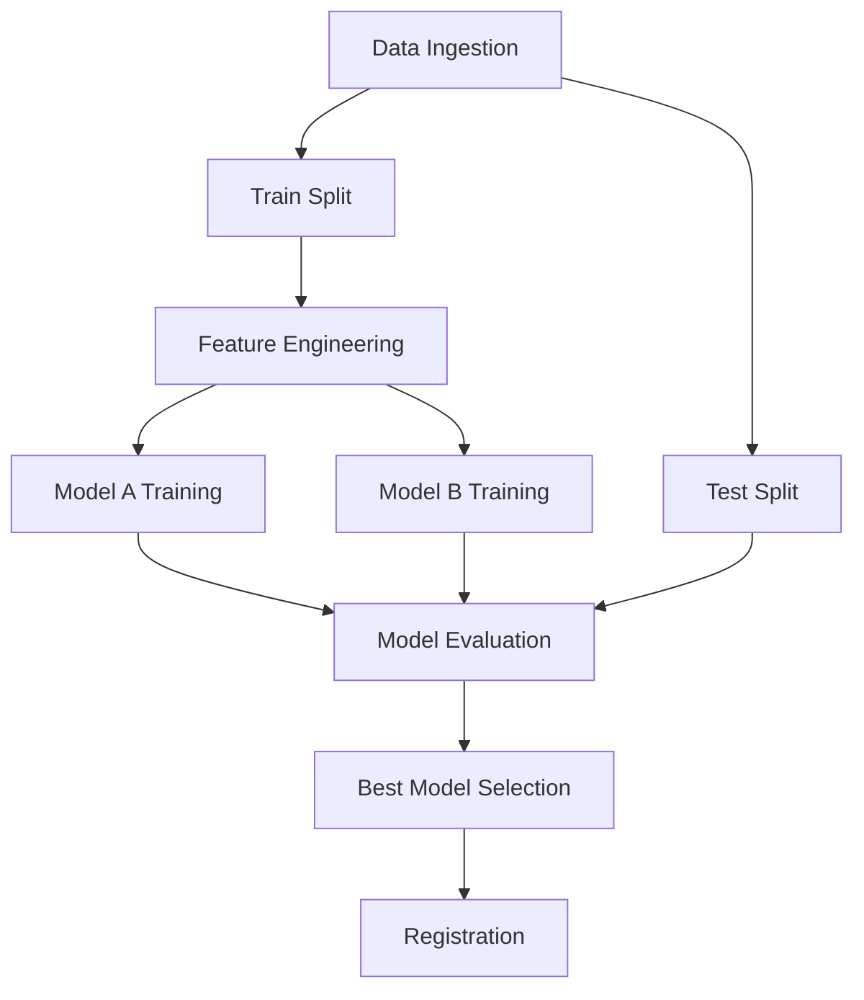
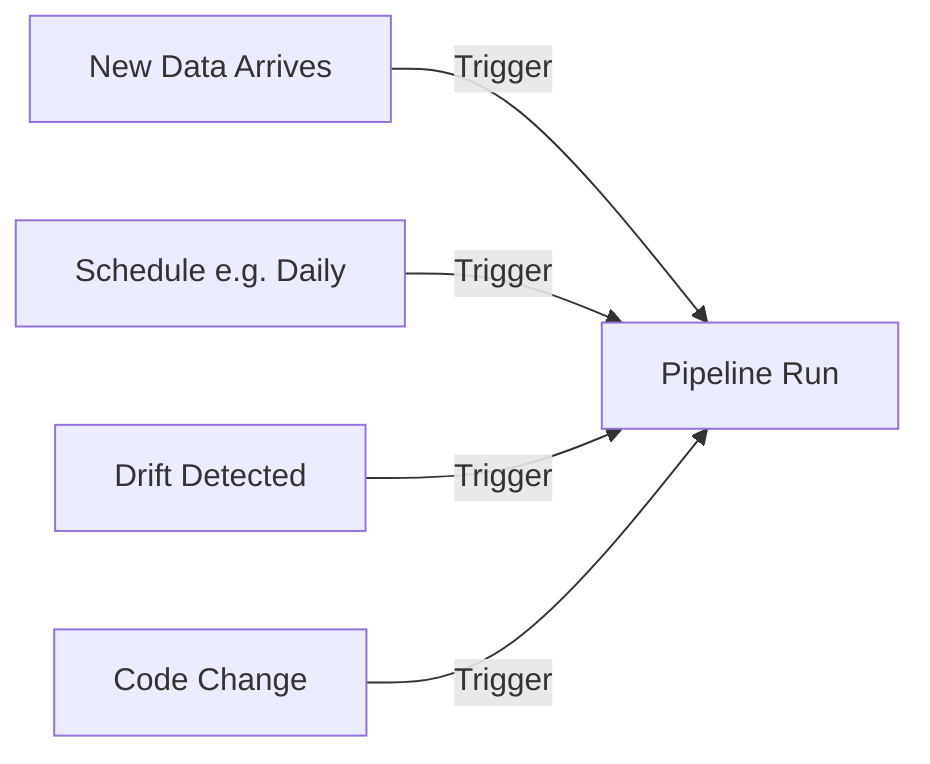

# ML Pipeline Orchestration

## Overview

ML pipelines automate the end-to-end machine learning workflow — from data ingestion and preprocessing through model training, evaluation, and deployment. Pipeline orchestration tools manage dependencies between steps, handle failures, enable reproducibility, and allow scheduled or triggered execution. This is the backbone of production ML systems.

## Pipeline Components



## Pipeline Design Patterns

### 1. Sequential Pipeline

```python
# Kubeflow Pipelines example
import kfp
from kfp import dsl

@dsl.component
def data_ingestion() -> str:
    # Load data from source
    return data_path

@dsl.component
def preprocessing(data_path: str) -> str:
    # Clean, transform, split
    return processed_path

@dsl.component
def training(processed_path: str) -> str:
    # Train model
    return model_path

@dsl.component
def evaluation(model_path: str) -> bool:
    # Evaluate against threshold
    return passes_criteria

@dsl.pipeline(name='ml-pipeline')
def ml_pipeline():
    data = data_ingestion()
    processed = preprocessing(data=data.output)
    model = training(processed=processed.output)
    eval_result = evaluation(model=model.output)
```

### 2. DAG Pipeline



### 3. Event-Driven Pipeline



## Popular Orchestration Tools

| Tool | Type | Strengths |
|------|------|-----------|
| Kubeflow Pipelines | K8s-native | Scalable, K8s integration |
| Airflow | General DAG | Mature, large ecosystem |
| Prefect | Modern DAG | Pythonic, easy to use |
| Dagster | Data-aware | Strong typing, asset-based |
| MLflow Projects | ML-specific | Simple, MLflow integration |
| Argo Workflows | K8s-native | Lightweight, container-native |

### Airflow Example

```python
from airflow import DAG
from airflow.operators.python import PythonOperator
from datetime import datetime, timedelta

default_args = {
    'owner': 'ml-team',
    'retries': 2,
    'retry_delay': timedelta(minutes=5),
}

with DAG(
    'ml_training_pipeline',
    default_args=default_args,
    schedule_interval='@weekly',
    start_date=datetime(2024, 1, 1),
    catchup=False,
) as dag:

    ingest = PythonOperator(task_id='ingest_data', python_callable=ingest_fn)
    validate = PythonOperator(task_id='validate_data', python_callable=validate_fn)
    preprocess = PythonOperator(task_id='preprocess', python_callable=preprocess_fn)
    train = PythonOperator(task_id='train_model', python_callable=train_fn)
    evaluate = PythonOperator(task_id='evaluate', python_callable=evaluate_fn)
    deploy = PythonOperator(task_id='deploy', python_callable=deploy_fn)

    ingest >> validate >> preprocess >> train >> evaluate >> deploy
```

## Pipeline Best Practices

1. **Idempotency**: Each step should produce the same output given the same input
2. **Versioning**: Version code, data, and model artifacts
3. **Caching**: Skip steps that haven't changed (Kubeflow caching)
4. **Validation gates**: Automatic quality checks between steps
5. **Observability**: Log metrics, artifacts, and execution metadata
6. **Failure handling**: Retry logic, alerts, graceful degradation

## Interview Questions

1. **Why use pipelines instead of scripts?** — Pipelines provide dependency management, parallel execution, caching, monitoring, reproducibility, and failure recovery that scripts lack.

2. **How do you handle pipeline failures?** — Retry with backoff, alert on-call, checkpoint intermediate results, implement idempotent steps so re-running is safe.

3. **What is the difference between Airflow and Kubeflow Pipelines?** — Airflow is a general-purpose workflow orchestrator. Kubeflow is ML-specific, runs on Kubernetes, and provides built-in ML components (training, serving, metadata tracking).

4. **How do you ensure reproducibility in ML pipelines?** — Version all inputs (code, data, hyperparameters), use deterministic random seeds, pin dependency versions, and log all artifacts.

5. **When should you retrain a model?** — Scheduled (daily/weekly), on data drift detection, on performance degradation, or on new data availability.

## Summary

ML pipeline orchestration automates the end-to-end ML lifecycle, ensuring reproducibility, scalability, and reliability. Tools like Kubeflow, Airflow, and Dagster manage DAG-based workflows with dependencies, caching, and failure handling. Best practices include idempotency, versioning, validation gates, and comprehensive observability.

## Cross-References

- [MLOps Overview](./README.md) — MLOps fundamentals
- [CI/CD for ML](./cicd.md) — Continuous integration and deployment
- [Model Registry](./model-registry.md) — Versioning trained models
- [Monitoring](./monitoring.md) — Production model monitoring
- [Data Pipeline](../system-design/data-pipeline.md) — Data engineering
