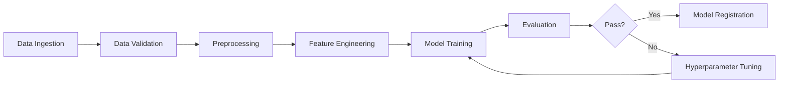
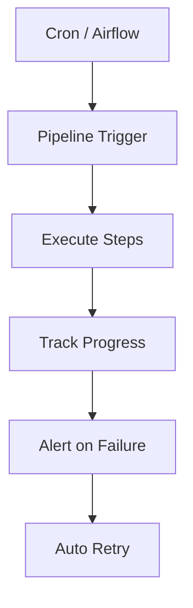

# ML Pipelines

## Overview

An ML Pipeline is a sequence of automated steps that transform raw data into a trained, deployable model. Pipelines ensure reproducibility, scalability, and maintainability of ML workflows.

## Pipeline Architecture



## Key Components

### 1. Data Ingestion
- Collect data from various sources (databases, APIs, files)
- Handle different formats (CSV, JSON, Parquet)
- Manage data freshness and scheduling

### 2. Data Validation
```python
# Example: Great Expectations validation
import great_expectations as gx

context = gx.get_context()
validator = context.sources.pandas_default.read_csv("data.csv")
validator.expect_column_values_to_not_be_null("feature_1")
validator.expect_column_values_to_be_between("age", 0, 120)
```

### 3. Preprocessing & Feature Engineering
- Handle missing values, outliers
- Normalize, encode, transform features
- Create new features from raw data

### 4. Model Training
- Train with various algorithms
- Hyperparameter tuning (Grid, Random, Bayesian)
- Cross-validation

### 5. Evaluation
- Metrics: accuracy, precision, recall, F1, AUC-ROC
- Compare against baseline
- Business metric alignment

## Pipeline Orchestration



## Tools

| Tool | Type | Key Feature |
|------|------|-------------|
| Apache Airflow | Orchestrator | DAG-based workflows |
| Kubeflow Pipelines | ML-native | Kubernetes-based |
| MLflow | Tracking | Experiment tracking |
| TFX | End-to-end | TensorFlow ecosystem |
| ZenML | Framework-agnostic | Stack abstraction |

## Interview Questions

1. **What are the benefits of using ML pipelines?**
2. **How do you handle pipeline failures and retries?**
3. **Explain the difference between batch and streaming pipelines.**
4. **How do you ensure reproducibility in pipelines?**
5. **How would you design a pipeline for real-time predictions?**

## Common Mistakes

- **Tight coupling**: Steps depend on each other too heavily, making changes difficult
- **No data validation**: Garbage in, garbage out — validate at every step
- **Missing logging**: Hard to debug failures without proper logging
- **No versioning**: Data, code, and model versions must be tracked together

## Summary

ML Pipelines automate the end-to-end workflow from data to deployed models. They ensure reproducibility, enable collaboration, and form the backbone of production ML systems. Key design principles include modularity, idempotency, and observability.
