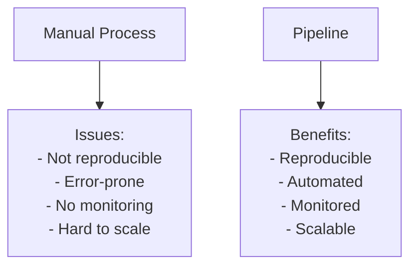
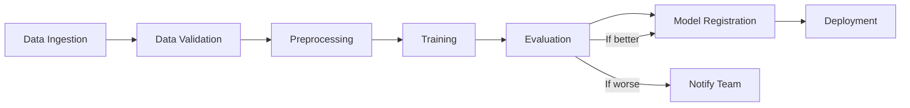

# ML Pipeline Orchestration

## Overview

ML pipeline orchestration automates the workflow of data processing, model training, evaluation, and deployment. Instead of running scripts manually, pipelines define these steps as a DAG (Directed Acyclic Graph) that can be scheduled, monitored, and reproduced. This is the foundation of reliable ML systems.

## Why Pipelines?



## Pipeline DAG



## Pipeline Orchestration Tools

### Comparison

| Tool | Type | Best For | Learning Curve |
|---|---|---|---|
| **Airflow** | General workflow | Complex DAGs, scheduling | Medium |
| **Kubeflow Pipelines** | ML-specific | Kubernetes-native ML | High |
| **Prefect** | Modern workflow | Python-native, easy | Low |
| **Dagster** | Data-aware | Data quality focus | Medium |
| **ZenML** | MLOps-specific | End-to-end MLOps | Low |
| **Metaflow** | ML-specific | Netflix-style ML | Low |

## Apache Airflow

The most widely-used workflow orchestrator:

```python
from airflow import DAG
from airflow.operators.python import PythonOperator
from datetime import datetime, timedelta

default_args = {
    'owner': 'ml-team',
    'retries': 2,
    'retry_delay': timedelta(minutes=5),
}

dag = DAG(
    'ml_training_pipeline',
    default_args=default_args,
    schedule_interval='@weekly',
    start_date=datetime(2024, 1, 1),
)

def ingest_data():
    """Pull latest data from source."""
    data = fetch_from_database()
    save_to_storage(data)

def validate_data(ti):
    """Validate data quality."""
    data = ti.xcom_pull(task_ids='ingest')
    assert data.shape[0] > 1000, "Not enough data"
    assert data.isnull().sum().sum() < 100, "Too many nulls"

def train_model(ti):
    """Train the model."""
    data = ti.xcom_pull(task_ids='preprocess')
    model = train(data)
    save_model(model)

# Define tasks
ingest = PythonOperator(task_id='ingest', python_callable=ingest_data, dag=dag)
validate = PythonOperator(task_id='validate', python_callable=validate_data, dag=dag)
preprocess = PythonOperator(task_id='preprocess', python_callable=preprocess_data, dag=dag)
train = PythonOperator(task_id='train', python_callable=train_model, dag=dag)
evaluate = PythonOperator(task_id='evaluate', python_callable=evaluate_model, dag=dag)
register = PythonOperator(task_id='register', python_callable=register_model, dag=dag)

# Define dependencies
ingest >> validate >> preprocess >> train >> evaluate >> register
```

## Kubeflow Pipelines

ML-native pipeline orchestration on Kubernetes:

```python
import kfp
from kfp import dsl

@dsl.component
def ingest_data() -> str:
    data_path = fetch_data()
    return data_path

@dsl.component
def train_model(data_path: str, learning_rate: float) -> str:
    model = train(data_path, lr=learning_rate)
    return model_path

@dsl.pipeline(
    name='training-pipeline',
    description='End-to-end training pipeline'
)
def ml_pipeline(learning_rate: float = 0.001):
    data = ingest_data()
    model = train_model(
        data_path=data.output,
        learning_rate=learning_rate
    )

# Compile and run
kfp.compiler.Compiler().compile(ml_pipeline, 'pipeline.yaml')
```

## Prefect

Modern Python-native orchestration:

```python
from prefect import flow, task
from prefect.tasks import task_input_hash

@task(cache_key_fn=task_input_hash, retries=2)
def ingest_data():
    return fetch_data()

@task
def train_model(data, learning_rate):
    model = train(data, lr=learning_rate)
    return model

@flow(name="ML Training Flow")
def training_flow(learning_rate: float = 0.001):
    data = ingest_data()
    model = train_model(data, learning_rate)
    evaluate_model(model)
```

## Interview Questions

### Q1: Why use pipeline orchestration for ML?
**Answer:** ML pipelines automate the workflow from data to deployment. Benefits:
1. **Reproducibility**: Same pipeline = same results
2. **Automation**: No manual steps to forget or misorder
3. **Monitoring**: Track each step's status, logs, metrics
4. **Scheduling**: Run training weekly/daily automatically
5. **Scalability**: Run on distributed infrastructure
6. **Collaboration**: Team can understand and modify the workflow

### Q2: Airflow vs Kubeflow vs Prefect?
**Answer:**
- **Airflow**: General-purpose, mature, large community. Good for complex DAGs. Not ML-specific.
- **Kubeflow**: ML-specific, Kubernetes-native, includes model serving. Complex setup.
- **Prefect**: Modern, Python-native, easy to use. Good for teams wanting simplicity.
- **ZenML**: MLOps-specific, integrates with ML tools. Best for end-to-end MLOps.

Choose based on: team expertise (Python? Kubernetes?), ML-specific needs, and infrastructure.

### Q3: How do you handle pipeline failures?
**Answer:**
1. **Retries**: Configure automatic retries for transient failures
2. **Alerting**: Notify team on failure (Slack, email, PagerDuty)
3. **Checkpointing**: Save intermediate results so you can resume
4. **Idempotency**: Design steps to be safely re-runnable
5. **Fallback**: Have backup data sources or model versions
6. **Logging**: Comprehensive logs for debugging

## Common Mistakes

- ❌ Making pipelines too monolithic (hard to debug)
- ❌ Not versioning pipeline code
- ❌ No data validation steps (garbage in, garbage out)
- ❌ Ignoring pipeline monitoring
- ❌ Not testing pipelines before production

## Summary

ML pipeline orchestration automates the workflow from data to deployment. Airflow (general), Kubeflow (ML-specific), and Prefect (modern) are the main tools. Key benefits: reproducibility, automation, monitoring, and scalability. Design pipelines with validation, retries, and checkpointing.

## Cross-References

- [CI/CD →](cicd.md) Automated testing and deployment
- [Model Registry →](model-registry.md) Where models are registered
- [Monitoring →](monitoring.md) Pipeline and model monitoring
- [Kubeflow →](kubeflow.md) Kubeflow deep dive
