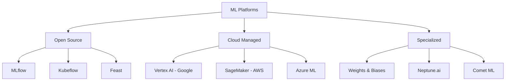
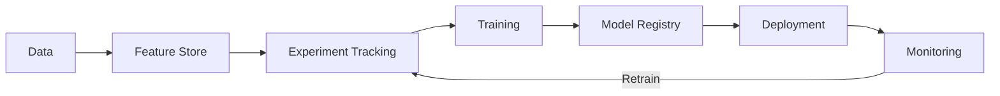

# ML Platforms

## Overview

ML platforms provide end-to-end infrastructure for the machine learning lifecycle — from data management and experiment tracking through model training, deployment, and monitoring. They reduce the engineering burden of building custom MLOps infrastructure, allowing teams to focus on model development.

## Platform Landscape

## Platform Comparison

| Platform | Provider | Strengths | Weaknesses |
|----------|----------|-----------|------------|
| MLflow | Open Source | Simple, framework-agnostic | Limited serving |
| Kubeflow | Open Source | K8s-native, scalable | Complex setup |
| Vertex AI | Google | Fully managed, AutoML | Vendor lock-in |
| SageMaker | AWS | Comprehensive, Studio UI | Complex pricing |
| Azure ML | Microsoft | Enterprise, Azure integration | Azure lock-in |
| W&B | Specialized | Best experiment tracking | Not full platform |

## Core Platform Components

## Interview Questions

1. **Build vs buy an ML platform?** — Buy when: small team, standard workflows, need to move fast. Build when: unique requirements, scale demands, engineering capacity. Most start with managed and migrate to custom as they scale.

2. **What are the must-have features of an ML platform?** — Experiment tracking, model registry, feature store, training infrastructure, deployment automation, and monitoring.

3. **How do you choose between cloud ML platforms?** — Consider existing cloud ecosystem, specific ML needs (AutoML, LLM support), team expertise, and cost. Multi-cloud strategies add complexity.

4. **What is the role of an ML platform team?** — Build and maintain the platform, provide tooling and templates, support ML teams, ensure best practices, and manage infrastructure costs.

## Summary

ML platforms abstract the complexity of MLOps infrastructure. Open-source options (MLflow, Kubeflow) offer flexibility, cloud platforms (Vertex AI, SageMaker) provide managed convenience, and specialized tools (W&B) excel at specific tasks. The choice depends on team size, existing infrastructure, and specific ML requirements.

## Cross-References

- [MLOps Overview](./README.md) — MLOps fundamentals
- [MLflow](./mlflow.md) — Open-source tracking
- [Kubeflow](./kubeflow.md) — K8s-native platform
- [Vertex AI](./vertex.md) — Google's platform
- [SageMaker](./sagemaker.md) — AWS platform
