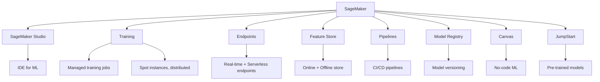

# Amazon SageMaker

## Overview

Amazon SageMaker is AWS's fully managed ML platform that covers the entire machine learning lifecycle. It provides tools for data labeling, notebook development, distributed training, hyperparameter tuning, model hosting, and monitoring. SageMaker's strength lies in its deep AWS integration, flexible pricing, and comprehensive feature set.

## Key Components



## Training Jobs

```python
import sagemaker
from sagemaker.estimator import Estimator

# Custom training
estimator = Estimator(
    image_uri="your-training-image:latest",
    role=sagemaker.get_execution_role(),
    instance_count=1,
    instance_type="ml.g4dn.xlarge",
    output_path="s3://bucket/output",
    use_spot_instances=True,  # 60-70% cost savings
    max_run=3600,
    max_wait=7200,
)

estimator.fit({"train": "s3://bucket/train", "test": "s3://bucket/test"})
```

## Hyperparameter Tuning

```python
from sagemaker.tuner import HyperparameterTuner, IntegerParameter, ContinuousParameter

hyperparameter_ranges = {
    "learning_rate": ContinuousParameter(0.0001, 0.1, scaling_type="Logarithmic"),
    "n_estimators": IntegerParameter(50, 500),
    "max_depth": IntegerParameter(3, 15),
}

tuner = HyperparameterTuner(
    estimator=estimator,
    objective_metric_name="validation:accuracy",
    hyperparameter_ranges=hyperparameter_ranges,
    max_jobs=50,
    max_parallel_jobs=5,
    strategy="Bayesian",
)

tuner.fit({"train": train_s3_path})
```

## Model Deployment

```python
# Deploy to real-time endpoint
predictor = estimator.deploy(
    initial_instance_count=1,
    instance_type="ml.m5.xlarge",
    endpoint_name="fraud-detection-endpoint",
)

# Serverless deployment
from sagemaker.serverless import ServerlessInferenceConfig

predictor = estimator.deploy(
    serverless_inference_config=ServerlessInferenceConfig(
        memory_size_in_mb=2048,
        max_concurrency=50,
    )
)

# Invoke endpoint
response = predictor.predict(data)
```

## SageMaker Pipelines

```python
from sagemaker.workflow.pipeline import Pipeline
from sagemaker.workflow.steps import TrainingStep, ProcessingStep
from sagemaker.workflow.conditions import ConditionGreaterThanOrEqualTo
from sagemaker.workflow.condition_step import ConditionStep

# Define steps
process_step = ProcessingStep(
    name="Preprocess",
    processor=sklearn_processor,
    inputs=[ProcessingInput(source=train_s3, destination="/opt/ml/processing/input")],
    outputs=[ProcessingInput(source="/opt/ml/processing/output", destination=process_s3)],
    code="preprocess.py",
)

train_step = TrainingStep(
    name="Train",
    estimator=estimator,
    inputs={"train": process_step.properties.ProcessingOutputConfig.Outputs["train"].S3Output.S3Uri},
)

# Quality gate
condition = ConditionGreaterThanOrEqualTo(
    left=train_step.properties.FinalMetricDataList[0].Value,
    right=0.90,
)

pipeline = Pipeline(
    name="ml-pipeline",
    steps=[process_step, train_step],
)

pipeline.upsert(role_arn=role)
pipeline.start()
```

## SageMaker Feature Store

```python
from sagemaker.feature_store.feature_group import FeatureGroup

feature_group = FeatureGroup(
    name="user-features",
    sagemaker_session=session,
)

feature_group.load_feature_definitions(data_frame=df)

feature_group.create(
    s3_uri="s3://bucket/feature-store",
    record_identifier_name="user_id",
    event_time_feature_name="event_time",
    role_arn=role,
)

# Ingest features
feature_group.put_record(record=[FeatureValue("user_id", "123"), FeatureValue("age", "25")])

# Retrieve features
record = feature_group.get_record(record_identifier_value="123")
```

## Interview Questions

1. **What is SageMaker?** — AWS's managed ML platform covering data labeling, training, tuning, deployment, and monitoring. It provides both no-code (Canvas) and code-first experiences.

2. **How does SageMaker handle cost optimization?** — Spot instances for training (60-70% savings), serverless inference, auto-scaling endpoints, and right-sizing instances.

3. **SageMaker Pipelines vs Kubeflow?** — SageMaker Pipelines: managed, AWS-integrated, less setup. Kubeflow: open-source, portable, more flexible. Choose based on cloud commitment.

4. **What is SageMaker JumpStart?** — A hub of pre-trained models and solutions that can be deployed with minimal code. Includes foundation models, computer vision, and NLP models.

5. **How does SageMaker handle distributed training?** — Supports data parallelism and model parallelism. SageMaker Distributed Training Library automatically shards data and gradients across instances.

## Summary

Amazon SageMaker provides a comprehensive, managed ML platform with deep AWS integration. Its strengths include flexible pricing (spot instances, serverless), extensive feature set (Canvas, JumpStart, Feature Store), and scalable training/serving. It's the default choice for AWS-native ML workloads.

## Cross-References

- [MLOps Overview](./README.md) — MLOps fundamentals
- [Vertex AI](./vertex.md) — GCP equivalent
- [ML Platforms](./platforms.md) — Platform comparison
- [Model Deployment](./deployment.md) — Deployment patterns
- [Feature Store](./feature-store.md) — Feature management
