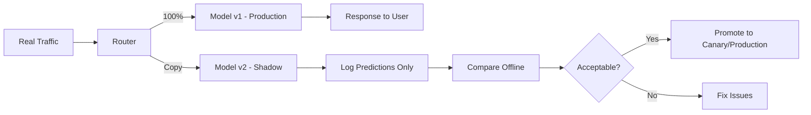

# Shadow Deployment

## Overview

Shadow deployment (also called "dark launching") runs the new model in parallel with the production model, processing the same real traffic but **without serving its predictions to users**. The new model's predictions are logged and compared against the production model's outputs. This enables testing the new model on production data with zero user impact.

## How Shadow Deployment Works



## Implementation

```python
class ShadowDeployment:
    def __init__(self, production_model, shadow_model):
        self.production_model = production_model
        self.shadow_model = shadow_model
        self.comparison_log = []

    def predict(self, features):
        # Production prediction (served to user)
        prod_prediction = self.production_model.predict(features)

        # Shadow prediction (logged, not served)
        try:
            shadow_prediction = self.shadow_model.predict(features)
            self.comparison_log.append({
                'features': features,
                'production': prod_prediction,
                'shadow': shadow_prediction,
                'timestamp': time.time()
            })
        except Exception as e:
            # Shadow errors should never affect production
            logging.error(f"Shadow model error: {e}")

        return prod_prediction  # Always return production prediction

    def analyze(self):
        """Compare shadow vs production predictions"""
        df = pd.DataFrame(self.comparison_log)
        agreement_rate = (df['production'] == df['shadow']).mean()
        return {
            'agreement_rate': agreement_rate,
            'total_predictions': len(df),
            'disagreements': len(df[df['production'] != df['shadow']])
        }
```

## Use Cases

| Use Case | Description |
|----------|-------------|
| New model validation | Test model behavior on real traffic |
| Latency benchmarking | Measure inference time in production environment |
| Data pipeline testing | Verify feature engineering works correctly |
| Regression detection | Compare new vs old predictions |

## Shadow vs Canary vs Blue-Green

| Aspect | Shadow | Canary | Blue-Green |
|--------|--------|--------|------------|
| User impact | None | Limited | None during switch |
| Traffic to new model | 100% (copy) | Gradual % | 0% or 100% |
| Risk | Zero | Low | Low |
| Purpose | Validation | Safe rollout | Instant rollback |
| Cost | 2x inference | 1-2x | 2x infrastructure |

## Interview Questions

1. **What is shadow deployment?** — Running a new model alongside production, processing the same traffic but not serving predictions to users. Predictions are logged for offline comparison.

2. **When would you use shadow deployment?** — Before canary deployment, to validate the new model works correctly on production data without any user impact. Especially useful for high-risk model changes.

3. **What are the costs of shadow deployment?** — Double inference cost (running two models), additional logging infrastructure, and engineering effort to build the comparison framework.

4. **Shadow vs A/B testing?** — Shadow has zero user impact (predictions aren't served). A/B testing serves different predictions to different users and measures business impact.

5. **How long should you run shadow deployment?** — Until you have enough data to confidently compare models — typically 1-7 days depending on traffic volume and prediction variance.

## Summary

Shadow deployment provides zero-risk validation of new models by running them in parallel with production without serving predictions to users. It's ideal for catching technical issues (latency, errors, data pipeline problems) before exposing the model to users via canary or A/B testing.

## Cross-References

- [Deployment Patterns](./deployment.md) — Overview of strategies
- [Canary Deployment](./canary.md) — Gradual rollout
- [Blue-Green Deployment](./blue-green.md) — Instant switch
- [Monitoring](./monitoring.md) — What to monitor
- [A/B Testing](./ab-testing.md) — Business metric comparison
