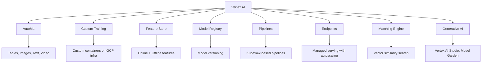

# Vertex AI

## Overview

Vertex AI is Google Cloud's fully managed ML platform that unifies the entire ML workflow. It provides AutoML for no-code model training, custom training for full control, a feature store, model registry, pipelines, and endpoints for serving. Vertex AI integrates deeply with Google Cloud services and provides access to Google's TPU infrastructure.

## Key Components



## AutoML

```python
from google.cloud import aiplatform

# Train AutoML model
job = aiplatform.AutoMLTabularTrainingJob(
    display_name="fraud-detection",
    optimization_prediction_type="classification",
    column_transformations=[
        {"numeric": {"column_name": "amount"}},
        {"categorical": {"column_name": "merchant_type"}},
    ],
)

model = job.run(
    dataset=dataset,
    target_column="is_fraud",
    training_fraction_split=0.8,
    validation_fraction_split=0.1,
    test_fraction_split=0.1,
)
```

## Custom Training

```python
job = aiplatform.CustomTrainingJob(
    display_name="custom-training",
    script_path="train.py",
    container_uri="us-docker.pkg.dev/vertex-ai/training/pytorch-gpu.1-13:latest",
    requirements=["torch", "scikit-learn"],
    model_serving_container_image_uri="us-docker.pkg.dev/vertex-ai/prediction/pytorch-gpu.1-13:latest",
)

model = job.run(
    replica_count=1,
    machine_type="n1-standard-4",
    accelerator_type="NVIDIA_TESLA_T4",
    accelerator_count=1,
)
```

## Model Deployment

```python
# Deploy to endpoint
endpoint = model.deploy(
    deployed_model_display_name="fraud-detection-v2",
    machine_type="n1-standard-4",
    min_replica_count=1,
    max_replica_count=10,  # Autoscaling
    traffic_split={"0": 100},  # All traffic to new model
)

# Online prediction
response = endpoint.predict(instances=[{"amount": 100, "merchant_type": "online"}])
```

## Vertex AI Pipelines

```python
from kfp.v2 import dsl
from google_cloud_pipeline_components.v1 import automl

@dsl.pipeline(name="training-pipeline")
def pipeline():
    dataset_op = automl.TabularDatasetCreateOp(
        project=PROJECT_ID,
        display_name="dataset",
        gcs_source="gs://bucket/data.csv",
    )
    training_op = automl.AutoMLTabularTrainingJobRunOp(
        project=PROJECT_ID,
        display_name="training",
        dataset=dataset_op.outputs["dataset"],
        target_column="target",
    )
```

## Interview Questions

1. **What is Vertex AI?** — Google Cloud's unified ML platform providing AutoML, custom training, feature store, model registry, pipelines, and managed serving. It integrates with GCP services and TPU infrastructure.

2. **AutoML vs Custom Training?** — AutoML: no-code, Google handles architecture/hyperparameters, limited customization. Custom Training: full control over code, architecture, and training process.

3. **How does Vertex AI handle scaling?** — Endpoints autoscale based on traffic (min/max replicas). Training jobs can use distributed training with GPU/TPU clusters. Pipelines scale with K8s.

4. **Vertex AI vs SageMaker?** — Both provide end-to-end ML platforms. Vertex AI: better TPU access, tighter GCP integration, stronger AutoML. SageMaker: larger ecosystem, more flexible pricing, AWS integration.

5. **What is Vertex AI Matching Engine?** — A managed vector similarity search service for building recommendation systems, semantic search, and other nearest-neighbor applications.

## Summary

Vertex AI provides a comprehensive, managed ML platform on Google Cloud. Its AutoML capabilities enable rapid prototyping, while custom training offers full control. Deep GCP integration, TPU access, and managed serving make it a strong choice for teams already on Google Cloud.

## Cross-References

- [MLOps Overview](./README.md) — MLOps fundamentals
- [SageMaker](./sagemaker.md) — AWS equivalent
- [ML Platforms](./platforms.md) — Platform comparison
- [Model Deployment](./deployment.md) — Deployment patterns
- [Kubeflow](./kubeflow.md) — Open-source alternative
- [Cloud Overview](../../cloud/overview.md)
