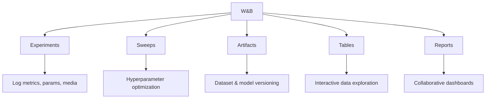

# Weights & Biases (W&B)

## Overview

Weights & Biases (W&B) is the leading experiment tracking and collaboration platform for ML teams. It provides rich visualization, experiment comparison, hyperparameter sweeps, model versioning, and dataset versioning. W&B integrates with all major ML frameworks and requires minimal code changes to adopt.

## Core Features



## Experiment Tracking

```python
import wandb

# Initialize run
wandb.init(
    project="fraud-detection",
    config={
        "learning_rate": 0.001,
        "epochs": 100,
        "batch_size": 64,
        "model": "xgboost"
    }
)

# Training loop
for epoch in range(100):
    loss = train_epoch()
    accuracy = evaluate()

    # Log metrics
    wandb.log({
        "loss": loss,
        "accuracy": accuracy,
        "epoch": epoch
    })

# Log artifacts
wandb.log_artifact("model.pkl", name="fraud-model", type="model")

wandb.finish()
```

## Hyperparameter Sweeps

```python
import wandb

# Define sweep
sweep_config = {
    "method": "bayes",  # bayes, grid, random
    "metric": {"name": "accuracy", "goal": "maximize"},
    "parameters": {
        "learning_rate": {"min": 0.0001, "max": 0.01},
        "batch_size": {"values": [32, 64, 128]},
        "n_estimators": {"min": 50, "max": 500},
        "max_depth": {"min": 3, "max": 15}
    }
}

# Create sweep
sweep_id = wandb.sweep(sweep_config, project="fraud-detection")

def train():
    wandb.init()
    config = wandb.config
    model = train_model(config)
    accuracy = evaluate(model)
    wandb.log({"accuracy": accuracy})

# Run sweep
wandb.agent(sweep_id, function=train, count=50)
```

## Artifacts (Versioning)

```python
# Log dataset
artifact = wandb.Artifact("training-data", type="dataset")
artifact.add_dir("data/")
wandb.log_artifact(artifact)

# Log model
model_artifact = wandb.Artifact("fraud-model", type="model")
model_artifact.add_file("model.pkl")
wandb.log_artifact(model_artifact)

# Use artifact
artifact = wandb.use_artifact("fraud-model:v3")
model_dir = artifact.download()
```

## W&B Tables

```python
# Log predictions for analysis
table = wandb.Table(columns=["input", "prediction", "truth", "confidence"])

for x, y_true in zip(X_test, y_test):
    y_pred = model.predict([x])[0]
    confidence = model.predict_proba([x]).max()
    table.add_data(str(x), y_pred, y_true, confidence)

wandb.log({"predictions": table})
```

## Interview Questions

1. **What is W&B and how does it differ from MLflow?** — W&B is a managed experiment tracking platform with superior visualization and collaboration. MLflow is open-source and self-hosted. W&B has better dashboards; MLflow has broader lifecycle management.

2. **How do W&B sweeps work?** — Define a search space (hyperparameters), optimization goal (maximize accuracy), and search strategy (Bayesian, random, grid). W&B runs experiments in parallel and visualizes results.

3. **What are W&B Artifacts?** — Versioned datasets and models with lineage tracking. Artifacts track which data and code produced each model version.

4. **How does W&B handle team collaboration?** — Shared projects, collaborative reports (like Google Docs for ML), team dashboards, and role-based access control.

5. **What is the W&B workspace?** — An interactive dashboard for comparing experiments, filtering runs, creating custom charts, and analyzing hyperparameter importance.

## Summary

W&B provides best-in-class experiment tracking with rich visualization, hyperparameter sweeps, and artifact versioning. Its ease of use and powerful collaboration features make it the preferred choice for many ML teams. While it's a managed service (costs scale with usage), the productivity gains often justify the investment.

## Cross-References

- [MLflow](./mlflow.md) — Open-source alternative
- [MLOps Overview](./README.md) — MLOps fundamentals
- [Model Registry](./model-registry.md) — Model versioning
- [ML Pipeline](./pipelines.md) — Pipeline integration
- [Optimization](../foundations/optimization.md) — Hyperparameter tuning
