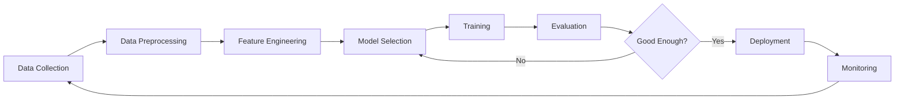
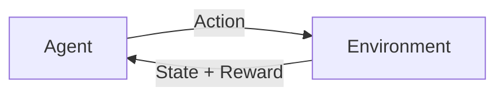
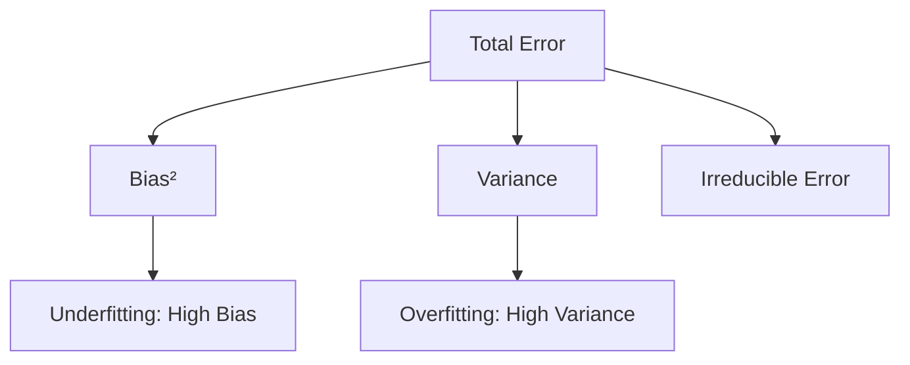
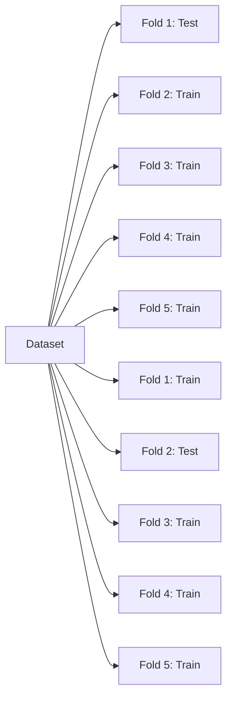
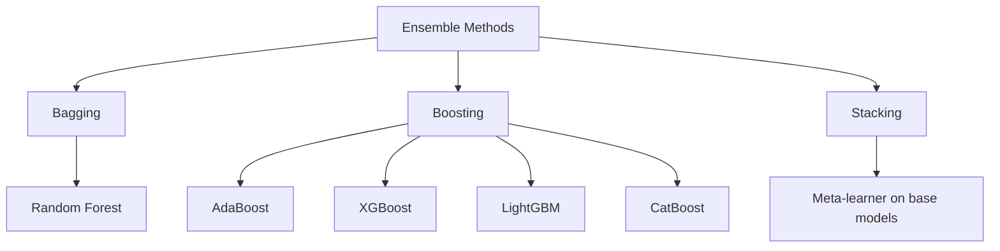

# Machine Learning Overview

## What is Machine Learning?

Machine Learning (ML) is a subset of Artificial Intelligence that enables systems to **learn patterns from data** and make predictions or decisions without being explicitly programmed. Instead of writing rules, we provide data and let the algorithm discover the underlying structure.

## The ML Pipeline

## Categories of Machine Learning

### 1. Supervised Learning
The model learns from **labeled data** — each input has a corresponding correct output.

| Task | Output | Examples |
|------|--------|----------|
| Classification | Discrete class | Spam detection, image classification |
| Regression | Continuous value | Price prediction, temperature forecasting |

**Common Algorithms:**
- Linear Regression, Logistic Regression
- Decision Trees, Random Forests, Gradient Boosting (XGBoost, LightGBM)
- Support Vector Machines (SVM)
- k-Nearest Neighbors (k-NN)
- Neural Networks

### 2. Unsupervised Learning
The model finds **hidden patterns** in unlabeled data.

| Task | Goal | Examples |
|------|------|----------|
| Clustering | Group similar items | Customer segmentation |
| Dimensionality Reduction | Compress features | PCA, t-SNE, UMAP |
| Anomaly Detection | Find outliers | Fraud detection |
| Association Rules | Find co-occurrences | Market basket analysis |

### 3. Semi-Supervised Learning
Uses a **small amount of labeled data** combined with a large amount of unlabeled data. Practical when labeling is expensive (e.g., medical imaging).

### 4. Reinforcement Learning
An **agent** learns by interacting with an **environment**, receiving **rewards** or **penalties** for actions. Used in game playing, robotics, and LLM alignment (RLHF).

## Key Concepts Every Interview Covers

### Bias-Variance Tradeoff

- **Bias**: Error from wrong assumptions (underfitting). Model is too simple.
- **Variance**: Error from sensitivity to training data fluctuations (overfitting). Model is too complex.
- **Goal**: Find the sweet spot that minimizes total error.

### Overfitting vs Underfitting

| | Overfitting | Underfitting |
|---|---|---|
| **Training Error** | Low | High |
| **Test Error** | High | High |
| **Model Complexity** | Too high | Too low |
| **Solution** | Regularization, more data, dropout | More features, complex model |

### Cross-Validation

**k-Fold Cross-Validation**: Split data into k folds. Train on k-1, test on 1. Repeat k times. Average the results. This gives a more robust estimate of model performance than a single train/test split.

### Regularization
Techniques to prevent overfitting by adding constraints:

- **L1 (Lasso)**: Adds |w| penalty → drives some weights to zero (feature selection)
- **L2 (Ridge)**: Adds w² penalty → shrinks weights uniformly
- **Elastic Net**: Combines L1 + L2
- **Dropout**: Randomly deactivates neurons during training (neural networks)

### Evaluation Metrics

**Classification:**
- **Accuracy**: (TP + TN) / Total — misleading with imbalanced data
- **Precision**: TP / (TP + FP) — "Of predicted positives, how many are correct?"
- **Recall**: TP / (TP + FN) — "Of actual positives, how many did we catch?"
- **F1 Score**: 2 × (Precision × Recall) / (Precision + Recall) — harmonic mean
- **AUC-ROC**: Area under the ROC curve — measures discrimination ability

**Regression:**
- **MAE**: Mean Absolute Error — robust to outliers
- **MSE**: Mean Squared Error — penalizes large errors
- **RMSE**: Root MSE — same unit as target
- **R²**: Proportion of variance explained

### Feature Engineering

- **Normalization** (Min-Max): Scale to [0, 1]
- **Standardization** (Z-score): Mean = 0, Std = 1
- **One-Hot Encoding**: Categorical → binary columns
- **Feature Selection**: Remove irrelevant/redundant features
- **Feature Interaction**: Create polynomial or cross features

## Ensemble Methods

| Method | How It Works | Reduces |
|--------|-------------|---------|
| **Bagging** | Train models on random subsets, average predictions | Variance |
| **Boosting** | Train models sequentially, each fixing previous errors | Bias |
| **Stacking** | Train a meta-model on base model predictions | Both |

## Interview Questions

### Conceptual Questions

**Q1: Explain the bias-variance tradeoff.**
> Bias is error from oversimplified models (underfitting). Variance is error from models that are too sensitive to training data (overfitting). We aim to balance both to minimize total generalization error.

**Q2: When would you choose Random Forest over XGBoost?**
> Random Forest when: you want parallel training, less hyperparameter tuning, and robustness to overfitting. XGBoost when: you need maximum accuracy, can handle sequential training, and have time for tuning. RF reduces variance; XGBoost reduces bias.

**Q3: How do you handle imbalanced datasets?**
> - Resampling: Oversample minority (SMOTE) or undersample majority
> - Class weights: Penalize misclassification of minority class more
> - Metrics: Use F1, AUC-ROC instead of accuracy
> - Algorithmic: Use anomaly detection if extreme imbalance
> - Data: Collect more minority samples if possible

**Q4: What's the difference between L1 and L2 regularization?**
> L1 (Lasso) adds absolute weight penalties → produces sparse weights (feature selection). L2 (Ridge) adds squared weight penalties → shrinks all weights proportionately. L1 is useful when you suspect many features are irrelevant.

**Q5: Explain precision vs recall with a real-world example.**
> In cancer screening: High recall is critical (catch all actual cancers, even if some false alarms). In spam filtering: High precision is critical (don't mark legitimate emails as spam). The tradeoff depends on the cost of false positives vs false negatives.

### Coding/Practical Questions

**Q6: You have a model with 99% training accuracy and 75% test accuracy. What's wrong?**
> Overfitting. The model memorized training data but doesn't generalize. Solutions: add regularization (L1/L2, dropout), get more training data, reduce model complexity, use data augmentation, or apply early stopping.

**Q7: How would you select features for a model?**
> - Filter methods: Statistical tests (chi-squared, correlation, mutual information)
> - Wrapper methods: Forward/backward selection, recursive feature elimination (RFE)
> - Embedded methods: L1 regularization, tree-based feature importance
> - Domain knowledge: Expert input on relevant features

**Q8: When would you use MAE vs MSE?**
> MAE when outliers are meaningful and you want robust error measurement. MSE when large errors are disproportionately bad and should be penalized. RMSE is preferred when you want the error in the same unit as the target variable.

## Common Mistakes

1. **Using accuracy for imbalanced data** — A model predicting "no cancer" for everyone gets 99% accuracy if 99% are healthy
2. **Data leakage** — Using test data info during training (e.g., fitting scaler on full dataset before split)
3. **Not scaling features** — Algorithms like SVM, k-NN, and neural networks are sensitive to feature scales
4. **Ignoring missing values** — Simply dropping rows can introduce bias; use imputation strategically
5. **Over-engineering features** — Too many features can lead to curse of dimensionality and overfitting
6. **Skipping EDA** — Always explore data first; understand distributions, correlations, and outliers before modeling

## Summary

| Concept | Key Takeaway |
|---------|-------------|
| Supervised Learning | Learn from labeled data → classification or regression |
| Unsupervised Learning | Find patterns in unlabeled data → clustering, reduction |
| Bias-Variance | Balance underfitting and overfitting |
| Regularization | L1 for sparsity, L2 for shrinkage |
| Ensemble Methods | Combine weak learners → strong learner |
| Evaluation | Choose metrics that match business objectives |
| Feature Engineering | Often more impactful than model selection |

Machine Learning is the foundation for Deep Learning, NLP, Computer Vision, and modern AI systems. A solid grasp of these fundamentals is essential for any technical interview.
