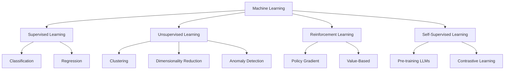
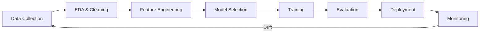
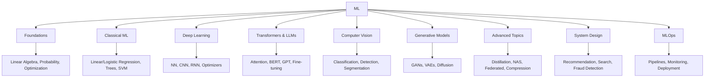

# Machine Learning Overview

## Overview

Machine Learning (ML) is a subset of artificial intelligence where systems learn patterns from data to make predictions or decisions without being explicitly programmed. This overview provides a roadmap of the ML landscape covered in this book, connecting foundational concepts to advanced topics.

## ML Taxonomy

## Learning Paradigms

| Paradigm | Data | Goal | Example |
|----------|------|------|---------|
| Supervised | Labeled (X, y) | Learn mapping X → y | Spam detection |
| Unsupervised | Unlabeled (X) | Find structure | Customer segmentation |
| Semi-supervised | Few labeled + many unlabeled | Leverage unlabeled data | Medical imaging |
| Self-supervised | Unlabeled (pretext task) | Learn representations | BERT, GPT pre-training |
| Reinforcement | Environment interaction | Maximize reward | Game playing, robotics |

## The ML Pipeline

## Topics in This Book

## Key Metrics by Task

| Task | Primary Metrics |
|------|----------------|
| Classification | Accuracy, Precision, Recall, F1, AUC-ROC |
| Regression | MAE, RMSE, R² |
| Ranking | NDCG, MAP, MRR |
| Generation | BLEU, ROUGE, Perplexity, FID |
| Clustering | Silhouette Score, Adjusted Rand Index |

## Interview Preparation Roadmap

1. **Foundations**: Linear algebra, probability, optimization, loss functions
2. **Classical ML**: Regression, trees, ensembles, SVM, clustering
3. **Deep Learning**: NN basics, CNNs, RNNs, optimizers, regularization
4. **Transformers**: Self-attention, BERT, GPT, fine-tuning, RLHF
5. **Specialized**: GANs, GNNs, time series, recommendation
6. **System Design**: End-to-end ML systems, feature stores, serving
7. **MLOps**: Pipelines, monitoring, deployment, drift detection
8. **Advanced**: Distillation, quantization, pruning, NAS

## Interview Questions

1. **What is the bias-variance tradeoff?** — High bias = underfitting (model too simple). High variance = overfitting (model too complex). The goal is to find the sweet spot that minimizes total error.

2. **How do you handle overfitting?** — Regularization (L1/L2), dropout, early stopping, more data, data augmentation, simpler model, cross-validation.

3. **What is cross-validation and why use it?** — K-fold CV splits data into K parts, trains on K-1, tests on 1, repeats K times. Provides more reliable performance estimate than a single train/test split.

4. **How do you choose a model?** — Start simple (logistic regression), increase complexity as needed. Consider: data size, interpretability requirements, latency constraints, and available compute.

5. **What is transfer learning?** — Using a model pre-trained on one task as a starting point for a different task. Especially powerful in NLP (BERT, GPT) and vision (ImageNet pre-trained CNNs).

## Common Mistakes

- Not exploring data before modeling (EDA is critical)
- Using accuracy for imbalanced datasets (use F1/AUC)
- Data leakage (using future data in training)
- Not validating on held-out test set
- Over-engineering features before trying simple models
- Ignoring business context (optimize the right metric)

## Summary

Machine learning encompasses supervised, unsupervised, and reinforcement learning paradigms. The ML pipeline from data collection to deployment requires expertise in statistics, algorithms, and engineering. This book covers the full spectrum from foundations to production systems, preparing you for ML interviews at top tech companies.

## Cross-References

- [Foundations](./foundations/README.md) — Math and statistics
- [Classical ML](./classical/README.md) — Traditional algorithms
- [Deep Learning](./deep-learning/README.md) — Neural networks
- [Transformers](./transformers/README.md) — Modern architectures
- [MLOps](./mlops/README.md) — Production ML
- [System Design](./system-design/README.md) — ML system design
- [LLM Architecture](../llm/llm-serving/architecture.md)
- [Interview ML Questions](../interview/ml-questions.md)
- [Cloud GPU](../cloud/virtualization/README.md)
