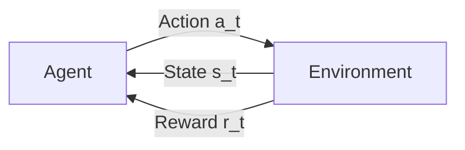
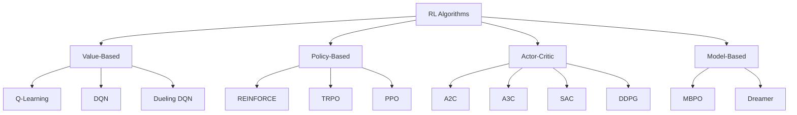
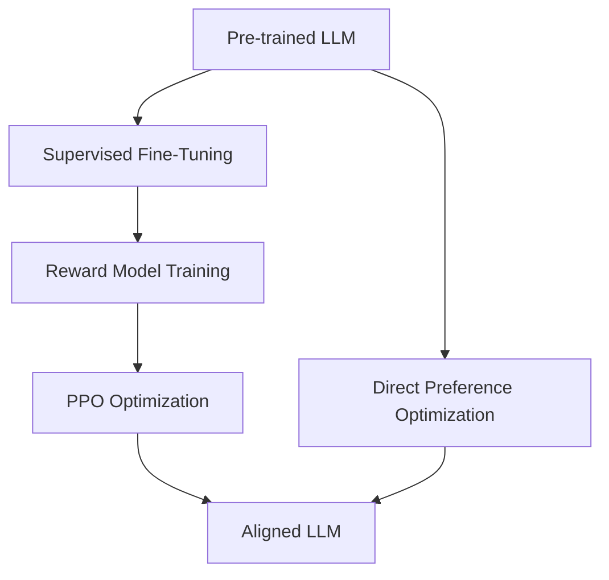

# Reinforcement Learning

## Overview

Reinforcement Learning (RL) is a paradigm where an **agent** learns to make decisions by interacting with an **environment** to maximize **cumulative reward**. Unlike supervised learning (labeled data) or unsupervised learning (finding patterns), RL learns from **trial and error** through experience. RL has achieved superhuman performance in games (AlphaGo, Atari), robotics, and most recently, aligning large language models with human preferences (RLHF).

## Core Concepts

The agent-environment interaction follows the **Markov Decision Process (MDP)**:

$$\text{MDP} = \langle \mathcal{S}, \mathcal{A}, P, R, \gamma \rangle$$

| Component | Symbol | Description |
|-----------|--------|-------------|
| State space | $\mathcal{S}$ | All possible states |
| Action space | $\mathcal{A}$ | All possible actions |
| Transition | $P(s'|s,a)$ | Probability of next state |
| Reward | $R(s,a,s')$ | Immediate reward |
| Discount | $\gamma \in [0,1]$ | Importance of future rewards |

## Topics in This Section

| Topic | Key Concepts | Interview Frequency |
|-------|-------------|-------------------|
| [Fundamentals](fundamentals.md) | MDP, value functions, Bellman equation | ⭐⭐⭐⭐⭐ |
| [Q-Learning](q-learning.md) | TD learning, DQN, experience replay | ⭐⭐⭐⭐⭐ |
| [Policy Gradient](policy-gradient.md) | REINFORCE, actor-critic, advantage | ⭐⭐⭐⭐⭐ |
| [PPO](ppo.md) | Proximal policy optimization, clipping | ⭐⭐⭐⭐⭐ |
| [RLHF](rlhf.md) | Reward modeling, RL from human feedback | ⭐⭐⭐⭐⭐ |
| [DPO](dpo.md) | Direct preference optimization | ⭐⭐⭐⭐ |
| [GRPO](grpo.md) | Group relative policy optimization | ⭐⭐⭐⭐ |

## RL Algorithms Taxonomy

## Value-Based vs Policy-Based

| Aspect | Value-Based | Policy-Based |
|--------|-------------|--------------|
| Learns | Value function $Q(s,a)$ | Policy $\pi(a|s)$ directly |
| Action selection | $\arg\max_a Q(s,a)$ | Sample from $\pi(a|s)$ |
| Continuous actions | Difficult | Natural |
| Convergence | Often guaranteed | Can get stuck |
| Exploration | $\epsilon$-greedy | Stochastic policy |

## The RLHF Revolution

RL has become central to LLM alignment:

## Interview Questions

### Q1: What is reinforcement learning?
**Answer:** RL is a learning paradigm where an agent learns to make sequential decisions by interacting with an environment. The agent receives rewards/penalties and learns a policy that maximizes cumulative reward over time. It's different from supervised learning (no labeled examples) and unsupervised learning (explicit reward signal).

### Q2: What is the Markov Decision Process?
**Answer:** An MDP is the mathematical framework for RL: states ($\mathcal{S}$), actions ($\mathcal{A}$), transitions ($P(s'|s,a)$), rewards ($R(s,a,s')$), and discount factor ($\gamma$). The Markov property means the future depends only on the current state, not history.

### Q3: How is RL used in LLM training?
**Answer:** RLHF (Reinforcement Learning from Human Feedback) uses RL to align LLMs: 1) Collect human preferences, 2) Train a reward model, 3) Use PPO to optimize the LLM against the reward model. This makes LLMs more helpful, harmless, and honest. DPO simplifies this by directly optimizing on preferences without a reward model.

## Summary

Reinforcement learning enables agents to learn optimal behavior through trial and error. Core concepts: MDP, value functions, policy optimization. Key algorithms: Q-learning (value-based), REINFORCE/PPO (policy-based), actor-critic methods. RL has become crucial for LLM alignment through RLHF and DPO.

## Cross-References

- [Fundamentals →](fundamentals.md) MDP, value functions, Bellman equation
- [Q-Learning →](q-learning.md) Value-based methods
- [Policy Gradient →](policy-gradient.md) Policy optimization
- [PPO →](ppo.md) The workhorse of RLHF
- [RLHF →](rlhf.md) RL for LLM alignment
- [DPO →](dpo.md) Direct preference optimization
- [GRPO →](grpo.md) Group relative policy optimization
