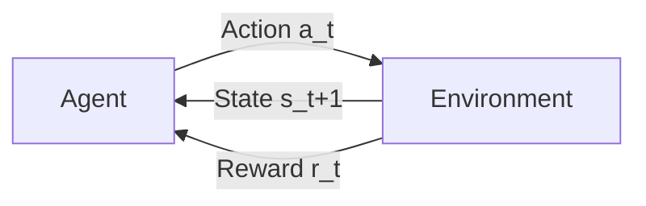
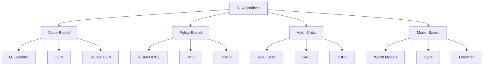
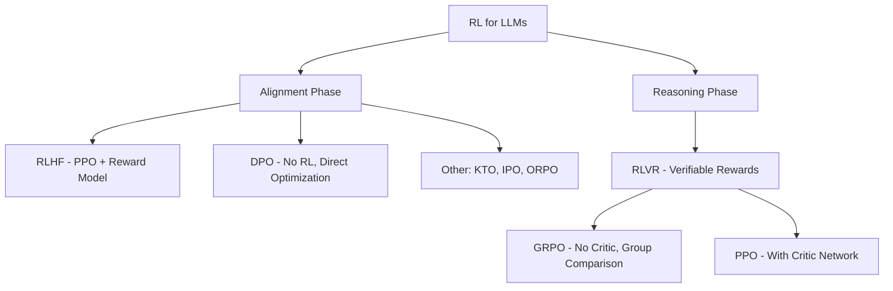
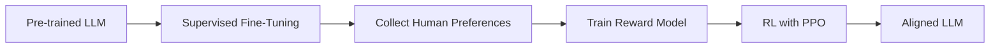

# Reinforcement Learning

This section covers Reinforcement Learning (RL) from fundamentals to cutting-edge techniques used in training Large Language Models (LLMs).

## Topics Covered

| Topic | Description | Relevance |
|-------|-------------|-----------|
| [Fundamentals](fundamentals.md) | Core RL concepts: MDP, rewards, policies | Foundation |
| [Q-Learning](q-learning.md) | Value-based RL with Q-tables and DQN | Classic algorithms |
| [Policy Gradient](policy-gradient.md) | Directly optimize the policy | REINFORCE, actor-critic |
| [PPO](ppo.md) | Proximal Policy Optimization | Stable policy updates |
| [RLHF](rlhf.md) | RL from Human Feedback | LLM alignment |
| [DPO](dpo.md) | Direct Preference Optimization | Simpler alignment |
| [GRPO](grpo.md) | Group Relative Policy Optimization | LLM reasoning (DeepSeek-R1) |

## What is Reinforcement Learning?

RL is a paradigm where an **agent** learns to make decisions by interacting with an **environment**. The agent takes **actions**, receives **rewards**, and updates its **policy** to maximize cumulative reward over time.

### RL vs Other ML Paradigms

| Aspect | Supervised | Unsupervised | RL |
|--------|-----------|-------------|-----|
| Signal | Labels | None | Rewards |
| Feedback | Immediate | N/A | Delayed |
| Data | Static dataset | Static dataset | Collected by interaction |
| Goal | Minimize loss | Find structure | Maximize reward |
| Examples | Classification | Clustering | Game playing, robotics |

## The Markov Decision Process (MDP)

An MDP is the formal framework for RL, defined by the tuple (S, A, P, R, γ):

| Component | Symbol | Description |
|-----------|--------|-------------|
| State space | S | All possible states of the environment |
| Action space | A | All possible actions the agent can take |
| Transition probability | P(s'\|s,a) | Probability of moving to state s' from s after action a |
| Reward function | R(s,a,s') | Expected reward for a transition |
| Discount factor | γ | How much to value future rewards (0 to 1) |

### The Markov Property

The future depends only on the current state, not on the history:

\\[
P(s_{t+1} | s_t, a_t, s_{t-1}, a_{t-1}, ...) = P(s_{t+1} | s_t, a_t)
\\]

**Interview tip:** Real-world problems are often POMDP (Partially Observable MDPs) where the agent doesn't have full state information. Solutions include RNNs, belief states, or attention mechanisms.

## Key RL Concepts

### Value Functions

| Function | Definition | What It Answers |
|----------|-----------|-----------------|
| **State Value V(s)** | Expected return from state s | "How good is this state?" |
| **Action Value Q(s,a)** | Expected return from state s, action a | "How good is this action in this state?" |
| **Advantage A(s,a)** | Q(s,a) - V(s) | "How much better is this action vs average?" |

**Bellman Equation (core of value-based RL):**

\\[
V(s) = \max_a \left[ R(s,a) + \gamma \sum_{s'} P(s'|s,a) V(s') \right]
\\]

### Policy Types

| Type | Description | Example |
|------|-------------|---------|
| **Deterministic** | π(s) = a | Always take the same action in a state |
| **Stochastic** | π(a\|s) = P(a\|s) | Probability distribution over actions |
| **On-policy** | Learn from data collected by current policy | PPO, A2C |
| **Off-policy** | Learn from data collected by any policy | Q-Learning, SAC |

### Exploration vs Exploitation

| Strategy | Description | Pros | Cons |
|----------|-------------|------|------|
| **ε-greedy** | Random action with probability ε | Simple | Inefficient exploration |
| **UCB** | Explore actions with high uncertainty | Principled | Computationally expensive |
| **Thompson Sampling** | Sample from posterior | Optimal in theory | Requires Bayesian model |
| **Entropy bonus** | Add entropy to objective | Encourages diverse actions | May slow convergence |

## The RL Algorithm Landscape

| Algorithm | Type | Key Innovation | Use Case |
|-----------|------|---------------|----------|
| Q-Learning | Value | Learn Q-values directly | Simple environments |
| DQN | Value | Neural network + experience replay | Atari games |
| REINFORCE | Policy | Monte Carlo policy gradient | Simple policy learning |
| PPO | Policy | Clipped surrogate objective | LLM training, robotics |
| A2C/A3C | Actor-Critic | Parallel advantage estimation | Continuous control |
| SAC | Actor-Critic | Maximum entropy RL | Robotics, continuous actions |

## The RL Landscape for LLMs

### RLHF Pipeline

1. **SFT**: Fine-tune base model on instruction-following data
2. **Reward Model**: Train on human preference pairs (chosen vs rejected)
3. **PPO**: Optimize LLM to maximize reward while staying close to SFT model (KL penalty)

### DPO: Simplifying Alignment

DPO eliminates the reward model entirely by directly optimizing the policy on preference data:

\\[
L_{DPO} = -\log \sigma \left( \beta \log \frac{\pi_\theta(y_w|x)}{\pi_{ref}(y_w|x)} - \beta \log \frac{\pi_\theta(y_l|x)}{\pi_{ref}(y_l|x)} \right)
\\]

Where y_w is the preferred response and y_l is the rejected response.

**Why DPO matters:** Simpler training (no reward model, no PPO loop), more stable, competitive with RLHF on many benchmarks.

### GRPO: Reasoning via RL

GRPO (Group Relative Policy Optimization) from DeepSeek-R1:

1. Generate a group of responses for each prompt
2. Score each response with a verifiable reward (math correctness, code execution)
3. Compare responses within the group (relative ranking)
4. Update policy to favor better responses

**Key innovation:** No critic network needed. The group itself provides the baseline for advantage estimation.

## Evolution of RL in LLMs

| Year | Method | Key Innovation | Used By |
|------|--------|---------------|---------|
| 2017 | PPO | Stable policy optimization | InstructGPT, ChatGPT |
| 2022 | RLHF | Human preferences as reward signal | ChatGPT, Claude |
| 2023 | DPO | Eliminate reward model entirely | Llama 2, Zephyr |
| 2024 | GRPO | No critic, group-relative rewards | DeepSeek-R1 |
| 2024 | RLVR | Verifiable rewards for reasoning | DeepSeek-R1, Qwen |
| 2024 | KTO | Kahneman-Tversky Optimization | Simpler than DPO |

## Common Interview Questions

1. **Explain the exploration-exploitation tradeoff.**
   Exploitation: choose the best-known action to maximize immediate reward. Exploration: try new actions to discover potentially better strategies. Too much exploitation → stuck in suboptimal policy. Too much exploration → wastes time on bad actions. ε-greedy, UCB, and entropy bonuses are common solutions.

2. **What is the difference between on-policy and off-policy RL?**
   On-policy (PPO): must learn from data collected by the current policy. Data becomes stale after policy updates. Safer but less data-efficient. Off-policy (Q-Learning, SAC): can learn from any data (old policies, other agents). More data-efficient but harder to stabilize.

3. **Why is PPO preferred for LLM training over other RL algorithms?**
   PPO's clipped objective prevents large policy updates, ensuring training stability. It's on-policy (important for safety), handles discrete action spaces well (token selection), and has a well-understood KL penalty mechanism to prevent reward hacking.

4. **How does RLHF address reward hacking?**
   KL divergence penalty between the RL policy and the SFT reference model prevents the policy from deviating too far to exploit the reward model. Without this, the model might find adversarial outputs that score high on the reward model but are actually poor quality.

5. **Compare RLHF and DPO for LLM alignment.**
   RLHF: separate reward model + PPO. More flexible (reward model can be reused), but complex training. DPO: direct optimization on preferences. Simpler, more stable, but can't reuse the reward signal. DPO is increasingly popular for its simplicity.

6. **What is GRPO and why is it significant?**
   GRPO eliminates the critic network by using group-relative advantages. Generate multiple responses, score them, compare within the group. This is simpler than PPO (no critic to train) and works well for tasks with verifiable rewards (math, code). Used by DeepSeek-R1 for reasoning training.

## Summary

Understanding RL is essential for anyone working on modern LLM training pipelines. The field has evolved from game-playing (Atari, Go) to LLM alignment (RLHF, DPO) and reasoning (GRPO, RLVR).

## References

- Sutton, R. & Barto, A. (2018). *Reinforcement Learning: An Introduction* — Free online, the RL bible
- Schulman, J. et al. (2017). "Proximal Policy Optimization Algorithms" — PPO paper
- Ouyang, L. et al. (2022). "Training language models to follow instructions with human feedback" — InstructGPT/RLHF
- Rafailov, R. et al. (2023). "Direct Preference Optimization: Your Language Model is Secretly a Reward Model" — DPO
- DeepSeek-AI (2025). "DeepSeek-R1: Incentivizing Reasoning Capability in LLMs via Reinforcement Learning" — GRPO
- Christiano, P. et al. (2017). "Deep Reinforcement Learning from Human Preferences" — Foundational RLHF

## Cross-References

- [Q-Learning](./q-learning.md)
- [Policy Gradient](./policy-gradient.md)
- [PPO](./ppo.md)
- [RLHF](./rlhf.md)
- [LLM RLHF](../../llm/llm-serving/rlhf.md)
