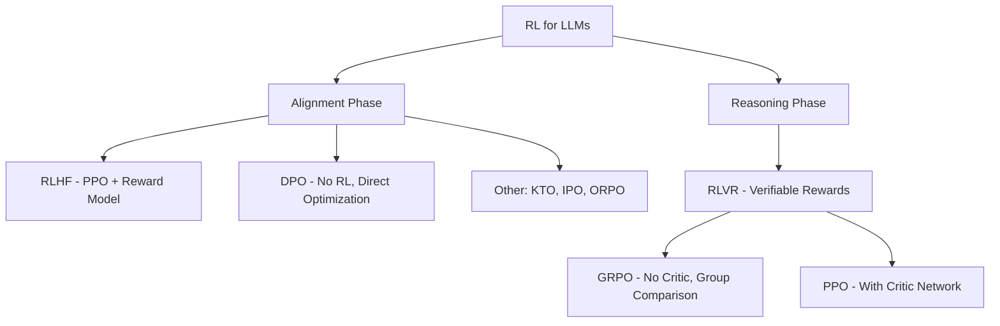

# Reinforcement Learning

This section covers Reinforcement Learning (RL) from fundamentals to cutting-edge techniques used in training Large Language Models (LLMs).

## Topics Covered

| Topic | Description | Relevance |
|-------|-------------|-----------|
| [Fundamentals](fundamentals.md) | Core RL concepts: MDP, rewards, policies | Foundation |
| [Q-Learning](q-learning.md) | Value-based RL with Q-tables and DQN | Classic algorithms |
| [Policy Gradient](policy-gradient.md) | Directly optimize the policy | REINFORCE, actor-critic |
| [PPO](ppo.md) | Proximal Policy Optimization | Stable policy updates |
| [RLHF](rlhf.md) | RL from Human Feedback | LLM alignment |
| [DPO](dpo.md) | Direct Preference Optimization | Simpler alignment |
| [GRPO](grpo.md) | Group Relative Policy Optimization | LLM reasoning (DeepSeek-R1) |

## The RL Landscape for LLMs

## Evolution of RL in LLMs

| Year | Method | Key Innovation | Used By |
|------|--------|---------------|---------|
| 2017 | PPO | Stable policy optimization | InstructGPT, ChatGPT |
| 2022 | RLHF | Human preferences as reward signal | ChatGPT, Claude |
| 2023 | DPO | Eliminate reward model entirely | Llama 2, Zephyr |
| 2024 | GRPO | No critic, group-relative rewards | DeepSeek-R1 |
| 2024 | RLVR | Verifiable rewards for reasoning | DeepSeek-R1, Qwen |

## Why RL Matters for LLMs

1. **Alignment**: Make models helpful, harmless, and honest
2. **Reasoning**: Train models to think step-by-step (chain-of-thought)
3. **Tool Use**: Learn when and how to use external tools
4. **Safety**: Reduce harmful outputs and hallucinations

Understanding RL is essential for anyone working on modern LLM training pipelines.

## Cross-References

- [Q-Learning](./q-learning.md)
- [Policy Gradient](./policy-gradient.md)
- [PPO](./ppo.md)
- [RLHF](./rlhf.md)
- [LLM RLHF](../../llm/llm-serving/rlhf.md)
