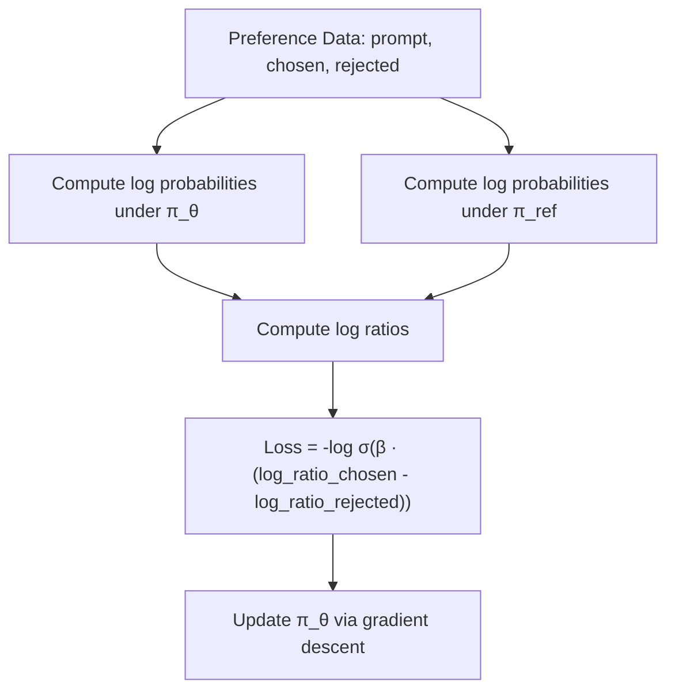
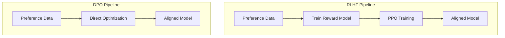
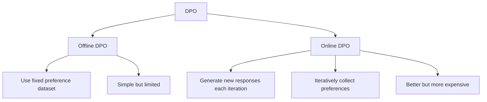

# Direct Preference Optimization (DPO)

## Overview

DPO (Rafailov et al., 2023) is a method for aligning language models with human preferences **without reinforcement learning**. It directly optimizes the policy on preference data by deriving a closed-form loss from the RLHF objective, eliminating the need for a separate reward model and PPO training.

## Key Insight

The RLHF objective (maximize reward + KL penalty) has a **closed-form optimal policy**. DPO reparameterizes the problem so we can optimize the policy directly on preference data, without ever training a reward model.

**RLHF Objective:**
$$\max_\pi \mathbb{E}_{x, y \sim \pi}[r(x,y)] - \beta D_{KL}[\pi \| \pi_{ref}]$$

**Optimal Solution:**
$$\pi^*(y|x) = \frac{1}{Z(x)} \pi_{ref}(y|x) \exp\left(\frac{1}{\beta} r(x,y)\right)$$

Rearranging to express the reward in terms of the policy:

$$r(x,y) = \beta \log \frac{\pi^*(y|x)}{\pi_{ref}(y|x)} + \beta \log Z(x)$$

Substituting into the Bradley-Terry preference model, the partition function Z(x) cancels out:

## DPO Loss Function

$$L_{DPO}(\theta) = -\mathbb{E}_{(x, y_w, y_l)} \left[ \log \sigma\left( \beta \log \frac{\pi_\theta(y_w|x)}{\pi_{ref}(y_w|x)} - \beta \log \frac{\pi_\theta(y_l|x)}{\pi_{ref}(y_l|x)} \right) \right]$$

Where:
- **y_w**: Preferred (winning) response
- **y_l**: Rejected (losing) response
- **π_θ**: Policy being optimized
- **π_ref**: Reference policy (usually SFT model)
- **β**: Temperature parameter (controls deviation from reference)

## How DPO Works



**Intuition**: DPO increases the likelihood of preferred responses relative to rejected ones, weighted by how much the current policy already differs from the reference.

## DPO vs RLHF Pipeline



| Aspect | RLHF | DPO |
|--------|------|-----|
| **Reward Model** | Explicit (separate network) | Implicit (derived from policy) |
| **RL Algorithm** | PPO | None (supervised loss) |
| **Training Complexity** | High (3+ models in memory) | Low (2 models: policy + reference) |
| **Hyperparameters** | Many (PPO, reward model, KL) | Few (mainly β) |
| **Stability** | Can be unstable | More stable |
| **Sample Efficiency** | Lower (on-policy) | Higher (off-policy) |
| **Reward Hacking** | Yes (explicit RM) | Less prone |

## DPO Implementation

```python
def dpo_loss(policy_logps, ref_logps, beta):
    """
    policy_logps: (chosen_logp, rejected_logp) from policy model
    ref_logps: (chosen_logp, rejected_logp) from reference model
    """
    log_ratio_chosen = policy_logps[0] - ref_logps[0]
    log_ratio_rejected = policy_logps[1] - ref_logps[1]
    
    logits = beta * (log_ratio_chosen - log_ratio_rejected)
    loss = -F.logsigmoid(logits).mean()
    return loss
```

**What you need:**
1. A reference model (frozen SFT model)
2. The policy model (being trained)
3. Preference data (prompt, chosen response, rejected response)

No reward model. No PPO. Just a simple binary cross-entropy-style loss.

## DPO Variants

### IPO (Identity Preference Optimization)
Addresses DPO's potential overfitting to preference data:

$$L_{IPO} = \left(\log \frac{\pi_\theta(y_w|x)}{\pi_{ref}(y_w|x)} - \log \frac{\pi_\theta(y_l|x)}{\pi_{ref}(y_l|x)} - \frac{1}{2\beta}\right)^2$$

### KTO (Kahneman-Tversky Optimization)
Works with **pointwise** data (good/bad) instead of pairwise comparisons:

$$L_{KTO} = \mathbb{E}[\text{loss based on whether response is desirable or undesirable}]$$

Doesn't need paired data — can use thumbs up/down signals.

### ORPO (Odds Ratio Preference Optimization)
Eliminates the reference model entirely by incorporating preference optimization directly into the SFT loss.

### SimPO (Simple Preference Optimization)
Uses average log probability as the implicit reward (length-normalized), removing the need for a reference model.

## Online vs Offline DPO



**Offline DPO**: Train on a fixed dataset of preferences. Simple but can suffer from distribution shift.

**Online DPO**: Generate new responses with the current policy, collect preferences, and update. More effective but requires on-the-fly generation and evaluation.

## DPO Limitations

1. **Distribution shift**: Offline DPO trains on data from π_ref, but evaluates under π_θ. As π_θ diverges, the data becomes off-distribution.
2. **No exploration**: DPO can only learn from the preference data it's given. RL methods (PPO) can discover new strategies through exploration.
3. **Implicit reward may not generalize**: The implicit reward learned by DPO may not transfer to new domains as well as an explicit reward model.
4. **Quality depends on preference data**: DPO is only as good as the preference data. Noisy or biased preferences → poor alignment.

## Interview Questions

**Q1: How does DPO eliminate the need for a reward model?**
> DPO derives a closed-form relationship between the optimal policy and the reward function from the RLHF objective. By reparameterizing the Bradley-Terry preference model in terms of the policy ratios (π_θ/π_ref), the reward model is implicitly embedded in the policy optimization. The partition function cancels out, leaving a simple loss function over preference pairs.

**Q2: What is the role of β in DPO?**
> β controls how much the policy can deviate from the reference model. Small β → more deviation allowed (aggressive optimization). Large β → policy stays close to reference (conservative). It's analogous to the KL coefficient in RLHF. Typical values: 0.1-0.5. Too small β can cause overfitting; too large β prevents learning.

**Q3: What are the advantages of DPO over RLHF?**
> (1) Simpler — no reward model, no PPO, (2) More stable — supervised loss instead of RL, (3) Easier to implement — one training loop instead of three, (4) Less memory — only policy + reference models, (5) Fewer hyperparameters — mainly β, (6) Off-policy — can reuse preference data.

**Q4: When would you prefer RLHF over DPO?**
> (1) When you need active exploration — RLHF/PPO can discover new strategies beyond the preference data, (2) When you have a well-calibrated reward model that generalizes, (3) When you want to do iterative alignment with online feedback, (4) When the preference dataset is small and you want to leverage the reward model's generalization.

**Q5: What is distribution shift in DPO and how do you address it?**
> DPO is trained on preference data collected from π_ref, but as π_θ diverges, the training data becomes off-distribution. Solutions: (1) Online DPO — generate new data with current policy, (2) Use a larger preference dataset, (3) Keep β large enough to stay near reference, (4) Periodically regenerate preference data with the current policy.

**Q6: Compare DPO with KTO and ORPO.**
> DPO: needs paired preferences (chosen vs rejected). KTO: needs only pointwise labels (good/bad) — more practical for real-world thumbs up/down data. ORPO: eliminates the reference model by combining SFT and preference optimization in one loss. SimPO: uses length-normalized log probability as implicit reward, no reference model needed.

## Common Mistakes

1. **Using a bad reference model** — DPO assumes π_ref is reasonable; use a well-trained SFT model
2. **β too small** — Causes overfitting and distribution shift
3. **Poor quality preference data** — Noisy labels degrade alignment
4. **Not monitoring implicit reward** — Track the DPO reward metric to ensure learning
5. **Ignoring length bias** — Longer responses may be implicitly preferred; normalize

## Summary

| Aspect | Detail |
|--------|--------|
| **Core Idea** | Optimize policy directly on preference data without RL |
| **Loss** | Binary cross-entropy on log probability ratios |
| **Models Needed** | Policy + reference (no reward model) |
| **Advantage** | Simpler, more stable than RLHF |
| **Limitation** | Distribution shift, no exploration |
| **Variants** | IPO, KTO, ORPO, SimPO |
| **When to Use** | When you have good preference data and want simplicity |

DPO democratized LLM alignment — making it accessible to teams without RL expertise. It's now one of the most popular alignment methods.

## Cross-References

- [RLHF](./rlhf.md)
- [GRPO](./grpo.md)
- [LLM SFT](../../llm/llm-serving/sft.md)
- [LLM RLHF](../../llm/llm-serving/rlhf.md)
- [Policy Gradient](./policy-gradient.md)
