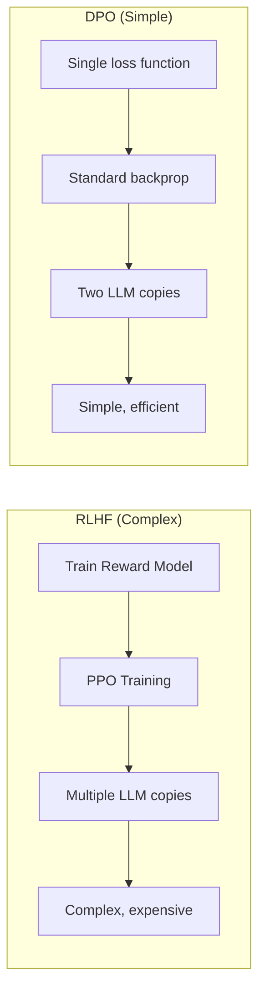

# DPO (Direct Preference Optimization)

## Overview

DPO, introduced by Rafailov et al. (2023), is a **simpler alternative to RLHF** that directly optimizes the language model on preference data without training a separate reward model or using PPO. It derives a closed-form loss function from the RLHF objective, turning preference learning into a simple classification problem. DPO has become widely adopted due to its simplicity and effectiveness.

## The Key Insight

The RLHF objective with KL constraint has a **closed-form optimal solution**:

$$\pi^*(y|x) = \frac{1}{Z(x)} \pi_{\text{ref}}(y|x) \exp\left(\frac{1}{\beta} r(x, y)\right)$$

Where $Z(x)$ is the partition function. Rearranging:

$$r(x, y) = \beta \log \frac{\pi^*(y|x)}{\pi_{\text{ref}}(y|x)} + \beta \log Z(x)$$

This means the **optimal policy implicitly defines the reward** — no separate reward model needed!

## DPO Loss Function

Substituting into the Bradley-Terry preference model:

$$\mathcal{L}_{\text{DPO}}(\theta) = -\mathbb{E}_{(x, y_w, y_l)}\left[\log \sigma\left(\beta \log \frac{\pi_\theta(y_w|x)}{\pi_{\text{ref}}(y_w|x)} - \beta \log \frac{\pi_\theta(y_l|x)}{\pi_{\text{ref}}(y_l|x)}\right)\right]$$



## DPO vs RLHF

| Aspect | RLHF | DPO |
|--------|------|-----|
| Reward model | Separate, trained first | Implicit in policy |
| RL algorithm | PPO (complex) | Simple loss function |
| LLM copies needed | 4 (policy, ref, reward, critic) | 2 (policy, reference) |
| Training stability | Can be unstable | More stable |
| Compute cost | High (multiple forward passes) | Lower |
| Implementation | Complex (PPO, GAE, etc.) | Simple cross-entropy loss |
| Performance | Slightly better in some cases | Comparable |

## Implementation

```python
import torch
import torch.nn as nn
import torch.nn.functional as F

class DPOTrainer:
    def __init__(self, model, ref_model, beta=0.1, lr=5e-7):
        self.model = model
        self.ref_model = ref_model  # Frozen
        self.beta = beta
        self.optimizer = torch.optim.AdamW(model.parameters(), lr=lr)
    
    def get_logprobs(self, model, input_ids, labels, attention_mask):
        """Get log probabilities of the response tokens."""
        outputs = model(input_ids, attention_mask=attention_mask)
        logits = outputs.logits[:, :-1, :]  # Shift for autoregressive
        labels = labels[:, 1:]
        log_probs = F.log_softmax(logits, dim=-1)
        # Gather log probs for the actual tokens
        token_log_probs = log_probs.gather(2, labels.unsqueeze(2)).squeeze(2)
        return token_log_probs.sum(dim=1)  # Sum over sequence
    
    def dpo_loss(self, chosen_ids, chosen_mask, chosen_labels,
                 rejected_ids, rejected_mask, rejected_labels):
        """Compute DPO loss."""
        # Log probs from policy
        policy_chosen = self.get_logprobs(self.model, chosen_ids, 
                                           chosen_labels, chosen_mask)
        policy_rejected = self.get_logprobs(self.model, rejected_ids, 
                                             rejected_labels, rejected_mask)
        
        # Log probs from reference (frozen)
        with torch.no_grad():
            ref_chosen = self.get_logprobs(self.ref_model, chosen_ids,
                                            chosen_labels, chosen_mask)
            ref_rejected = self.get_logprobs(self.ref_model, rejected_ids,
                                              rejected_labels, rejected_mask)
        
        # DPO loss
        chosen_rewards = self.beta * (policy_chosen - ref_chosen)
        rejected_rewards = self.beta * (policy_rejected - ref_rejected)
        
        loss = -F.logsigmoid(chosen_rewards - rejected_rewards).mean()
        
        # Metrics
        chosen_reward = chosen_rewards.detach().mean()
        rejected_reward = rejected_rewards.detach().mean()
        accuracy = (chosen_rewards > rejected_rewards).float().mean()
        
        return loss, chosen_reward, rejected_reward, accuracy
    
    def train_step(self, batch):
        self.model.train()
        loss, cr, rr, acc = self.dpo_loss(
            batch['chosen_ids'], batch['chosen_mask'], batch['chosen_labels'],
            batch['rejected_ids'], batch['rejected_mask'], batch['rejected_labels']
        )
        
        self.optimizer.zero_grad()
        loss.backward()
        nn.utils.clip_grad_norm_(self.model.parameters(), 1.0)
        self.optimizer.step()
        
        return {
            'loss': loss.item(),
            'chosen_reward': cr.item(),
            'rejected_reward': rr.item(),
            'accuracy': acc.item()
        }
```

## DPO Variants

| Variant | Innovation | Benefit |
|---------|-----------|---------|
| **IPO** | Uses different loss function | More robust to noise |
| **KTO** | Uses only thumbs up/down (not pairs) | Easier data collection |
| **ORPO** | Combines SFT + preference in one step | Simpler pipeline |
| **SimPO** | Uses average log prob (no reference model) | Even simpler |
| **cDPO** | Conservative DPO with label smoothing | Handles label noise |

## Data Format

DPO needs preference pairs:

```json
{
    "prompt": "Explain quantum computing simply.",
    "chosen": "Quantum computing uses quantum bits (qubits) that can be 0 and 1 simultaneously...",
    "rejected": "Quantum computing is a type of computing that uses quantum mechanics..."
}
```

```python
def prepare_dpo_data(dataset):
    """Format data for DPO training."""
    examples = []
    for item in dataset:
        examples.append({
            'prompt': item['prompt'],
            'chosen': item['chosen_response'],
            'rejected': item['rejected_response']
        })
    return examples
```

## Interview Questions

### Q1: What is DPO and how does it differ from RLHF?
**Answer:** DPO directly optimizes the policy on preference data using a simple loss function, without training a separate reward model or using PPO. The key insight: the optimal RLHF policy implicitly defines the reward, so we can express the RLHF objective as a function of the policy itself. This simplifies the pipeline from 3 stages (SFT → RM → PPO) to effectively 1 stage.

### Q2: What is the DPO loss function?
**Answer:** $\mathcal{L} = -\mathbb{E}[\log \sigma(\beta \log \frac{\pi_\theta(y_w)}{\pi_{\text{ref}}(y_w)} - \beta \log \frac{\pi_\theta(y_l)}{\pi_{\text{ref}}(y_l)})]$. It maximizes the difference in log-probability ratios between chosen and rejected responses. The reference model prevents the policy from diverging. $\beta$ controls the strength of the KL constraint.

### Q3: Why does DPO need a reference model?
**Answer:** The reference model (frozen SFT model) serves the same role as the KL penalty in RLHF — it prevents the policy from diverging too far from the pre-trained distribution. Without it, the policy could degenerate or exploit the preference data. The log-ratio $\log \frac{\pi_\theta}{\pi_{\text{ref}}}$ measures how much the policy has changed.

### Q4: What are the advantages of DPO over RLHF?
**Answer:**
1. **Simpler**: No reward model, no PPO, no value function
2. **Cheaper**: Only 2 LLM copies (policy + reference) vs. 4
3. **More stable**: Simple loss function, no RL training instability
4. **Easier to implement**: Standard supervised training loop
5. **Comparable performance**: Matches or approaches RLHF quality

### Q5: What are the limitations of DPO?
**Answer:
1. **Offline only**: Uses fixed preference data, can't explore new responses
2. **Data quality dependent**: Poor preferences → poor alignment
3. **No reward model**: Can't score new responses independently
4. **Temperature sensitivity**: $\beta$ needs careful tuning
5. **May underperform RLHF** on complex tasks where exploration helps

## Common Mistakes

- ❌ Not freezing the reference model (reference drifts → unstable training)
- ❌ Using a weak reference model (should be the SFT model)
- ❌ Poor quality preference data (inconsistent or noisy labels)
- ❌ Setting $\beta$ too high (overly conservative) or too low (divergence)
- ❌ Not handling padding/tokens correctly in log-probability computation

## Summary

DPO simplifies RLHF by eliminating the reward model and PPO. It directly optimizes the policy on preference pairs using a closed-form loss derived from the RLHF objective. Simpler, cheaper, and more stable than RLHF with comparable performance. Variants like IPO, KTO, and SimPO further simplify the approach.

## Cross-References

- [RLHF →](rlhf.md) The full RLHF pipeline
- [PPO →](ppo.md) The RL algorithm DPO replaces
- [GRPO →](grpo.md) Group relative policy optimization
- [Fundamentals →](fundamentals.md) RL foundations
