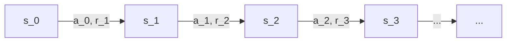
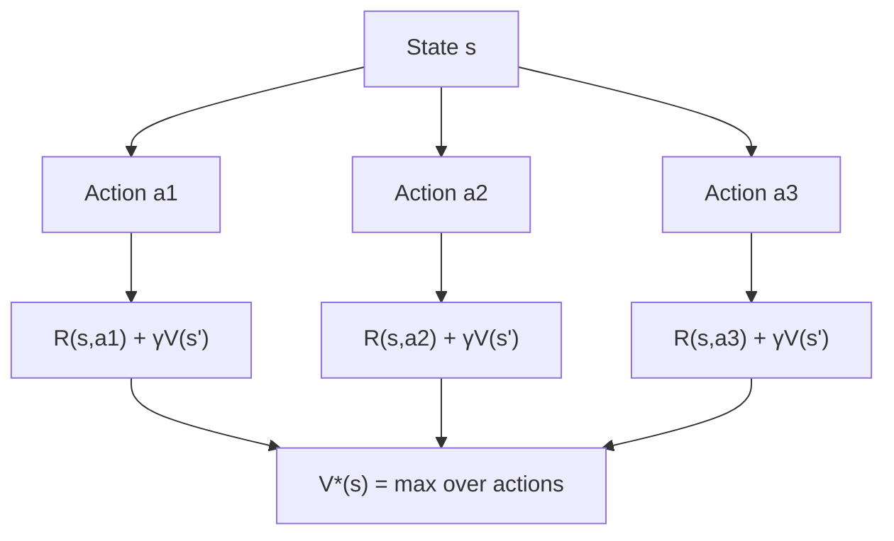
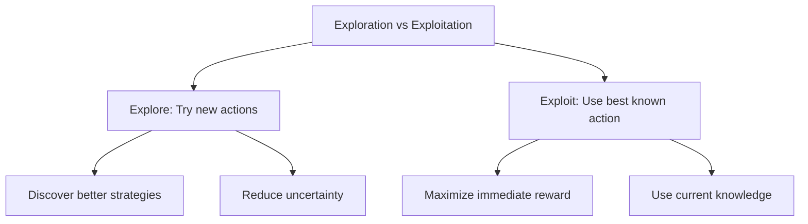

# RL Fundamentals

## Overview

This page covers the mathematical foundations of reinforcement learning: Markov Decision Processes, value functions, the Bellman equation, and the exploration-exploitation tradeoff. These concepts are the building blocks for all RL algorithms.

## Markov Decision Process (MDP)

An MDP is defined by the tuple $\langle \mathcal{S}, \mathcal{A}, P, R, \gamma \rangle$:



### Markov Property

The future is independent of the past given the present:

$$P(s_{t+1} | s_t, a_t, s_{t-1}, a_{t-1}, \dots) = P(s_{t+1} | s_t, a_t)$$

### Return (Cumulative Reward)

$$G_t = r_{t+1} + \gamma r_{t+2} + \gamma^2 r_{t+3} + \dots = \sum_{k=0}^{\infty} \gamma^k r_{t+k+1}$$

- $\gamma = 0$: Myopic (only care about immediate reward)
- $\gamma = 1$: Far-sighted (care about all future rewards equally)
- Typical values: $\gamma \in [0.95, 0.99]$

## Value Functions

### State Value Function $V^\pi(s)$

Expected return starting from state $s$, following policy $\pi$:

$$V^\pi(s) = \mathbb{E}_\pi[G_t | s_t = s] = \mathbb{E}_\pi\left[\sum_{k=0}^{\infty} \gamma^k r_{t+k+1} \mid s_t = s\right]$$

### Action-Value Function $Q^\pi(s,a)$

Expected return starting from state $s$, taking action $a$, then following policy $\pi$:

$$Q^\pi(s, a) = \mathbb{E}_\pi[G_t | s_t = s, a_t = a]$$

### Relationship

$$V^\pi(s) = \sum_{a} \pi(a|s) Q^\pi(s, a)$$

$$Q^\pi(s, a) = R(s, a) + \gamma \sum_{s'} P(s'|s,a) V^\pi(s')$$

## Bellman Equations

### Bellman Expectation Equation

The value of a state equals the immediate reward plus the discounted value of the next state:

$$V^\pi(s) = \sum_{a} \pi(a|s) \left[ R(s, a) + \gamma \sum_{s'} P(s'|s,a) V^\pi(s') \right]$$

$$Q^\pi(s, a) = R(s, a) + \gamma \sum_{s'} P(s'|s,a) \sum_{a'} \pi(a'|s') Q^\pi(s', a')$$

### Bellman Optimality Equation

For the optimal policy $\pi^*$:

$$V^*(s) = \max_{a} \left[ R(s, a) + \gamma \sum_{s'} P(s'|s,a) V^*(s') \right]$$

$$Q^*(s, a) = R(s, a) + \gamma \sum_{s'} P(s'|s,a) \max_{a'} Q^*(s', a')$$



## Policy

A policy $\pi$ maps states to actions:

- **Deterministic**: $a = \pi(s)$
- **Stochastic**: $\pi(a|s) = P(a_t = a | s_t = s)$

### Optimal Policy

$$\pi^* = \arg\max_\pi V^\pi(s) \quad \forall s$$

All optimal policies share the same optimal value functions $V^*$ and $Q^*$.

## Exploration vs Exploitation



### Exploration Strategies

| Strategy | Description | Pros | Cons |
|----------|-------------|------|------|
| $\epsilon$-greedy | Random action with prob $\epsilon$ | Simple | Fixed exploration rate |
| Boltzmann | Softmax over Q-values | Adapts to uncertainty | Needs temperature tuning |
| UCB | Upper confidence bound | Theoretically grounded | Computationally expensive |
| Thompson Sampling | Sample from posterior | Bayesian optimal | Needs distribution model |

```python
import numpy as np

class EpsilonGreedy:
    def __init__(self, n_actions, epsilon=0.1):
        self.n_actions = n_actions
        self.epsilon = epsilon
        self.q_values = np.zeros(n_actions)
        self.action_counts = np.zeros(n_actions)
    
    def select_action(self):
        if np.random.random() < self.epsilon:
            return np.random.randint(self.n_actions)  # Explore
        else:
            return np.argmax(self.q_values)  # Exploit
    
    def update(self, action, reward):
        self.action_counts[action] += 1
        n = self.action_counts[action]
        self.q_values[action] += (reward - self.q_values[action]) / n
```

## Dynamic Programming

### Policy Evaluation

Compute $V^\pi$ for a given policy $\pi$:

```python
def policy_evaluation(env, policy, gamma=0.99, theta=1e-8):
    V = np.zeros(env.n_states)
    while True:
        delta = 0
        for s in range(env.n_states):
            v = V[s]
            # Bellman expectation update
            V[s] = sum(
                policy[a] * sum(
                    p * (r + gamma * V[s_next])
                    for p, s_next, r in env.transitions(s, a)
                )
                for a in range(env.n_actions)
            )
            delta = max(delta, abs(v - V[s]))
        if delta < theta:
            break
    return V
```

### Policy Iteration

Alternates between evaluation and improvement:

```python
def policy_iteration(env, gamma=0.99):
    policy = np.ones((env.n_states, env.n_actions)) / env.n_actions
    
    while True:
        # Policy Evaluation
        V = policy_evaluation(env, policy, gamma)
        
        # Policy Improvement
        policy_stable = True
        for s in range(env.n_states):
            old_action = np.argmax(policy[s])
            # Greedy update
            Q = [sum(p * (r + gamma * V[s_next])
                     for p, s_next, r in env.transitions(s, a))
                 for a in range(env.n_actions)]
            policy[s] = np.eye(env.n_actions)[np.argmax(Q)]
            if old_action != np.argmax(policy[s]):
                policy_stable = False
        
        if policy_stable:
            return policy, V
```

## Interview Questions

### Q1: What is the Bellman equation and why is it important?
**Answer:** The Bellman equation expresses the value of a state recursively in terms of the immediate reward and the discounted value of successor states: $V(s) = \max_a [R(s,a) + \gamma \sum_{s'} P(s'|s,a) V(s')]$. It's important because: 1) It's the foundation of all RL algorithms, 2) It decomposes a long-horizon problem into single-step decisions, 3) It enables iterative computation of optimal values.

### Q2: What is the difference between $V(s)$ and $Q(s,a)$?
**Answer:** $V(s)$ is the expected return from state $s$ following policy $\pi$. $Q(s,a)$ is the expected return from state $s$ taking action $a$ then following $\pi$. $Q$ is more useful for action selection because it tells you the value of each action, not just the state. $V^*(s) = \max_a Q^*(s,a)$.

### Q3: Explain the exploration-exploitation tradeoff.
**Answer:** Exploration means trying actions whose outcomes are uncertain to discover potentially better strategies. Exploitation means choosing the best-known action to maximize immediate reward. Too much exploration wastes time on suboptimal actions; too much exploitation may miss the optimal policy. $\epsilon$-greedy is the simplest solution: exploit with probability $1-\epsilon$, explore with probability $\epsilon$.

### Q4: Why do we discount future rewards?
**Answer:** Discount factor $\gamma < 1$ serves multiple purposes: 1) Mathematical convenience (ensures infinite sums converge), 2) Models uncertainty about the future, 3) Reflects time preference (sooner rewards are more valuable), 4) Prevents the agent from getting stuck in infinite loops. Typical values are 0.95-0.99.

## Common Mistakes

- ❌ Confusing $V(s)$ with $Q(s,a)$
- ❌ Forgetting that the Bellman equation is recursive
- ❌ Not understanding the Markov property
- ❌ Setting $\gamma$ too high (training instability) or too low (short-sighted)
- ❌ Ignoring exploration (greedy-only leads to suboptimal policies)

## Summary

RL is built on MDPs: states, actions, transitions, rewards, and discount. Value functions ($V$, $Q$) estimate expected returns. The Bellman equation provides recursive computation of optimal values. Exploration-exploitation is the fundamental tradeoff. These foundations underpin all RL algorithms from Q-learning to PPO to RLHF.

## Cross-References

- [Q-Learning →](q-learning.md) TD learning and DQN
- [Policy Gradient →](policy-gradient.md) Policy optimization
- [PPO →](ppo.md) Modern policy optimization
- [RLHF →](rlhf.md) RL for LLM alignment
