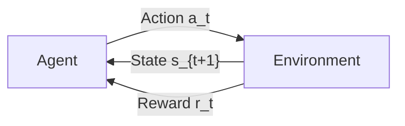
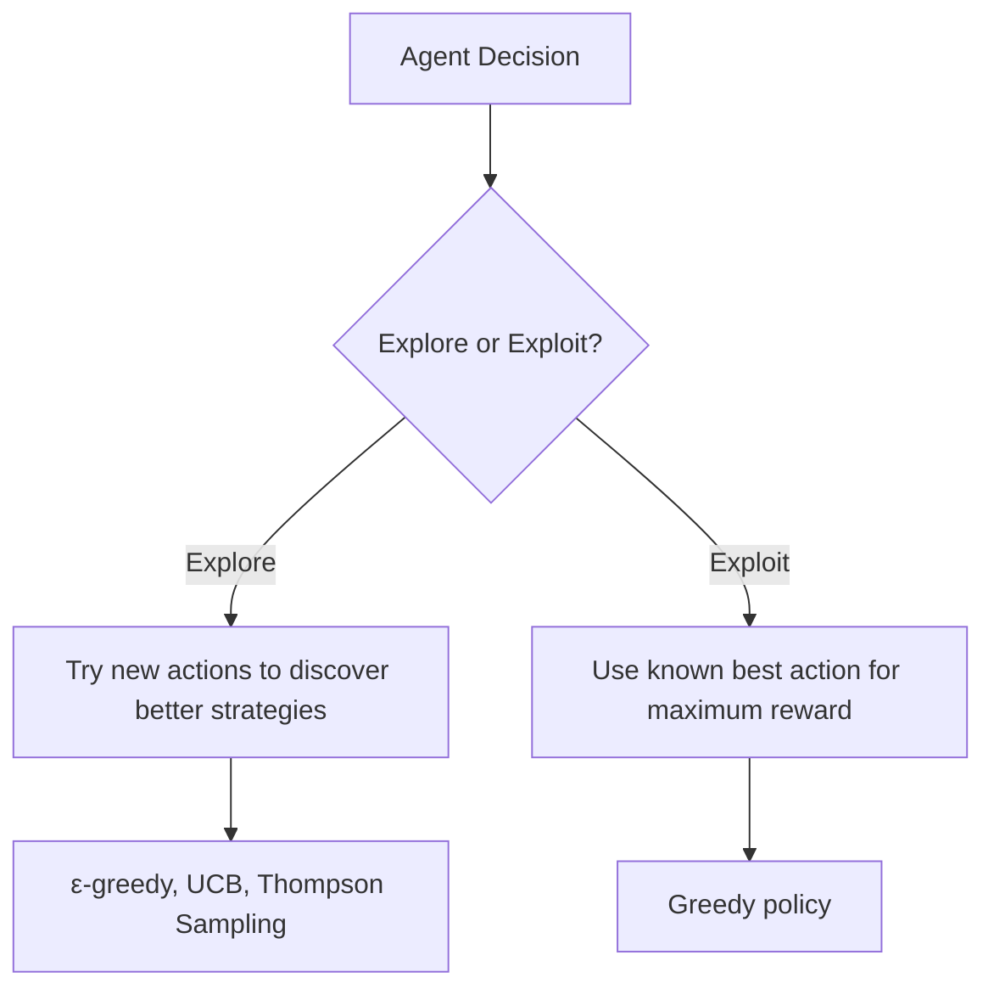
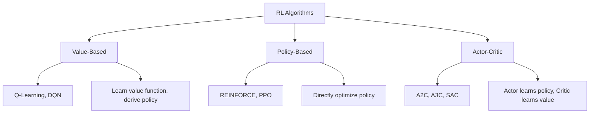

# RL Fundamentals

## Overview

Reinforcement Learning is a learning paradigm where an **agent** learns to make decisions by interacting with an **environment**. The agent takes **actions**, receives **rewards**, and transitions between **states** — learning a **policy** that maximizes cumulative reward over time.

## Core Concepts

### Key Terminology

| Term | Symbol | Meaning |
|------|--------|---------|
| **State** | s | Current situation of the environment |
| **Action** | a | What the agent can do |
| **Policy** | π(a\|s) | Strategy: mapping from states to actions |
| **Reward** | r | Immediate feedback signal |
| **Return** | G | Cumulative discounted reward |
| **Value Function** | V(s) | Expected return from state s |
| **Q-Function** | Q(s,a) | Expected return from state s taking action a |
| **Discount Factor** | γ | How much we value future vs immediate rewards |

## Markov Decision Process (MDP)

RL problems are formalized as MDPs, defined by the tuple (S, A, P, R, γ):

- **S**: Set of states
- **A**: Set of actions
- **P(s'|s,a)**: Transition probability
- **R(s,a,s')**: Reward function
- **γ ∈ [0,1]**: Discount factor

**Markov Property**: The future depends only on the current state, not the history.

\\[P(s_{t+1} | s_t, a_t, s_{t-1}, a_{t-1}, ...) = P(s_{t+1} | s_t, a_t)\\]

## Return and Discounting

The **discounted return** from time t:

\\[G_t = r_t + \gamma r_{t+1} + \gamma^2 r_{t+2} + ... = \sum_{k=0}^{\infty} \gamma^k r_{t+k}\\]

- **γ = 0**: Only care about immediate reward (myopic)
- **γ = 1**: Care equally about all future rewards (far-sighted)
- **γ = 0.99**: Common default; value future rewards slightly less

## Value Functions

### State Value V(s)
Expected return starting from state s, following policy π:

\\[V^{\pi}(s) = \mathbb{E}_{\pi}[G_t | s_t = s]\\]

### Action Value Q(s,a)
Expected return starting from state s, taking action a, then following π:

\\[Q^{\pi}(s, a) = \mathbb{E}_{\pi}[G_t | s_t = s, a_t = a]\\]

### Bellman Equations

The recursive relationship:

\\[V^{\pi}(s) = \sum_a \pi(a|s) \sum_{s'} P(s'|s,a) [R(s,a,s') + \gamma V^{\pi}(s')]\\]

\\[Q^{\pi}(s,a) = \sum_{s'} P(s'|s,a) [R(s,a,s') + \gamma \sum_{a'} \pi(a'|s') Q^{\pi}(s',a')]\\]

### Optimal Value Functions

\\[V^*(s) = \max_a Q^*(s, a)\\]

\\[Q^*(s, a) = \sum_{s'} P(s'|s,a) [R(s,a,s') + \gamma \max_{a'} Q^*(s', a')]\\]

## Exploration vs Exploitation

| Strategy | Description |
|----------|-------------|
| **ε-greedy** | With probability ε explore, else exploit (most common) |
| **UCB** | Upper Confidence Bound — explore uncertain actions |
| **Thompson Sampling** | Sample from posterior distribution of action values |
| **Boltzmann Exploration** | Softmax over Q-values for probabilistic action selection |

## Categories of RL Algorithms

### Value-Based Methods
- Learn Q(s,a) or V(s)
- Derive policy: choose action with highest Q-value
- Examples: Q-Learning, DQN, Double DQN
- Limitation: Only for discrete action spaces (usually)

### Policy-Based Methods
- Directly learn policy π(a|s)
- Optimize expected return via gradient ascent
- Examples: REINFORCE, PPO
- Advantage: Can handle continuous action spaces

### Actor-Critic Methods
- **Actor**: Policy network π(a|s)
- **Critic**: Value network V(s) or Q(s,a)
- Critic provides baseline to reduce variance in policy gradients
- Examples: A2C, A3C, PPO, SAC

## Markov vs Non-Markov Environments

| Property | Markov | Non-Markov |
|----------|--------|------------|
| **History dependence** | Only current state | Needs history |
| **Example** | Chess (full board state) | Poker (hidden cards) |
| **Solution** | Standard MDP | POMDP, RNN-based policies |

For LLMs, the "state" is the entire conversation history — technically a POMDP if we consider hidden user intent.

## Discount Factor Intuition

| γ Value | Behavior | Use Case |
|---------|----------|----------|
| 0.99 | Values long-term rewards | Navigation, planning |
| 0.95 | Moderate horizon | Game playing |
| 0.9 | Shorter horizon | Real-time control |
| 0 | Myopic | Bandits, immediate decisions |

## Interview Questions

**Q1: What is the Markov property and why does it matter?**
> The Markov property states that the future state depends only on the current state, not the history. It matters because it simplifies the problem — we can use the current state as a sufficient statistic. In practice, many environments aren't fully Markov, so we use RNNs or attention to encode history into a state representation.

**Q2: Why do we discount future rewards?**
> Three reasons: (1) Mathematical convenience — ensures infinite sums converge, (2) Uncertainty — future rewards are less certain, (3) Preference for immediacy — in many practical settings, earlier rewards are genuinely more valuable. For LLMs, discounting is less critical since episodes are short.

**Q3: What's the difference between value-based and policy-based methods?**
> Value-based: learn Q(s,a), derive policy by picking argmax actions. Discrete actions only. Policy-based: directly optimize π(a|s) via gradient ascent. Handles continuous actions. Actor-critic combines both — actor for policy, critic for value estimation (baseline to reduce variance).

**Q4: What is the exploration-exploitation tradeoff?**
> Exploitation: use current knowledge to maximize reward. Exploration: try new actions to discover potentially better strategies. Too much exploitation → stuck in local optimum. Too much exploration → waste time on suboptimal actions. ε-greedy is the simplest solution: exploit with probability 1-ε, explore with probability ε.

**Q5: Explain the Bellman equation intuitively.**
> The value of a state equals the immediate reward plus the discounted value of the next state. It's recursive: V(s) = r + γ·V(s'). This creates a system of equations that can be solved iteratively (value iteration) or from data (Q-learning). The Bellman equation is the foundation of all value-based RL.

## Common Mistakes

1. **Confusing episode with step** — An episode is a full sequence from start to terminal state
2. **Not discounting properly** — γ too high can cause unstable training; γ too low ignores long-term planning
3. **Ignoring exploration** — Pure greedy policies get stuck in local optima
4. **Assuming Markov when it's not** — Use RNNs or history frames for non-Markov environments
5. **Mixing up V and Q** — V(s) is state value, Q(s,a) is state-action value; Q includes the action

## Summary

| Concept | Key Takeaway |
|---------|-------------|
| **MDP** | (S, A, P, R, γ) — formal framework for RL |
| **Policy** | π(a\|s) — agent's strategy |
| **Value Function** | Expected cumulative reward |
| **Bellman Equation** | Recursive relationship: V(s) = r + γ·V(s') |
| **Exploration** | Balance trying new things vs using known best |
| **Algorithm Types** | Value-based, policy-based, actor-critic |

These fundamentals underpin everything from game-playing AI to LLM alignment via RLHF.

## Cross-References

- [Q-Learning](./q-learning.md)
- [Policy Gradient](./policy-gradient.md)
- [PPO](./ppo.md)
- [Agent Architecture](../agents/architecture.md)
