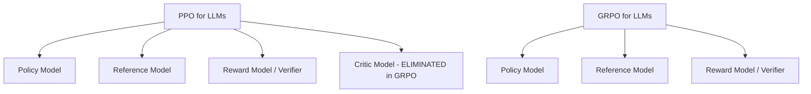
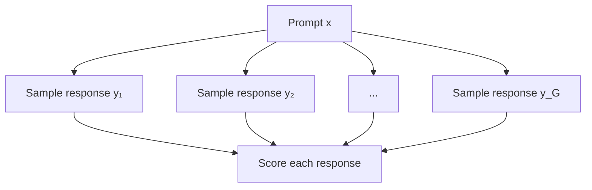
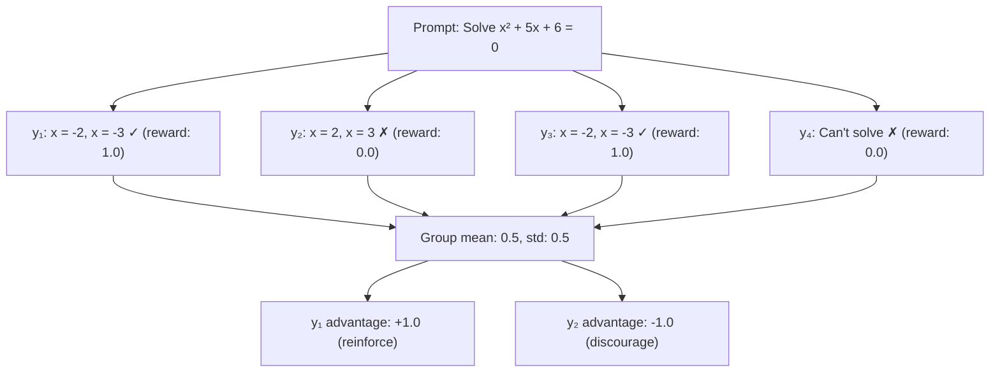
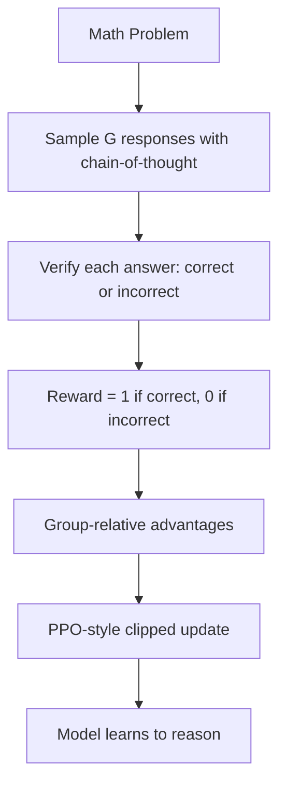

# Group Relative Policy Optimization (GRPO)

## Overview

GRPO is an RL algorithm that **eliminates the critic network** by using **group-relative advantages** — comparing multiple sampled outputs from the same prompt to estimate how good each response is. Popularized by DeepSeek-R1 (2025), GRPO is now the dominant RL optimizer for training reasoning models (LRMs).

## Motivation

PPO for LLMs requires four models in memory:
1. **Policy** (being optimized)
2. **Reference** (for KL penalty)
3. **Reward model** (or verifier)
4. **Critic/Value model** (for advantage estimation)

GRPO removes the critic, reducing memory and complexity while maintaining training effectiveness.



## How GRPO Works

### Step 1: Sample a Group of Responses

For each prompt, generate **G responses** from the current policy:



### Step 2: Compute Rewards

Score each response using a reward function (reward model or rule-based verifier):

$$r_i = R(x, y_i) \quad \text{for } i = 1, ..., G$$

### Step 3: Compute Group-Relative Advantages

Normalize rewards **within the group**:

$$\hat{A}_i = \frac{r_i - \text{mean}(r_1, ..., r_G)}{\text{std}(r_1, ..., r_G)}$$

This is the key innovation — advantages are relative to the group, not estimated by a critic.

### Step 4: Policy Update with Clipped Objective

Use a PPO-style clipped objective with the group-relative advantages:

$$L_{GRPO}(\theta) = \mathbb{E}\left[ \min\left( \frac{\pi_\theta(y_i|x)}{\pi_{\theta_{old}}(y_i|x)} \hat{A}_i, \text{clip}(\cdot, 1-\epsilon, 1+\epsilon) \hat{A}_i \right) - \beta D_{KL}[\pi_\theta \| \pi_{ref}] \right]$$

## GRPO vs PPO

| Aspect | PPO | GRPO |
|--------|-----|------|
| **Critic Model** | Required (V(s)) | Not needed |
| **Advantage Estimation** | GAE with critic | Group-relative normalization |
| **Models in Memory** | 4 (policy, ref, reward, critic) | 3 (policy, ref, reward) |
| **Per-Prompt Samples** | 1 response | G responses (typically 4-64) |
| **Variance Reduction** | Critic baseline | Group normalization |
| **Implementation** | Complex | Simpler |
| **Used By** | InstructGPT, ChatGPT | DeepSeek-R1, Qwen |

## Why Group-Relative Works



By comparing responses to the **same prompt**, we get a natural baseline — the average quality of responses in the group. No critic needed.

## GRPO in DeepSeek-R1

DeepSeek-R1 uses GRPO with **verifiable rewards (RLVR)** for training reasoning:



**Key observations from DeepSeek-R1:**
- The model spontaneously develops **chain-of-thought** reasoning
- Longer, more detailed reasoning emerges over training
- "Aha moments" — the model learns to self-correct
- GRPO with rule-based rewards (math verification) works without a learned reward model

## RLVR: Reinforcement Learning with Verifiable Rewards

GRPO pairs naturally with RLVR — rewards from deterministic verifiers:

| Task | Verifier | Reward |
|------|----------|--------|
| Math | Check final answer | 1 if correct, 0 if not |
| Code | Run test cases | Fraction of tests passing |
| Logic | Rule-based checker | 1 if valid, 0 if not |

**Advantage over RLHF rewards:**
- No reward model to train (no annotation cost)
- No reward hacking (verification is exact)
- Clear, unambiguous reward signal
- Scales easily

## GRPO Algorithm Pseudocode

```python
def grpo_training(policy, ref_model, reward_fn, prompts, G=8, eps=0.2, beta=0.01):
    for prompt in prompts:
        # Step 1: Sample G responses
        responses = [policy.generate(prompt) for _ in range(G)]
        
        # Step 2: Score each response
        rewards = [reward_fn(prompt, resp) for resp in responses]
        
        # Step 3: Group-relative advantages
        mean_r, std_r = mean(rewards), std(rewards)
        advantages = [(r - mean_r) / (std_r + 1e-8) for r in rewards]
        
        # Step 4: PPO-style update
        for resp, adv in zip(responses, advantages):
            ratio = policy.prob(resp) / old_policy.prob(resp)
            clipped_ratio = clip(ratio, 1-eps, 1+eps)
            policy_loss = -min(ratio * adv, clipped_ratio * adv)
            kl_penalty = beta * kl_div(policy.prob(resp), ref.prob(resp))
            loss = policy_loss + kl_penalty
            loss.backward()
        
        optimizer.step()
```

## Hyperparameters for GRPO

| Parameter | Typical Value | Notes |
|-----------|--------------|-------|
| **Group size G** | 4-64 | More = better advantage estimates, more compute |
| **Clip ε** | 0.1-0.2 | Same as PPO |
| **KL coefficient β** | 0.001-0.01 | Lower than PPO (no critic instability) |
| **Learning rate** | 1e-6 to 5e-6 | Small for LLM stability |
| **Temperature** | 0.7-1.0 | For sampling diversity in the group |
| **Max response length** | 512-8192 | Task dependent |

## Interview Questions

**Q1: How does GRPO eliminate the critic?**
> Instead of using a learned value function V(s) as a baseline, GRPO generates multiple responses per prompt and uses the group's average reward as the baseline. The advantage of each response is its reward normalized by the group mean and standard deviation. This provides a natural, zero-cost baseline.

**Q2: What are the tradeoffs of using a group-based baseline vs a critic?**
> Pros: Less memory (no critic model), simpler implementation, no critic training instability. Cons: Higher variance (group estimates are noisy), requires multiple samples per prompt (more compute), baseline quality depends on group size. In practice, the simplicity and memory savings outweigh the variance increase.

**Q3: Why does GRPO work well for reasoning tasks?**
> Reasoning tasks have verifiable rewards (math answers can be checked). GRPO + RLVR uses rule-based verification instead of learned reward models. This avoids reward hacking and provides clear learning signals. The group comparison naturally distinguishes good reasoning from bad reasoning.

**Q4: How does DeepSeek-R1 use GRPO?**
> DeepSeek-R1 uses GRPO with verifiable rewards: math problems are verified by checking answers, code by running tests. The model samples multiple chain-of-thought responses, gets binary rewards (correct/incorrect), and updates using group-relative advantages. This led to emergent reasoning capabilities including self-correction.

**Q5: What is the role of group size G in GRPO?**
> Larger G gives better advantage estimates (lower variance) but costs more compute. With G=2, the comparison is noisy. With G=64, you get a reliable baseline. Typical range: 8-32 for training, though DeepSeek uses larger groups. The tradeoff is compute vs estimate quality.

**Q6: How does GRPO differ from REINFORCE with baseline?**
> REINFORCE with baseline subtracts a fixed or state-dependent baseline from the return. GRPO's baseline is the group mean — specific to each prompt and sampled from the current policy. This is more adaptive and doesn't require learning a baseline function. The clipped objective also makes GRPO more stable than vanilla REINFORCE.

## Common Mistakes

1. **Too small group size** — G < 4 gives noisy advantage estimates
2. **Not normalizing advantages** — Always normalize within the group
3. **Using GRPO with non-verifiable tasks** — Works best with clear reward signals (math, code)
4. **Ignoring KL divergence** — Without it, the model can degenerate
5. **Low sampling temperature** — Need diversity in the group for meaningful comparisons

## Summary

| Aspect | Detail |
|--------|--------|
| **Core Innovation** | Group-relative advantages replace the critic |
| **Key Benefit** | Simpler, less memory than PPO |
| **Best Paired With** | Verifiable rewards (RLVR) |
| **Used By** | DeepSeek-R1, Qwen reasoning models |
| **Group Size** | Typically 8-32 responses per prompt |
| **Advantage** | Normalized rewards within group |

GRPO is the algorithm behind the current generation of reasoning models. Its simplicity and effectiveness have made it the go-to choice for training LLMs to reason.

## Cross-References

- [DPO](./dpo.md)
- [RLHF](./rlhf.md)
- [PPO](./ppo.md)
- [LLM RLHF](../../llm/llm-serving/rlhf.md)
- [DeepSeek](../../llm/sota/deepseek.md)

