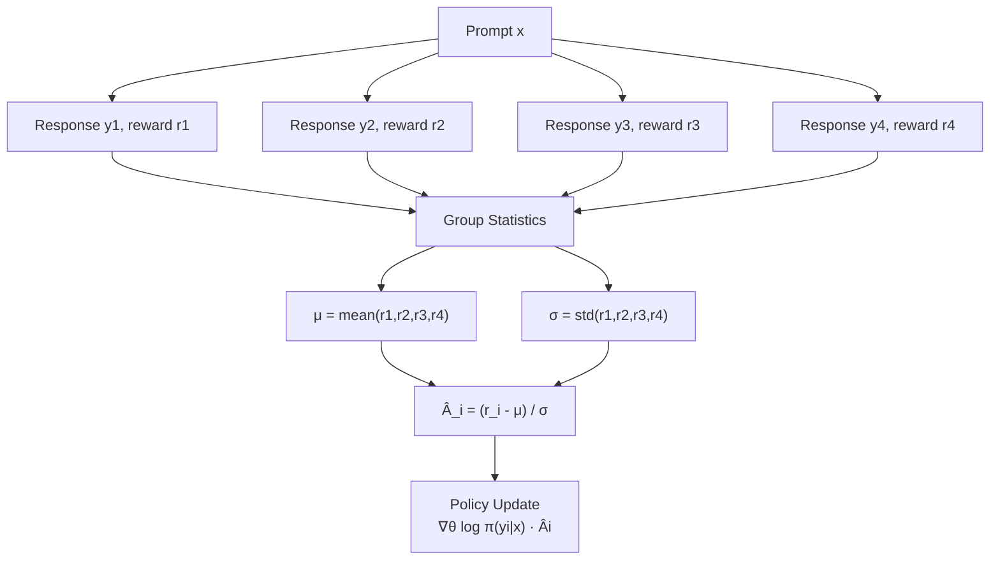
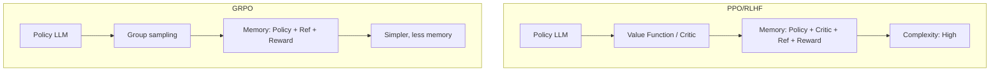
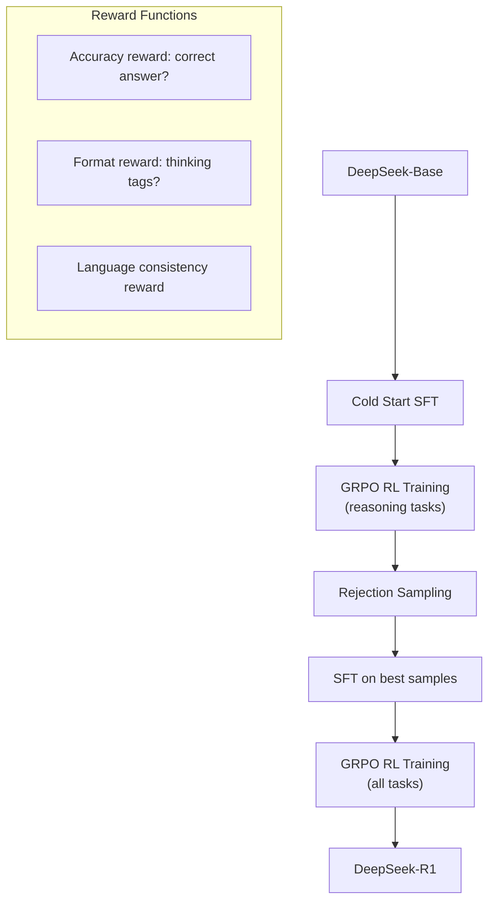
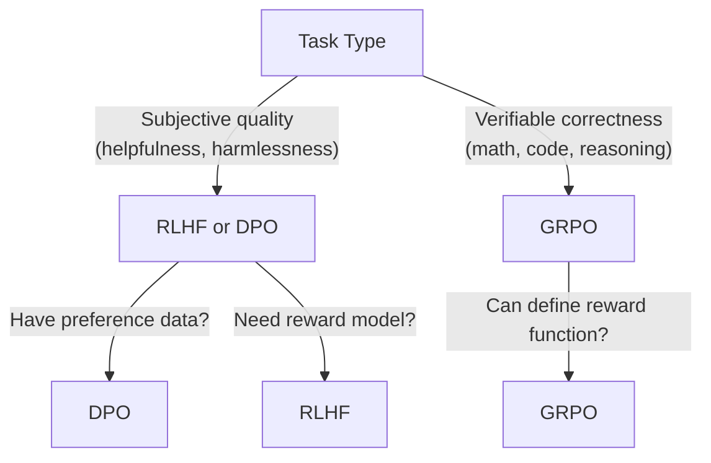

# GRPO (Group Relative Policy Optimization)

## Overview

GRPO, introduced by DeepSeek (Shao et al., 2024), is a variant of policy optimization that **eliminates the critic/value function** by using **group-level baseline estimation**. Instead of training a separate value network to compute advantages, GRPO generates multiple responses for each prompt, computes their rewards, and uses the group statistics (mean, std) as the baseline. This significantly reduces memory and compute requirements while maintaining performance.

## Core Idea



## Group Advantage Estimation

For each prompt $x$, generate $G$ responses $\{y_1, y_2, \dots, y_G\}$ with rewards $\{r_1, r_2, \dots, r_G\}$:

$$\hat{A}_i = \frac{r_i - \text{mean}(\{r_j\}_{j=1}^G)}{\text{std}(\{r_j\}_{j=1}^G)}$$

This normalized advantage:
- Positive for above-average responses (reinforced)
- Negative for below-average responses (penalized)
- Automatically scales with group variance

## GRPO Objective

The GRPO loss combines policy gradient with KL regularization:

$$\mathcal{L}_{\text{GRPO}}(\theta) = -\mathbb{E}_{x \sim \mathcal{D}}\left[\frac{1}{G} \sum_{i=1}^{G} \min\left(\rho_i \hat{A}_i, \; \text{clip}(\rho_i, 1-\epsilon, 1+\epsilon) \hat{A}_i\right) - \beta \cdot D_{\text{KL}}(\pi_\theta \| \pi_{\text{ref}})\right]$$

Where:
- $\rho_i = \frac{\pi_\theta(y_i|x)}{\pi_{\text{old}}(y_i|x)}$: probability ratio
- $\hat{A}_i$: group-relative advantage
- $\epsilon$: PPO clipping parameter
- $\beta$: KL penalty coefficient

## Why No Critic?



| Aspect | PPO (with critic) | GRPO (no critic) |
|--------|-------------------|-------------------|
| LLM copies | 4 (policy, ref, reward, critic) | 3 (policy, ref, reward) |
| Advantage estimation | Learned value function | Group statistics |
| Memory | Higher | Lower |
| Complexity | More hyperparameters | Fewer |
| Stability | Can have value function errors | No value function issues |

## Implementation

```python
import torch
import torch.nn.functional as F
from copy import deepcopy

class GRPOTrainer:
    def __init__(self, model, ref_model, reward_fn, 
                 beta=0.04, epsilon=0.2, num_generations=8):
        self.model = model
        self.ref_model = ref_model  # Frozen
        self.reward_fn = reward_fn
        self.beta = beta
        self.epsilon = epsilon
        self.G = num_generations
        self.optimizer = torch.optim.AdamW(model.parameters(), lr=1e-6)
    
    def compute_logprobs(self, model, input_ids, labels, attention_mask):
        """Compute log probabilities of response tokens."""
        outputs = model(input_ids, attention_mask=attention_mask)
        logits = outputs.logits[:, :-1, :]
        labels = labels[:, 1:]
        log_probs = F.log_softmax(logits, dim=-1)
        token_log_probs = log_probs.gather(2, labels.unsqueeze(2)).squeeze(2)
        return token_log_probs.sum(dim=1)
    
    def train_step(self, prompts):
        self.model.train()
        all_loss = 0
        
        for prompt in prompts:
            # 1. Generate G responses per prompt
            responses = []
            for _ in range(self.G):
                response = self.model.generate(prompt, max_length=512)
                responses.append(response)
            
            # 2. Compute rewards
            rewards = torch.tensor([
                self.reward_fn(prompt, resp) for resp in responses
            ])
            
            # 3. Compute group-relative advantages
            advantages = (rewards - rewards.mean()) / (rewards.std() + 1e-8)
            
            # 4. Compute log probs for policy and reference
            policy_logprobs = []
            ref_logprobs = []
            for resp in responses:
                input_ids, labels, mask = tokenize(prompt, resp)
                policy_lp = self.compute_logprobs(
                    self.model, input_ids, labels, mask)
                with torch.no_grad():
                    ref_lp = self.compute_logprobs(
                        self.ref_model, input_ids, labels, mask)
                policy_logprobs.append(policy_lp)
                ref_logprobs.append(ref_lp)
            
            policy_logprobs = torch.stack(policy_logprobs)
            ref_logprobs = torch.stack(ref_logprobs)
            old_logprobs = policy_logprobs.detach()
            
            # 5. PPO-clip with group advantages
            ratio = (policy_logprobs - old_logprobs).exp()
            surr1 = ratio * advantages
            surr2 = torch.clamp(ratio, 1 - self.epsilon, 1 + self.epsilon) * advantages
            pg_loss = -torch.min(surr1, surr2).mean()
            
            # 6. KL penalty
            kl = (policy_logprobs - ref_logprobs).mean()
            
            # 7. Total loss
            loss = pg_loss + self.beta * kl
            
            self.optimizer.zero_grad()
            loss.backward()
            torch.nn.utils.clip_grad_norm_(self.model.parameters(), 1.0)
            self.optimizer.step()
            
            all_loss += loss.item()
        
        return all_loss / len(prompts)
```

## GRPO in DeepSeek

DeepSeek-R1 uses GRPO for training reasoning models:



### Reward Functions in DeepSeek-R1

```python
def accuracy_reward(prompt, response, ground_truth):
    """Reward for correct final answer."""
    extracted = extract_answer(response)
    return 1.0 if extracted == ground_truth else 0.0

def format_reward(response):
    """Reward for using proper thinking format."""
    has_think = "<think>" in response and "</think>" in response
    has_answer = "<answer>" in response and "</answer>" in response
    return 0.5 * has_think + 0.5 * has_answer

def combined_reward(prompt, response, ground_truth):
    return (0.7 * accuracy_reward(prompt, response, ground_truth) +
            0.3 * format_reward(response))
```

## When to Use GRPO vs DPO vs RLHF

| Method | Best For | Requirements |
|--------|----------|-------------|
| **RLHF** | Maximum alignment quality | Reward model, PPO, 4 LLM copies |
| **DPO** | Simple preference optimization | Preference pairs, 2 LLM copies |
| **GRPO** | Reasoning tasks, verifiable rewards | Reward function, 3 LLM copies |



## Interview Questions

### Q1: What is GRPO and how does it differ from PPO?
**Answer:** GRPO eliminates the critic/value function by using group-level baseline estimation. For each prompt, it generates multiple responses, computes their rewards, and uses the group mean and standard deviation to normalize advantages. This reduces memory (no critic), simplifies training (fewer hyperparameters), and avoids value function estimation errors.

### Q2: How does GRPO compute advantages without a value function?
**Answer:** For each prompt, generate $G$ responses. Compute rewards for each response. The advantage of each response is its reward normalized by the group statistics: $\hat{A}_i = (r_i - \mu_G) / \sigma_G$. This provides a natural baseline — above-average responses are reinforced, below-average are penalized.

### Q3: When should you use GRPO vs DPO?
**Answer:** Use GRPO when you have a **verifiable reward function** (correct answer for math, passing tests for code). Use DPO when you have **human preference pairs** (subjective quality judgments). GRPO is better for reasoning tasks where correctness is objectively measurable; DPO is better for alignment tasks where quality is subjective.

### Q4: Why did DeepSeek-R1 use GRPO?
**Answer:** DeepSeek-R1 trains reasoning models where the reward is verifiable (math answers can be checked, code can be tested). GRPO is ideal because: 1) No need for a learned reward model (use rule-based rewards), 2) Group sampling naturally explores different reasoning paths, 3) Less memory than PPO (no critic), 4) The group baseline provides stable advantage estimates for reasoning tasks.

### Q5: What is the role of the KL penalty in GRPO?
**Answer:** The KL penalty $D_{\text{KL}}(\pi_\theta \| \pi_{\text{ref}})$ constrains the policy to stay close to the reference model, preventing: 1) Reward hacking (exploiting the reward function), 2) Language quality degradation, 3) Mode collapse (always generating similar responses). It's the same role as in RLHF but applied within the group-based framework.

## Common Mistakes

- ❌ Too few generations per prompt (unstable baseline estimates)
- ❌ Not normalizing advantages (different reward scales break training)
- ❌ KL penalty too strong (policy can't learn) or too weak (reward hacking)
- ❌ Using GRPO for subjective tasks where reward is hard to define
- ❌ Forgetting to freeze the reference model

## Summary

GRPO replaces the critic with group-level advantage estimation, making it simpler and more memory-efficient than PPO. It generates multiple responses per prompt, uses group statistics as baseline, and applies PPO-clip with group-relative advantages. Ideal for tasks with verifiable rewards (math, code, reasoning). Used in DeepSeek-R1 for training reasoning models.

## Cross-References

- [PPO →](ppo.md) The base algorithm GRPO improves upon
- [RLHF →](rlhf.md) Full RLHF pipeline
- [DPO →](dpo.md) Preference-based alternative
- [Policy Gradient →](policy-gradient.md) Policy gradient foundations
- [Fundamentals →](fundamentals.md) RL basics
