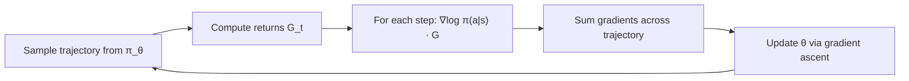
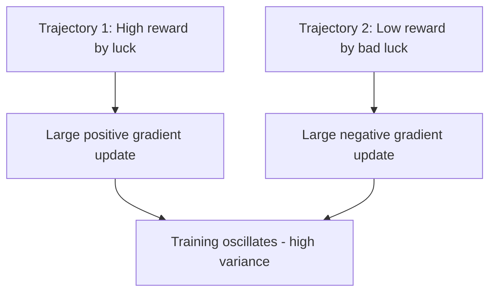
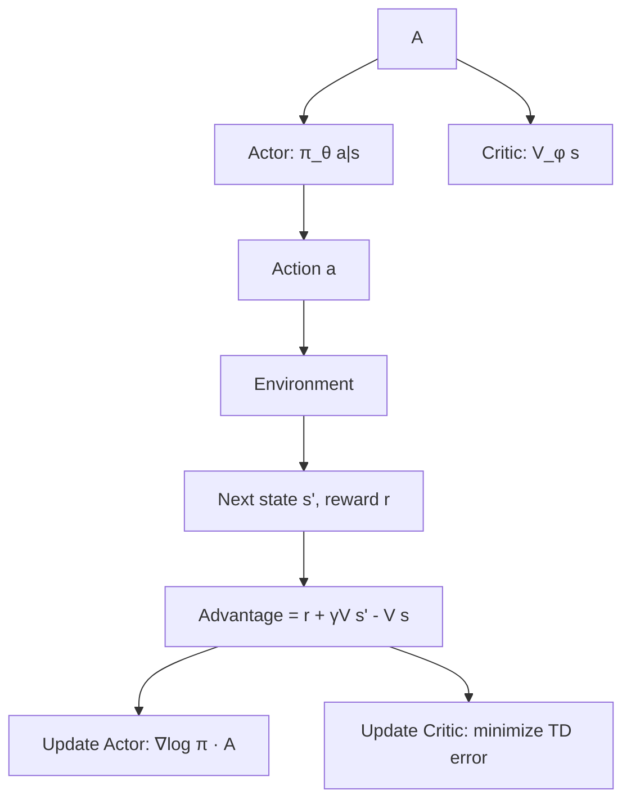

# Policy Gradient Methods

## Overview

Policy Gradient methods directly optimize the **policy** π(a|s) by computing gradients of the expected return with respect to the policy parameters. Unlike value-based methods (Q-learning), policy gradients can handle continuous action spaces and naturally learn stochastic policies.

## Core Idea

Instead of learning Q-values and deriving a policy, **directly parameterize the policy** and optimize it via gradient ascent:

$$\nabla_\theta J(\theta) = \mathbb{E}_{\pi_\theta} \left[ \nabla_\theta \log \pi_\theta(a|s) \cdot G_t \right]$$

Where:
- **J(θ)**: Expected return under policy π_θ
- **π_θ(a|s)**: Probability of taking action a in state s
- **G_t**: Discounted return from time t

This is the **REINFORCE** algorithm (Williams, 1992).

## The Policy Gradient Theorem

$$\nabla_\theta J(\theta) = \mathbb{E}_{\pi_\theta} \left[ \sum_t \nabla_\theta \log \pi_\theta(a_t|s_t) \cdot G_t \right]$$

**Intuition**: 
- If action a led to high reward → increase its probability (∇log π positive)
- If action a led to low reward → decrease its probability (∇log π negative)
- The return G_t acts as a scaling factor



## REINFORCE Algorithm

```python
def reinforce(env, policy, num_episodes, gamma, lr):
    for episode in range(num_episodes):
        states, actions, rewards = [], [], []
        
        # Collect trajectory
        state = env.reset()
        done = False
        while not done:
            action = sample_action(policy, state)
            next_state, reward, done, _ = env.step(action)
            states.append(state)
            actions.append(action)
            rewards.append(reward)
            state = next_state
        
        # Compute discounted returns
        returns = compute_discounted_returns(rewards, gamma)
        
        # Update policy
        loss = 0
        for s, a, G in zip(states, actions, returns):
            loss -= log_prob(policy, s, a) * G
        
        loss.backward()
        optimizer.step()
```

## High Variance Problem

REINFORCE suffers from **high variance** — a single trajectory can be noisy:



Solutions:

### 1. Baseline Subtraction
Subtract a baseline b(s) from the return to reduce variance without introducing bias:

$$\nabla_\theta J(\theta) = \mathbb{E} \left[ \nabla_\theta \log \pi_\theta(a|s) \cdot (G_t - b(s)) \right]$$

Common baseline: **state value function V(s)**

$$G_t - V(s_t) = \text{Advantage } A(s_t, a_t)$$

The advantage tells us how much better action a was compared to the average action in state s.

### 2. Actor-Critic Architecture



- **Actor**: Policy network π_θ(a|s) — decides actions
- **Critic**: Value network V_φ(s) — evaluates states
- Critic provides a lower-variance baseline than raw returns

### 3. Advantage Function

$$A(s, a) = Q(s, a) - V(s)$$

- A > 0: Action is better than average → increase probability
- A < 0: Action is worse than average → decrease probability

**Generalized Advantage Estimation (GAE)**:
$$A_t^{GAE} = \sum_{l=0}^{\infty} (\gamma \lambda)^l \delta_{t+l}$$
Where $\delta_t = r_t + \gamma V(s_{t+1}) - V(s_t)$

- **λ = 0**: Only TD error (low variance, high bias)
- **λ = 1**: Full Monte Carlo return (high variance, low bias)
- **λ = 0.95**: Common sweet spot

## Policy Gradient vs Value-Based

| Aspect | Policy Gradient | Value-Based |
|--------|----------------|-------------|
| **What's learned** | Policy π(a\|s) directly | Q(s,a) or V(s) |
| **Action spaces** | Continuous + discrete | Mostly discrete |
| **Policy type** | Stochastic or deterministic | Deterministic (argmax) |
| **Convergence** | Local optimum | Global (tabular) |
| **Variance** | High (need baselines) | Lower |
| **Example** | REINFORCE, PPO | Q-Learning, DQN |

## Trust Region Methods

Large policy updates can cause catastrophic performance drops. Trust region methods constrain the update size:

### TRPO (Trust Region Policy Optimization)
Maximize expected advantage subject to KL divergence constraint:

$$\max_\theta \mathbb{E}\left[\frac{\pi_\theta(a|s)}{\pi_{\theta_{old}}(a|s)} A(s,a)\right] \quad \text{s.t.} \quad \mathbb{E}[D_{KL}(\pi_{\theta_{old}} \| \pi_\theta)] \leq \delta$$

- Guarantees monotonic improvement (theoretically)
- Expensive (requires computing Fisher information matrix inverse)
- Led to PPO (practical approximation)

## Interview Questions

**Q1: What is the policy gradient theorem?**
> It states that the gradient of the expected return with respect to policy parameters equals the expected gradient of log π(a|s) weighted by the return. This lets us optimize the policy directly via gradient ascent — actions that led to high returns get reinforced, actions that led to low returns get discouraged.

**Q2: Why does REINFORCE have high variance and how do you reduce it?**
> High variance because each trajectory is a single sample from a stochastic environment. Reduction: (1) Baseline subtraction (V(s)) — advantage instead of raw return, (2) Actor-critic — use learned value function as baseline, (3) GAE — balance bias-variance with λ parameter, (4) Multiple trajectories per update — average over more samples.

**Q3: What is the advantage function and why is it important?**
> A(s,a) = Q(s,a) - V(s) measures how much better action a is compared to the average action in state s. It's important because: (1) It reduces variance by centering the returns, (2) It provides a more informative learning signal — "how much better was this action?" rather than "was this return high?"

**Q4: Explain actor-critic methods.**
> Actor-critic combines policy gradient (actor) with value function approximation (critic). The actor learns the policy π(a|s) and the critic learns V(s). The critic provides a baseline for the actor's gradient updates, reducing variance. The critic is updated using TD errors. Examples: A2C, A3C, PPO, SAC.

**Q5: Why do we need trust region methods like TRPO/PPO?**
> Large policy updates can cause catastrophic performance collapse — the new policy may be much worse. Trust region methods constrain how much the policy changes per update. TRPO uses a hard KL constraint; PPO uses a clipped objective as a soft constraint. This enables stable, incremental improvement.

**Q6: What's the difference between on-policy and off-policy in policy gradient context?**
> On-policy (REINFORCE, PPO): Must use data from the current policy. Old data is discarded. Sample inefficient but stable. Off-policy (SAC, DDPG): Can reuse data from older policies with importance sampling corrections. More sample efficient but potentially unstable. For LLMs, PPO is on-policy — must generate new responses each iteration.

## Common Mistakes

1. **Not using a baseline** — Raw returns cause huge variance; always use V(s) or similar
2. **Too large learning rate** — Policy gradient updates are sensitive; use small LR
3. **Ignoring advantage normalization** — Normalize advantages across batch for stability
4. **Not handling terminal states** — V(s_terminal) = 0; handle correctly
5. **Collecting too few trajectories** — Need enough samples for reliable gradient estimates

## Summary

| Aspect | Detail |
|--------|--------|
| **Core Idea** | Directly optimize π(a\|s) via gradient ascent on expected return |
| **REINFORCE** | ∇log π(a\|s) · G_t — simple but high variance |
| **Variance Reduction** | Baseline V(s), advantage function, GAE |
| **Actor-Critic** | Actor = policy, Critic = value function baseline |
| **Trust Region** | Constrain policy updates (TRPO, PPO) |
| **LLM Relevance** | Foundation for PPO, GRPO used in LLM alignment |

Policy gradient methods are the direct predecessors of PPO and GRPO — the algorithms that power LLM alignment and reasoning training.

## Cross-References

- [PPO](./ppo.md)
- [REINFORCE / Fundamentals](./fundamentals.md)
- [Q-Learning](./q-learning.md)
- [RLHF](./rlhf.md)
- [Agent Planning](../agents/planning.md)
