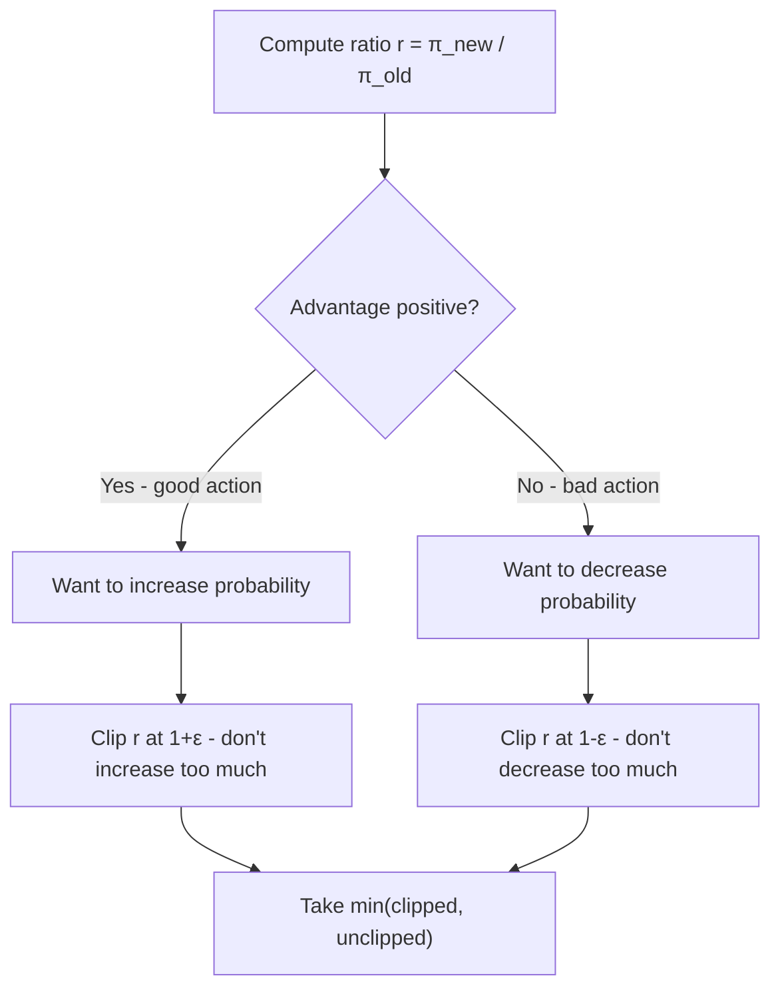
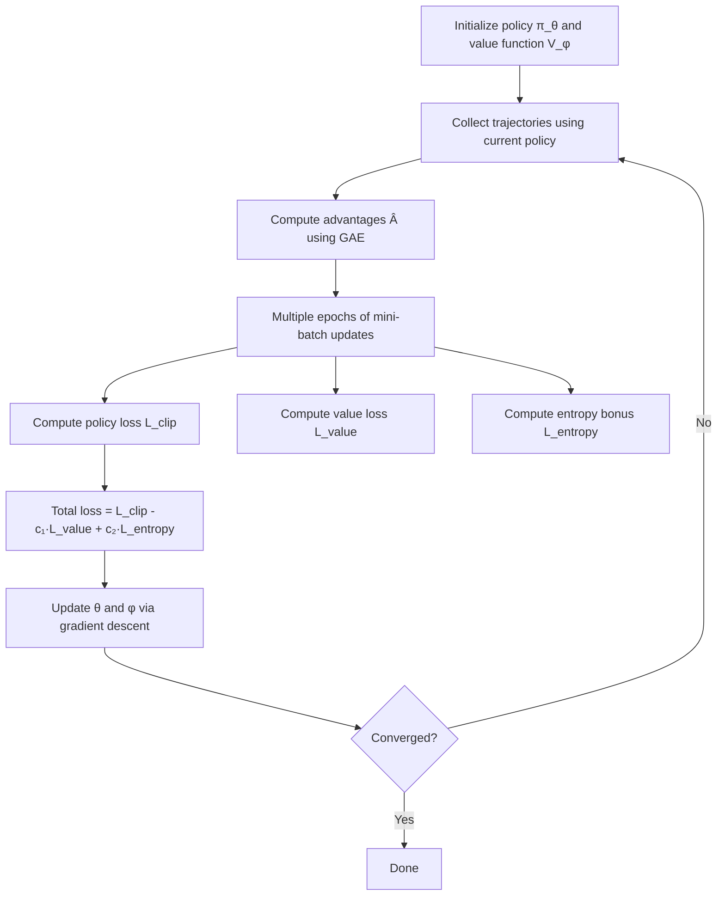
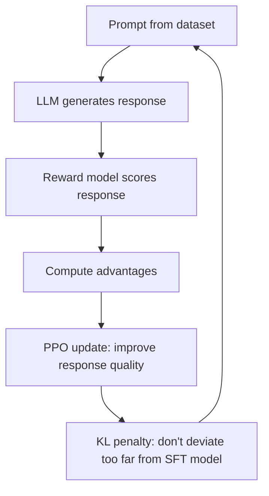
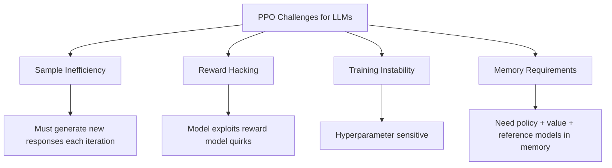

# Proximal Policy Optimization (PPO)

## Overview

PPO (Schulman et al., 2017) is the most widely used policy gradient algorithm in practice. It simplifies TRPO's constrained optimization into a **clipped surrogate objective** that's easy to implement and stable to train. PPO was the RL algorithm behind InstructGPT, ChatGPT, and many LLM alignment systems.

## Why PPO?

| Problem | REINFORCE | TRPO | PPO |
|---------|-----------|------|-----|
| Variance | Very high | Low | Low |
| Stability | Unstable | Stable | Stable |
| Implementation | Simple | Complex (KL constraint, Fisher matrix) | Simple |
| Hyperparameter sensitivity | High | Low | Low |
| Sample efficiency | Low | Moderate | Moderate |

## PPO-Clip Objective

The core innovation is the **clipped surrogate objective**:

$$L^{CLIP}(\theta) = \mathbb{E}_t \left[ \min\left( r_t(\theta) \hat{A}_t, \text{clip}(r_t(\theta), 1-\epsilon, 1+\epsilon) \hat{A}_t \right) \right]$$

Where:
- **r_t(θ) = π_θ(a|s) / π_{θ_old}(a|s)**: Probability ratio (new / old policy)
- **Â_t**: Estimated advantage
- **ε**: Clipping parameter (typically 0.1-0.2)

### How Clipping Works

**When  > 0** (good action): We want to increase its probability, but clipping at 1+ε prevents excessively large updates.

**When  < 0** (bad action): We want to decrease its probability, but clipping at 1-ε prevents excessively small updates.

The `min` operation takes the **pessimistic** bound — we never benefit from going outside the clip range.

## PPO Algorithm

### Full PPO Objective

$$L(\theta) = \mathbb{E}\left[ L^{CLIP}(\theta) - c_1 L^{VF}(\theta) + c_2 H[\pi_\theta](s) \right]$$

Where:
- **L^CLIP**: Clipped surrogate objective (policy improvement)
- **L^VF**: Value function loss (MSE between V(s) and returns)
- **H**: Entropy bonus (encourages exploration)
- **c₁, c₂**: Coefficients (typically 0.5, 0.01)

## PPO Variants

### PPO-Clip (Most Common)
The clipped objective described above. Used in most implementations.

### PPO-Penalty
Uses KL divergence as a penalty instead of clipping:

$$L(\theta) = \mathbb{E}\left[ r_t(\theta) \hat{A}_t - \beta D_{KL}[\pi_{\theta_{old}} \| \pi_\theta] \right]$$

Adaptive β: increase if KL too large, decrease if KL too small.

### PPO for LLMs (RLHF Context)

Key modifications for LLMs:
- **KL penalty** against the SFT (supervised fine-tuned) model to prevent reward hacking
- **Reward model** provides the reward signal instead of environment
- **GAE** computed over token-level rewards (usually only at the last token)
- **Mini-batch** over prompt-response pairs

## PPO Hyperparameters

| Parameter | Typical Value | Impact |
|-----------|--------------|--------|
| **ε (clip range)** | 0.1-0.2 | Smaller = more conservative |
| **Learning rate** | 1e-5 to 3e-4 | Smaller for LLMs |
| **GAE λ** | 0.95 | Bias-variance tradeoff |
| **Mini-batch size** | 64-512 | Larger = more stable |
| **PPO epochs** | 2-4 per rollout | More = sample efficient but risk overfitting |
| **Entropy coefficient** | 0.01 | Encourages exploration |
| **Value loss coefficient** | 0.5 | Balances policy and value learning |
| **Max KL** | 0.01-0.02 | KL constraint against reference |

## Why PPO for LLMs?

| Requirement | PPO Provides |
|-------------|-------------|
| Stable updates | Clipped objective prevents large policy changes |
| Works with sparse reward | Only needs reward at end of generation |
| Compatible with large models | Scales to billions of parameters |
| Handles discrete action space | Token selection is naturally discrete |
| Proven track record | Used by OpenAI, Anthropic, DeepMind |

## PPO Challenges for LLMs

These challenges motivated the development of DPO and GRPO.

## Interview Questions

**Q1: How does PPO's clipping work?**
> PPO clips the probability ratio r(θ) = π_new/π_old to the range [1-ε, 1+ε]. For good actions (positive advantage), we allow increasing probability but cap at 1+ε. For bad actions (negative advantage), we allow decreasing but cap at 1-ε. The min operation takes the pessimistic side, ensuring we never gain from exceeding the trust region.

**Q2: Why is PPO preferred over TRPO?**
> PPO achieves similar stability to TRPO but is much simpler to implement. TRPO requires computing the Fisher information matrix and solving a constrained optimization problem (expensive). PPO replaces this with a simple clipping operation that's differentiable and works with standard SGD. PPO also generalizes better to large-scale settings (LLMs).

**Q3: What role does the KL penalty play in RLHF with PPO?**
> Without KL penalty, the LLM can "hack" the reward model — finding responses that score high but aren't actually good. The KL penalty against the SFT model prevents the policy from deviating too far, keeping outputs coherent and on-distribution. It's typically implemented as a per-token KL penalty added to the reward.

**Q4: How many PPO epochs do you run per rollout?**
> Typically 2-4 epochs. More epochs improve sample efficiency but risk overfitting to the collected data. Since PPO is on-policy, the data becomes stale after the policy changes. For LLMs, 1-2 epochs is common because the action space is enormous and overfitting is a bigger concern.

**Q5: What's the difference between PPO-Clip and PPO-Penalty?**
> PPO-Clip: Hard clips the ratio, takes the min of clipped/unclipped objective. Simple, no extra hyperparameter (just ε). PPO-Penalty: Adds KL divergence as a penalty term with adaptive coefficient β. More theoretically grounded but harder to tune. PPO-Clip is overwhelmingly more popular in practice.

**Q6: Why does PPO need a value function (critic) in the LLM setting?**
> The value function estimates V(s) = expected reward from a given prompt/context. This serves as a baseline for computing advantages: A = R - V(s). Without it, we'd use raw rewards, which have high variance. The critic reduces variance in gradient estimates, making training more stable. However, GRPO eliminates the critic entirely by using group-relative advantages.

## Common Mistakes

1. **Not normalizing advantages** — Normalize advantages across the batch (mean=0, std=1)
2. **Too many PPO epochs** — Causes overfitting to rollout data; 2-4 is usually enough
3. **Forgetting entropy bonus** — Without it, policy collapses to deterministic too early
4. **Not clipping the value function** — Can also clip value updates for stability
5. **Ignoring KL divergence monitoring** — Track KL to detect reward hacking
6. **Wrong reward normalization** — Reward scale affects training; normalize or clip rewards

## Summary

| Aspect | Detail |
|--------|--------|
| **Core Innovation** | Clipped surrogate objective for stable policy updates |
| **Key Parameter** | ε ∈ [0.1, 0.2] — controls trust region size |
| **Advantage** | Simple, stable, scalable to large models |
| **LLM Use** | RLHF alignment (InstructGPT, ChatGPT) |
| **Variants** | PPO-Clip (popular), PPO-Penalty, PPO for LLMs |
| **Limitation** | Sample inefficient, needs critic, memory heavy |

PPO is the workhorse of RL for LLMs — understanding it deeply is essential for anyone working on model alignment.

## Cross-References

- [Policy Gradient](./policy-gradient.md)
- [RLHF](./rlhf.md)
- [DPO](./dpo.md)
- [LLM RLHF](../../llm/llm-serving/rlhf.md)
- [ChatGPT / InstructGPT](../../llm/sota/gpt4.md)
