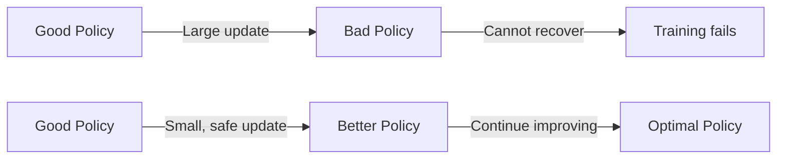
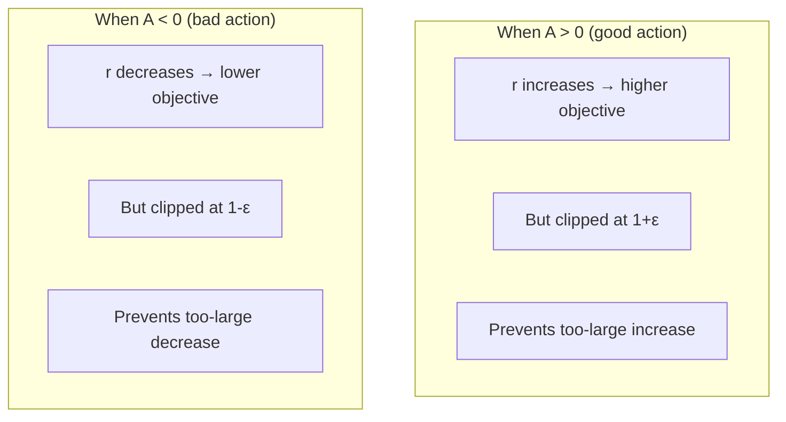
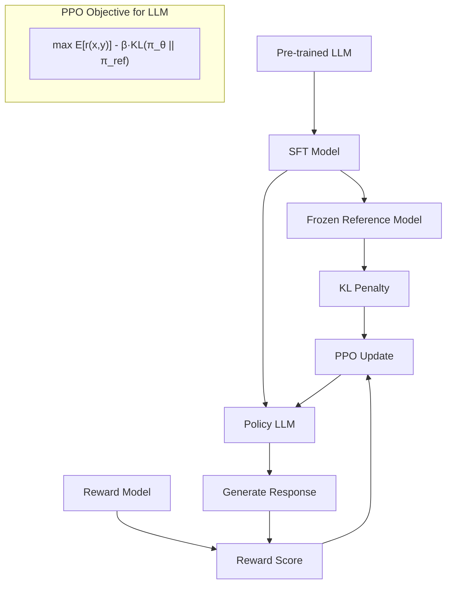

# PPO (Proximal Policy Optimization)

## Overview

PPO, introduced by Schulman et al. (2017), is the most widely used policy gradient algorithm. It improves upon TRPO by using a **clipped surrogate objective** that prevents destructively large policy updates while being simple to implement. PPO is the workhorse behind RLHF for LLM alignment (ChatGPT, Claude, Llama).

## The Problem: Policy Collapse

Large policy updates can cause catastrophic performance drops:



## PPO-Clip Objective

The core innovation — a clipped surrogate objective:

$$L^{\text{CLIP}}(\theta) = \mathbb{E}_t\left[\min\left(r_t(\theta) \hat{A}_t, \; \text{clip}(r_t(\theta), 1-\epsilon, 1+\epsilon) \hat{A}_t\right)\right]$$

Where:
- $r_t(\theta) = \frac{\pi_\theta(a_t|s_t)}{\pi_{\theta_{\text{old}}}(a_t|s_t)}$: probability ratio
- $\hat{A}_t$: advantage estimate
- $\epsilon$: clipping parameter (typically 0.2)

### How Clipping Works



| Scenario | Ratio $r_t$ | Advantage $\hat{A}_t$ | Effect |
|----------|-------------|----------------------|--------|
| Good action, increase prob | $r > 1$ | $A > 0$ | Objective increases (clipped) |
| Bad action, decrease prob | $r < 1$ | $A < 0$ | Objective increases (clipped) |
| Good action, decrease prob | $r < 1$ | $A > 0$ | Clipped, prevents damage |
| Bad action, increase prob | $r > 1$ | $A < 0$ | Clipped, prevents damage |

## Full PPO Algorithm

```python
import torch
import torch.nn as nn
from torch.distributions import Categorical

class PPO:
    def __init__(self, state_dim, action_dim, lr=3e-4, gamma=0.99, 
                 lam=0.95, epsilon=0.2, epochs=10, batch_size=64):
        self.policy = ActorCritic(state_dim, action_dim)
        self.optimizer = torch.optim.Adam(self.policy.parameters(), lr=lr)
        self.gamma = gamma
        self.lam = lam
        self.epsilon = epsilon
        self.epochs = epochs
        self.batch_size = batch_size
    
    def compute_gae(self, rewards, values, next_values, dones):
        advantages = []
        gae = 0
        for t in reversed(range(len(rewards))):
            delta = rewards[t] + self.gamma * next_values[t] * (1 - dones[t]) - values[t]
            gae = delta + self.gamma * self.lam * (1 - dones[t]) * gae
            advantages.insert(0, gae)
        return torch.tensor(advantages, dtype=torch.float32)
    
    def update(self, trajectories):
        # Extract data
        states = torch.FloatTensor(trajectories['states'])
        actions = torch.LongTensor(trajectories['actions'])
        old_log_probs = torch.FloatTensor(trajectories['log_probs'])
        rewards = trajectories['rewards']
        values = trajectories['values']
        next_values = trajectories['next_values']
        dones = trajectories['dones']
        
        # Compute advantages
        advantages = self.compute_gae(rewards, values, next_values, dones)
        returns = advantages + torch.FloatTensor(values)
        advantages = (advantages - advantages.mean()) / (advantages.std() + 1e-8)
        
        # PPO update epochs
        for _ in range(self.epochs):
            # Mini-batch updates
            for start in range(0, len(states), self.batch_size):
                end = start + self.batch_size
                mb_states = states[start:end]
                mb_actions = actions[start:end]
                mb_old_log_probs = old_log_probs[start:end]
                mb_advantages = advantages[start:end]
                mb_returns = returns[start:end]
                
                # Current policy
                action_probs, new_values = self.policy(mb_states)
                dist = Categorical(action_probs)
                new_log_probs = dist.log_prob(mb_actions)
                entropy = dist.entropy().mean()
                
                # Probability ratio
                ratio = (new_log_probs - mb_old_log_probs).exp()
                
                # Clipped objective
                surr1 = ratio * mb_advantages
                surr2 = torch.clamp(ratio, 1 - self.epsilon, 1 + self.epsilon) * mb_advantages
                actor_loss = -torch.min(surr1, surr2).mean()
                
                # Value loss
                critic_loss = (mb_returns - new_values.squeeze()).pow(2).mean()
                
                # Total loss
                loss = actor_loss + 0.5 * critic_loss - 0.01 * entropy
                
                self.optimizer.zero_grad()
                loss.backward()
                nn.utils.clip_grad_norm_(self.policy.parameters(), 0.5)
                self.optimizer.step()
```

## PPO Variants

| Variant | Description | Use Case |
|---------|-------------|----------|
| **PPO-Clip** | Clipped surrogate objective | Most common |
| **PPO-Penalty** | KL penalty instead of clipping | When KL constraint needed |
| **PPO-Continuous** | Gaussian policy for continuous actions | Robotics, control |
| **PPO for LLMs** | Policy = LLM, reward = reward model | RLHF |

### PPO for Continuous Actions

```python
class ContinuousPolicy(nn.Module):
    def __init__(self, state_dim, action_dim, hidden_dim=128):
        super().__init__()
        self.shared = nn.Sequential(
            nn.Linear(state_dim, hidden_dim), nn.ReLU()
        )
        self.mean = nn.Linear(hidden_dim, action_dim)
        self.log_std = nn.Parameter(torch.zeros(action_dim))
    
    def forward(self, x):
        features = self.shared(x)
        mean = self.mean(features)
        std = self.log_std.exp()
        return mean, std
```

## PPO in RLHF



The PPO objective for LLMs:

$$\mathcal{L}^{\text{PPO}}(\theta) = \mathbb{E}_{(x,y) \sim \pi_\theta}\left[r_\phi(x, y) - \beta \cdot D_{\text{KL}}(\pi_\theta(\cdot|x) \| \pi_{\text{ref}}(\cdot|x))\right]$$

Where:
- $r_\phi(x, y)$: reward model score
- $\pi_\theta$: current policy (LLM being optimized)
- $\pi_{\text{ref}}$: reference policy (frozen SFT model)
- $\beta$: KL penalty coefficient

## Hyperparameter Guidelines

| Hyperparameter | Typical Value | Notes |
|---------------|---------------|-------|
| Learning rate | $3 \times 10^{-4}$ | Lower for LLMs ($1 \times 10^{-6}$) |
| $\gamma$ | 0.99 | Discount factor |
| $\lambda$ (GAE) | 0.95 | Bias-variance tradeoff |
| $\epsilon$ (clip) | 0.2 | Clipping range |
| PPO epochs | 3-10 | More epochs = more sample efficient |
| Batch size | 64-2048 | Larger for LLMs |
| Entropy coeff | 0.01 | Encourages exploration |
| Max grad norm | 0.5 | Gradient clipping |

## Interview Questions

### Q1: What is PPO and why is it popular?
**Answer:** PPO is a policy gradient algorithm that uses a clipped surrogate objective to prevent destructively large policy updates. It's popular because: 1) Simple to implement (just a clipped loss), 2) Stable training (clipping prevents collapse), 3) Good sample efficiency (multiple epochs per rollout), 4) Works for both discrete and continuous actions, 5) Used in RLHF for LLM alignment.

### Q2: How does the clipping mechanism work?
**Answer:** The probability ratio $r_t = \pi_{\text{new}} / \pi_{\text{old}}$ is clipped to $[1-\epsilon, 1+\epsilon]$. When advantage is positive (good action), the objective is the minimum of the unclipped and clipped versions, preventing the policy from changing too much. When advantage is negative (bad action), the same clipping prevents too-large decreases. This creates a "trust region" without complex second-order methods.

### Q3: Why use PPO instead of TRPO?
**Answer:** TRPO constrains updates using KL divergence with a trust region, requiring complex second-order optimization (conjugate gradient, line search). PPO achieves similar stability with a simple clipping mechanism that's first-order (standard gradient descent). PPO is easier to implement, more general, and performs comparably or better.

### Q4: How is PPO used in RLHF?
**Answer:** In RLHF, the LLM is the policy, generated text is the action, and the reward model scores responses. PPO maximizes reward while constraining the policy to stay close to the reference model (via KL penalty) to prevent reward hacking. The process: 1) Generate responses with current policy, 2) Score with reward model, 3) Compute advantages, 4) Update policy with PPO-clip.

## Common Mistakes

- ❌ Not normalizing advantages (training instability)
- ❌ Too many PPO epochs (overfitting to rollouts)
- ❌ Not clipping gradients (exploding gradients)
- ❌ Setting $\epsilon$ too large (no effective clipping)
- ❌ Forgetting entropy bonus (policy collapses to deterministic too early)

## Summary

PPO is the dominant policy gradient algorithm, using a clipped surrogate objective for stable updates. It's simple to implement, sample-efficient, and works across domains. PPO is the backbone of RLHF for LLM alignment. Key components: probability ratio, clipping, GAE advantages, multiple update epochs per rollout.

## Cross-References

- [Policy Gradient →](policy-gradient.md) Policy gradient foundations
- [Fundamentals →](fundamentals.md) MDP, value functions
- [RLHF →](rlhf.md) PPO for LLM alignment
- [DPO →](dpo.md) Alternative to PPO-based RLHF
- [GRPO →](grpo.md) Group relative policy optimization
