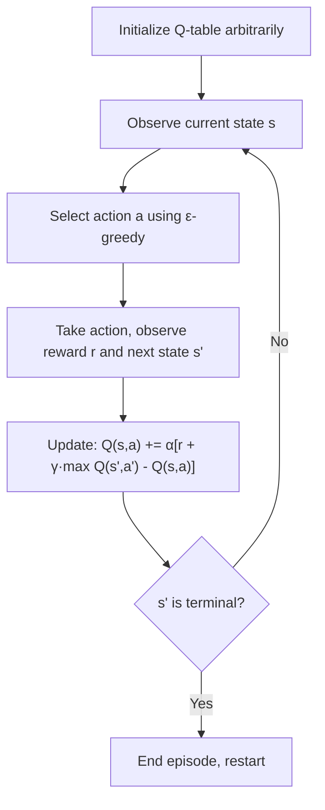
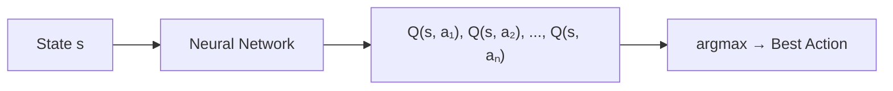
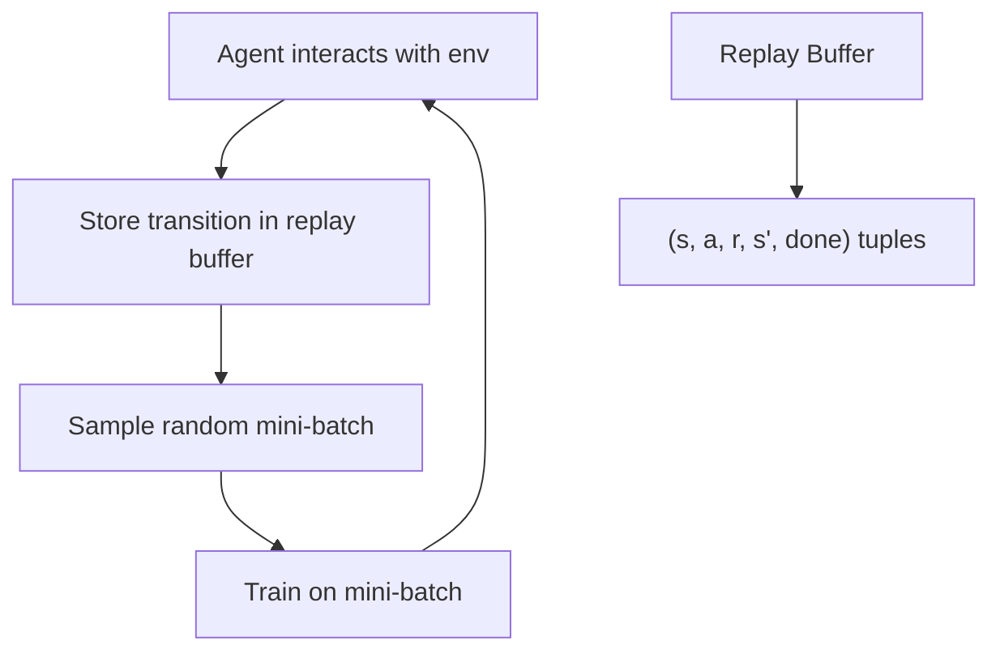
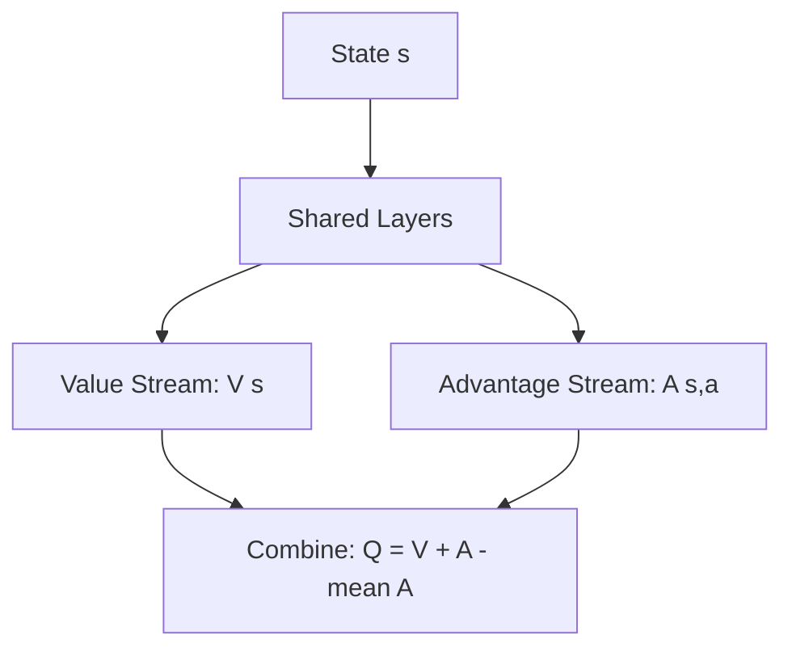

# Q-Learning

## Overview

Q-Learning is a **model-free, value-based** reinforcement learning algorithm that learns the optimal action-value function Q*(s,a) directly from experience, without needing a model of the environment. It's one of the most foundational RL algorithms.

## Core Idea

Learn a table (or function) mapping each (state, action) pair to its expected cumulative reward:

\\[Q(s, a) \leftarrow Q(s, a) + \alpha \left[ r + \gamma \max_{a'} Q(s', a') - Q(s, a) \right]\\]

Where:
- **α**: Learning rate
- **γ**: Discount factor
- **r**: Immediate reward
- **max Q(s', a')**: Best Q-value for the next state (greedy target)

## Q-Learning Algorithm



### ε-Greedy Action Selection

```python
def epsilon_greedy(Q, state, epsilon):
    if random.random() < epsilon:
        return random.randint(0, num_actions - 1)  # Explore
    else:
        return argmax(Q[state])  # Exploit
```

Typically decay ε over training: start with ε=1.0 (full exploration), decay to ε=0.01.

## Q-Learning Properties

| Property | Detail |
|----------|--------|
| **Model-free** | Doesn't need transition probabilities P(s'\|s,a) |
| **Off-policy** | Learns about greedy policy while following ε-greedy |
| **Bootstrapping** | Updates estimates using other estimates (not full returns) |
| **Convergence** | Guaranteed with tabular Q-learning under certain conditions |

### On-Policy vs Off-Policy

- **Off-policy (Q-Learning)**: Learns the optimal policy while exploring with ε-greedy. The target uses max (greedy action).
- **On-policy (SARSA)**: Learns about the policy it's actually following. The target uses the action actually taken.

\\[\text{Q-Learning: } Q(s,a) \leftarrow r + \gamma \max_{a'} Q(s', a')\\]
\\[\text{SARSA: } Q(s,a) \leftarrow r + \gamma Q(s', a') \text{ (where a' is actually taken)}\\]

## Deep Q-Network (DQN)

Tabular Q-learning doesn't scale — we can't store a table for millions of states. DQN uses a **neural network** to approximate Q(s,a).



### Key DQN Innovations (Mnih et al., 2015)

#### 1. Experience Replay
Store transitions in a buffer and sample random mini-batches:



- Breaks temporal correlation between consecutive samples
- Reuses data efficiently (each experience used multiple times)
- Stabilizes training

#### 2. Target Network
Use a separate, slowly-updating network for the target:

\\[\text{Loss} = \left[ r + \gamma \max_{a'} Q_{\text{target}}(s', a') - Q(s, a) \right]^2\\]

- Prevents "moving target" problem
- Target network updated periodically (every C steps) or with soft update

#### 3. Clipping Rewards
Clip rewards to [-1, +1] for stability (used in Atari).

### DQN Architecture (Atari)

```
Input: 84×84×4 (4 stacked frames)
→ Conv 8×8, 32 filters, stride 4
→ Conv 4×4, 64 filters, stride 2
→ Conv 3×3, 64 filters, stride 1
→ FC 512
→ FC num_actions (Q-values)
```

## DQN Improvements

### Double DQN (DDQN)
Q-learning overestimates Q-values (max operator is biased). Double DQN decouples action selection from evaluation:

\\[\text{Target} = r + \gamma Q_{\text{target}}(s', \arg\max_{a'} Q_{\text{online}}(s', a'))\\]

Use online network to select the best action, target network to evaluate it.

### Dueling DQN
Separate the Q-value into **value** and **advantage**:

\\[Q(s, a) = V(s) + A(s, a) - \frac{1}{|A|} \sum_{a'} A(s, a')\\]



### Prioritized Experience Replay
Sample important transitions more frequently:
- Priority = |TD error| (larger error = more to learn)
- Use importance sampling to correct bias

### Rainbow DQN
Combines all improvements: DDQN + Dueling + Prioritized Replay + Multi-step Learning + Distributional RL + Noisy Nets

## From DQN to LLMs

Q-learning concepts are foundational for understanding LLM training:

| DQN Concept | LLM Equivalent |
|-------------|----------------|
| State | Conversation/prompt |
| Action | Token to generate |
| Reward | Human preference score |
| Policy | Language model |
| Q-value | Expected quality of generating token a in context s |

However, modern LLM alignment uses PPO/DPO/GRPO instead of Q-learning because the action space (vocabulary) is enormous and the reward is sparse.

## Interview Questions

**Q1: Why is Q-learning off-policy?**
> Because it learns about the optimal (greedy) policy using max Q(s',a') while actually following an exploratory ε-greedy policy. The behavior policy (what the agent does) differs from the target policy (what it learns about). This is more sample-efficient since it can learn from any experience, not just its own.

**Q2: What problems does experience replay solve?**
> (1) Temporal correlation — consecutive samples are correlated, causing unstable gradients. Random sampling breaks this. (2) Sample efficiency — each experience can be reused many times. (3) Distribution stability — mini-batches come from a stable distribution (the buffer) rather than the current policy.

**Q3: Why does Q-learning overestimate Q-values and how does Double DQN fix it?**
> The max operator in the target max Q(s',a') is biased upward — it tends to select actions with overestimated Q-values. Double DQN decouples selection and evaluation: use the online network to select the best action, use the target network to evaluate it. This reduces overestimation significantly.

**Q4: When would you use Q-learning vs policy gradient?**
> Q-learning: discrete action spaces, off-policy learning needed, want to learn from old data. Policy gradient: continuous action spaces, stochastic policies needed, on-policy is acceptable. For LLMs: policy gradient (PPO/GRPO) is used because the action space (tokens) is discrete but enormous, and the policy formulation is more natural.

**Q5: Explain the dueling architecture.**
> It splits Q(s,a) into V(s) + A(s,a). The value stream estimates how good the state is regardless of action. The advantage stream estimates how much better each action is compared to average. This helps when action choices don't matter much — the network can learn V(s) without needing to estimate each action's value separately.

## Common Mistakes

1. **Not decaying ε** — Start exploratory, gradually exploit more
2. **Too small replay buffer** — Need enough diversity; typically 100K-1M transitions
3. **Updating target network too frequently** — Causes instability; update every 1000+ steps
4. **Ignoring reward scaling** — Unbounded rewards cause exploding Q-values
5. **Using Q-learning for continuous actions** — Need DDPG, SAC, or similar

## Summary

| Aspect | Detail |
|--------|--------|
| **Core Idea** | Learn Q*(s,a) = expected return from (s,a) |
| **Update Rule** | Q(s,a) += α[r + γ·max Q(s',a') - Q(s,a)] |
| **Properties** | Model-free, off-policy, bootstrapping |
| **DQN** | Neural network approximation + replay + target network |
| **Key Fixes** | Double DQN (overestimation), Dueling (V+A decomposition) |
| **LLM Relevance** | Foundation for understanding RL-based alignment |

Q-learning is the bridge between tabular RL and deep RL — understanding it is essential for grasping modern algorithms like PPO and GRPO.

## Cross-References

- [Fundamentals](./fundamentals.md)
- [Policy Gradient](./policy-gradient.md)
- [Agent Architecture](../agents/architecture.md)
- [Deep Learning](../deep-learning/README.md)
