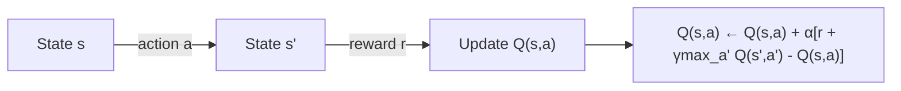
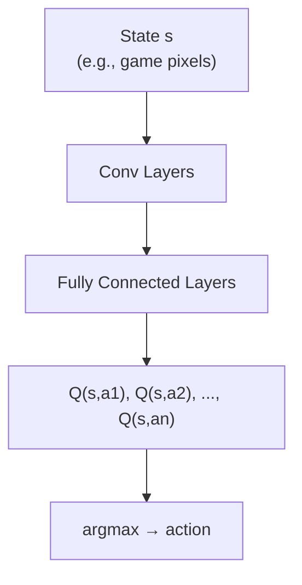

# Q-Learning

## Overview

Q-Learning is a **model-free, off-policy** algorithm that learns the optimal action-value function $Q^*(s,a)$ directly from experience, without needing a model of the environment. It uses **temporal difference (TD) learning** to update Q-values based on the Bellman optimality equation. Deep Q-Networks (DQN) extend this to high-dimensional state spaces using neural networks.

## Tabular Q-Learning

### Algorithm

Update rule:

$$Q(s_t, a_t) \leftarrow Q(s_t, a_t) + \alpha \left[ r_{t+1} + \gamma \max_{a'} Q(s_{t+1}, a') - Q(s_t, a_t) \right]$$

Where:
- $\alpha$: learning rate
- $\gamma$: discount factor
- $r_{t+1} + \gamma \max_{a'} Q(s_{t+1}, a')$: TD target
- $r_{t+1} + \gamma \max_{a'} Q(s_{t+1}, a') - Q(s_t, a_t)$: TD error



### Implementation

```python
import numpy as np

class QLearning:
    def __init__(self, n_states, n_actions, lr=0.1, gamma=0.99, epsilon=0.1):
        self.q_table = np.zeros((n_states, n_actions))
        self.lr = lr
        self.gamma = gamma
        self.epsilon = epsilon
        self.n_actions = n_actions
    
    def select_action(self, state):
        if np.random.random() < self.epsilon:
            return np.random.randint(self.n_actions)
        return np.argmax(self.q_table[state])
    
    def update(self, state, action, reward, next_state, done):
        if done:
            target = reward
        else:
            target = reward + self.gamma * np.max(self.q_table[next_state])
        
        td_error = target - self.q_table[state, action]
        self.q_table[state, action] += self.lr * td_error
        return td_error
```

### Training Loop

```python
def train_q_learning(env, agent, episodes=1000):
    for episode in range(episodes):
        state = env.reset()
        total_reward = 0
        
        while True:
            action = agent.select_action(state)
            next_state, reward, done, _ = env.step(action)
            agent.update(state, action, reward, next_state, done)
            
            state = next_state
            total_reward += reward
            
            if done:
                break
        
        if episode % 100 == 0:
            print(f"Episode {episode}, Reward: {total_reward}")
```

## Deep Q-Network (DQN)

For large/continuous state spaces, use a neural network to approximate $Q(s,a)$:

$$Q(s, a; \theta) \approx Q^*(s, a)$$



### DQN Architecture

```python
import torch
import torch.nn as nn

class DQN(nn.Module):
    def __init__(self, state_dim, action_dim, hidden_dim=128):
        super().__init__()
        self.network = nn.Sequential(
            nn.Linear(state_dim, hidden_dim),
            nn.ReLU(),
            nn.Linear(hidden_dim, hidden_dim),
            nn.ReLU(),
            nn.Linear(hidden_dim, action_dim)
        )
    
    def forward(self, x):
        return self.network(x)
```

### Key DQN Innovations

#### 1. Experience Replay

Store transitions and sample random mini-batches:

```python
from collections import deque
import random

class ReplayBuffer:
    def __init__(self, capacity=100000):
        self.buffer = deque(maxlen=capacity)
    
    def push(self, state, action, reward, next_state, done):
        self.buffer.append((state, action, reward, next_state, done))
    
    def sample(self, batch_size):
        batch = random.sample(self.buffer, batch_size)
        states, actions, rewards, next_states, dones = zip(*batch)
        return (np.array(states), np.array(actions), np.array(rewards),
                np.array(next_states), np.array(dones))
```

**Why replay?**
- Breaks correlation between consecutive samples
- Reuses data efficiently
- Stabilizes training

#### 2. Target Network

Use a separate, slowly-updated network for TD targets:

$$\text{target} = r + \gamma \max_{a'} Q(s', a'; \theta^{-})$$

```python
class DQNAgent:
    def __init__(self, state_dim, action_dim):
        self.q_network = DQN(state_dim, action_dim)
        self.target_network = DQN(state_dim, action_dim)
        self.target_network.load_state_dict(self.q_network.state_dict())
        self.optimizer = torch.optim.Adam(self.q_network.parameters(), lr=1e-3)
        self.replay_buffer = ReplayBuffer()
        self.update_freq = 1000  # Update target network every N steps
    
    def update(self, batch_size=32):
        states, actions, rewards, next_states, dones = self.replay_buffer.sample(batch_size)
        
        states = torch.FloatTensor(states)
        actions = torch.LongTensor(actions)
        rewards = torch.FloatTensor(rewards)
        next_states = torch.FloatTensor(next_states)
        dones = torch.FloatTensor(dones)
        
        # Current Q values
        q_values = self.q_network(states).gather(1, actions.unsqueeze(1))
        
        # Target Q values
        with torch.no_grad():
            next_q = self.target_network(next_states).max(1)[0]
            targets = rewards + self.gamma * next_q * (1 - dones)
        
        # Loss
        loss = nn.MSELoss()(q_values.squeeze(), targets)
        
        self.optimizer.zero_grad()
        loss.backward()
        self.optimizer.step()
        
        # Update target network
        if self.step % self.update_freq == 0:
            self.target_network.load_state_dict(self.q_network.state_dict())
```

## DQN Improvements

| Method | Innovation | Benefit |
|--------|-----------|---------|
| **Double DQN** | Use online net for action selection, target for evaluation | Reduces overestimation |
| **Dueling DQN** | Separate V(s) and A(s,a) streams | Better state estimation |
| **Prioritized Replay** | Sample transitions with high TD error more often | Faster learning |
| **Noisy Nets** | Add learned noise to weights | Better exploration |
| **Rainbow** | Combines all above | State-of-the-art |

### Double DQN

Standard DQN overestimates Q-values because $\max$ is biased upward:

$$\text{target} = r + \gamma Q(s', \arg\max_{a'} Q(s', a'; \theta); \theta^{-})$$

```python
# Double DQN update
with torch.no_grad():
    # Use online network to select action
    best_actions = self.q_network(next_states).argmax(1)
    # Use target network to evaluate action
    next_q = self.target_network(next_states).gather(1, best_actions.unsqueeze(1))
    targets = rewards + self.gamma * next_q.squeeze() * (1 - dones)
```

## Interview Questions

### Q1: What is Q-Learning and how does it work?
**Answer:** Q-Learning learns the optimal action-value function $Q^*(s,a)$ using temporal difference updates: $Q(s,a) \leftarrow Q(s,a) + \alpha[r + \gamma \max_{a'} Q(s',a') - Q(s,a)]$. It's model-free (doesn't need transition probabilities) and off-policy (can learn from any experience, not just the current policy). The agent explores with $\epsilon$-greedy and updates Q-values from stored experiences.

### Q2: Why does DQN need experience replay and target networks?
**Answer:**
- **Experience replay**: Breaks temporal correlation between consecutive samples (which destabilizes neural network training). Also improves data efficiency by reusing transitions.
- **Target network**: Prevents "moving target" problem — if both the prediction and target use the same network, updates chase a constantly shifting target, causing oscillation. A slowly-updated target network provides stable training signal.

### Q3: What is the difference between on-policy and off-policy?
**Answer:**
- **On-policy**: Learns from data generated by the current policy (e.g., SARSA, REINFORCE)
- **Off-policy**: Can learn from data generated by any policy (e.g., Q-Learning, DQN)
- Q-Learning is off-policy because it updates using $\max_{a'} Q(s',a')$ (greedy policy) while the behavior policy is $\epsilon$-greedy.

### Q4: How does Double DQN fix overestimation?
**Answer:** Standard DQN uses $\max_{a'} Q(s',a')$ for both selecting and evaluating the best action, which biases the estimate upward (the max of noisy estimates is biased high). Double DQN decouples selection and evaluation: use the online network to select the best action, use the target network to evaluate it.

## Common Mistakes

- ❌ Not using experience replay (correlated samples → unstable training)
- ❌ Not using target networks (moving target → oscillation)
- ❌ Setting $\epsilon$ too low during training (insufficient exploration)
- ❌ Forgetting to update the target network periodically
- ❌ Using Q-Learning for continuous action spaces (use policy gradient instead)

## Summary

Q-Learning learns optimal Q-values using TD updates. DQN extends this to high-dimensional states with neural networks, experience replay, and target networks. Double DQN, Dueling DQN, and prioritized replay further improve performance. Q-Learning is off-policy and model-free, making it sample-efficient but limited to discrete actions.

## Cross-References

- [Fundamentals →](fundamentals.md) MDP, Bellman equation
- [Policy Gradient →](policy-gradient.md) Continuous action alternative
- [PPO →](ppo.md) Modern RL algorithm
- [RLHF →](rlhf.md) RL for LLM alignment
