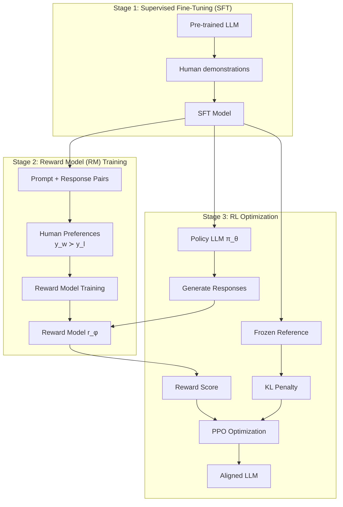

# RLHF (Reinforcement Learning from Human Feedback)

## Overview

RLHF is the process of aligning language models with human preferences using reinforcement learning. It's the key technique behind ChatGPT, Claude, and other aligned LLMs. RLHF trains a reward model on human comparisons, then uses PPO to optimize the LLM against this reward model while maintaining proximity to the original model via KL regularization.

## The RLHF Pipeline



## Stage 1: Supervised Fine-Tuning (SFT)

Fine-tune the base LLM on high-quality demonstrations:

$$\mathcal{L}_{\text{SFT}} = -\mathbb{E}_{(x,y) \sim \mathcal{D}}\left[\sum_t \log \pi_\theta(y_t | x, y_{<t})\right]$$

```python
# SFT training
for batch in sft_dataloader:
    loss = model(batch['input_ids'], labels=batch['labels']).loss
    loss.backward()
    optimizer.step()
    optimizer.zero_grad()
```

## Stage 2: Reward Model Training

### Data Collection

For each prompt, generate multiple responses and collect human preferences:

| Prompt | Chosen ($y_w$) | Rejected ($y_l$) |
|--------|----------------|-------------------|
| "Explain gravity" | Clear, accurate explanation | Vague, inaccurate |
| "Write a poem" | Creative, well-structured | Generic, bland |
| "Help me code" | Working solution with explanation | Broken code, no explanation |

### Reward Model Architecture

The reward model takes a prompt + response and outputs a scalar reward:

$$r_\phi(x, y) = \text{Linear}(\text{LLM}_{\text{frozen}}([x; y])_{\text{last\_token}})$$

### Training with Bradley-Terry Model

The probability that $y_w$ is preferred over $y_l$:

$$P(y_w \succ y_l | x) = \sigma(r_\phi(x, y_w) - r_\phi(x, y_l))$$

Where $\sigma$ is the sigmoid function.

$$\mathcal{L}_{\text{RM}} = -\mathbb{E}_{(x, y_w, y_l) \sim \mathcal{D}}\left[\log \sigma(r_\phi(x, y_w) - r_\phi(x, y_l))\right]$$

```python
class RewardModel(nn.Module):
    def __init__(self, base_model):
        super().__init__()
        self.backbone = base_model  # Frozen LLM backbone
        self.reward_head = nn.Linear(base_model.config.hidden_size, 1)
    
    def forward(self, input_ids, attention_mask):
        outputs = self.backbone(input_ids, attention_mask=attention_mask)
        last_hidden = outputs.last_hidden_state[:, -1, :]  # Last token
        reward = self.reward_head(last_hidden)
        return reward

def train_reward_model(rm, optimizer, batch):
    rewards_chosen = rm(batch['chosen_ids'], batch['chosen_mask'])
    rewards_rejected = rm(batch['rejected_ids'], batch['rejected_mask'])
    
    loss = -torch.log(torch.sigmoid(rewards_chosen - rewards_rejected)).mean()
    
    optimizer.zero_grad()
    loss.backward()
    optimizer.step()
    
    accuracy = (rewards_chosen > rewards_rejected).float().mean()
    return loss.item(), accuracy.item()
```

## Stage 3: PPO Optimization

### Objective Function

$$\mathcal{L}^{\text{RLHF}}(\theta) = \mathbb{E}_{x \sim \mathcal{D}, y \sim \pi_\theta(\cdot|x)}\left[r_\phi(x, y) - \beta \cdot D_{\text{KL}}(\pi_\theta(\cdot|x) \| \pi_{\text{ref}}(\cdot|x))\right]$$

### KL Penalty

The KL divergence term prevents the policy from diverging too far from the reference:

$$D_{\text{KL}}(\pi_\theta \| \pi_{\text{ref}}) = \mathbb{E}_{y \sim \pi_\theta}\left[\log \frac{\pi_\theta(y|x)}{\pi_{\text{ref}}(y|x)}\right]$$

**Why KL penalty?**
- Prevents **reward hacking** (finding loopholes in the reward model)
- Maintains language quality (doesn't degenerate into gibberish)
- Keeps the model close to the pre-trained distribution

```python
def compute_kl_penalty(policy_logprobs, ref_logprobs, beta=0.1):
    """Compute KL divergence penalty."""
    kl = policy_logprobs - ref_logprobs
    return beta * kl.mean()
```

### Full RLHF Training Loop

```python
def rlhf_training(sft_model, reward_model, prompts, ppo_config):
    # Initialize
    policy = copy.deepcopy(sft_model)
    ref_model = copy.deepcopy(sft_model)  # Frozen
    ppo_trainer = PPOTrainer(policy, **ppo_config)
    
    for epoch in range(num_epochs):
        for prompt in prompts:
            # 1. Generate response
            response = policy.generate(prompt, max_length=512)
            
            # 2. Get reward
            reward = reward_model(prompt, response)
            
            # 3. Compute KL penalty
            policy_logprobs = policy.log_prob(prompt, response)
            ref_logprobs = ref_model.log_prob(prompt, response)
            kl = policy_logprobs - ref_logprobs
            
            # 4. PPO update
            ppo_trainer.step(
                prompt, response,
                reward=reward - beta * kl
            )
```

## Reward Hacking

A critical challenge — the policy finds ways to get high reward without being genuinely helpful:

| Reward Hacking | Description |
|---------------|-------------|
| Length exploitation | Longer responses get higher reward regardless of quality |
| Sycophancy | Always agreeing with the user |
| Repetition | Repeating phrases that coincidentally get high reward |
| Formatting tricks | Using markdown/formatting to boost scores |

### Mitigations

1. **KL penalty**: Keeps policy close to reference
2. **Reward model ensemble**: Average multiple reward models
3. **Reward model scaling**: Train reward models of different sizes
4. **Constitutional constraints**: Hard rules the policy must follow
5. **Periodic retraining**: Update reward model with new data

## Interview Questions

### Q1: What is RLHF and why is it important?
**Answer:** RLHF aligns LLMs with human preferences through three stages: 1) SFT on demonstrations, 2) Train reward model on human comparisons, 3) Optimize policy with PPO against reward model. It's important because it makes LLMs helpful, harmless, and honest — transforming a raw text generator into a useful assistant.

### Q2: Why train a reward model instead of using human feedback directly?
**Answer:** Human feedback is expensive and slow (requires humans for every response). A reward model generalizes from a small set of human preferences to score unlimited responses. Once trained, the reward model provides instant, consistent feedback for RL training at scale.

### Q3: What is reward hacking and how do you prevent it?
**Answer:** Reward hacking is when the policy exploits loopholes in the reward model to get high scores without being genuinely helpful (e.g., generating long, sycophantic responses). Prevention: KL penalty (stay close to reference), reward ensembles, periodic retraining, and constitutional constraints.

### Q4: What is the role of the KL penalty in RLHF?
**Answer:** The KL penalty $D_{\text{KL}}(\pi_\theta \| \pi_{\text{ref}})$ constrains the policy to stay close to the reference (SFT) model. Without it, the policy would exploit the reward model, potentially generating gibberish or degenerate text. It maintains language quality while allowing optimization toward higher rewards.

### Q5: What are the limitations of RLHF?
**Answer:**
1. **Reward model quality**: Garbage in, garbage out — poor preferences → poor alignment
2. **Reward hacking**: Policy finds unintended shortcuts
3. **Cost**: PPO training requires multiple LLM forward passes (expensive)
4. **Distribution shift**: Reward model may not generalize to novel prompts
5. **Human biases**: Preferences reflect annotator biases, not universal truth

## Common Mistakes

- ❌ Skipping SFT (RLHF from base model is unstable)
- ❌ Poor quality preference data (inconsistent human labels)
- ❌ KL penalty too strong (policy can't improve) or too weak (reward hacking)
- ❌ Not using a frozen reference model (reference drifts during training)
- ❌ Training reward model on too little data (overfits to specific examples)

## Summary

RLHF aligns LLMs through SFT, reward modeling, and PPO optimization. The reward model learns from human preferences, and PPO optimizes the LLM against the reward while maintaining proximity to the reference model via KL penalty. Reward hacking is the main challenge, mitigated by KL constraints and ensemble methods. RLHF powers ChatGPT, Claude, and other aligned LLMs.

## Cross-References

- [PPO →](ppo.md) The RL algorithm used in RLHF
- [DPO →](dpo.md) Simplified alternative to RLHF
- [GRPO →](grpo.md) Group relative policy optimization
- [Fundamentals →](fundamentals.md) RL foundations
- [Transformers: Training →](../transformers/training.md) LLM training pipeline
